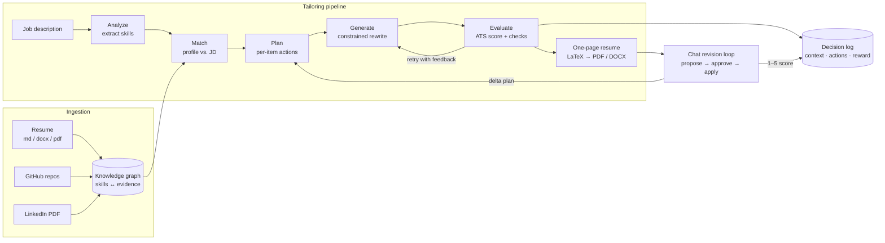

# ART — Agentic Resume Tailoring

**Tailor your resume to any job description through an AI chat workflow.**

ART ingests your resume, GitHub, and LinkedIn data into a skills knowledge
graph, then uses a pipeline of LLM agents to plan, generate, and score a
focused, ATS-friendly one-page resume for a specific job — with a chat
interface for iterative, reviewable revision.

🔗 **Live demo:** https://artie-resume-tailoring.fly.dev/

---

## How it works



Every tailoring run is **planned as typed, per-item edit actions**, executed
under deterministic guards, **scored algorithmically**, and **logged** — so the
system can explain each change and learn which tailoring choices work over
time.

---

## Architecture

### System overview

React/TypeScript SPA served as static files by a FastAPI backend — one process
runs the whole product in production. `services.py` is the shared business
layer used by the web routers, the chat agent, and the CLI.

```
web/frontend (React/TS)  ──►  FastAPI routers (web/routers/)
                                     │
                                     ▼
                         services.py  ── shared business logic
                          │        │
                          ▼        ▼
              ingestion/        agents/ + graph/  ── LLM tailoring pipeline
              (resume,          knowledge_graph/  ── skills graph builder
               github,                 │
               linkedin)               ▼
                          database/ (SQLModel: SQLite / Supabase Postgres)
```

- **Auth:** Supabase Auth (JWT via JWKS) in production, signed-cookie fallback
  locally. Per-request user binding keeps multi-user data isolated.
- **Database:** SQLModel ORM. Local SQLite by default; Supabase Postgres when
  `DATABASE_URL` is set. Schema changes ship as idempotent `ALTER TABLE`
  migrations so existing databases keep loading.

### Ingestion → knowledge graph

Each source (resume file, GitHub account/repo, LinkedIn PDF) is parsed into
structured rows — skills, experiences, projects, education, achievements —
with **evidence edges**: every skill records where it was demonstrated
(`UserSkill.evidence_source/detail`). Tailoring later uses this graph degree as
a signal (a project evidencing many skills ranks higher) and never claims a
skill without support. Rows are deduplicated across sources, and manual edits
in the profile UI are protected from re-ingestion overwrites.

### The tailoring pipeline (`graph/pipeline.py`, `agents/`)

A LangGraph flow: `analyze_job → match_skills → tailor_resume → format_resume`.
The tailor stage is itself a **plan → generate → evaluate** loop:

1. **Prepare** — experiences are cleaned, deduplicated, relevance-ranked
   against the JD, and given per-item bullet budgets; projects are scored
   (relevance + complexity + recency) and the top-k selected, keeping the
   remainder as a **replacement pool**; missing JD keywords are signal-ranked
   and assigned to the specific item whose own content supports them.
2. **Plan** (`agents/tailor_planner.py`) — a planner LLM emits one typed action
   per item: `keep | revise | replace | delete`, with a named revision strategy
   (`keyword_weave | quantify | tighten | reframe`), the keywords to weave, a
   replacement from the pool, and a one-sentence rationale. Plans are validated
   deterministically (unknown items dropped, replace is pool-only, a section
   can never be emptied) and degrade to a safe default plan if the LLM fails.
   On re-tailors the planner plans a **delta against the current tailored
   resume** — the source of truth — instead of regenerating from scratch.
3. **Generate** — the generator LLM executes the plan under strict rules:
   revise-don't-rewrite, never fabricate, respect bullet budgets and per-item
   keyword assignments. Deterministic guards enforce what prompts can't
   guarantee: pre-ranked ordering, restored dates and repo links, budget
   truncation, plan enforcement (deleted items stay out, kept items keep their
   bullets verbatim).
4. **Evaluate** — the same algorithmic **ATS scoring engine** that scores the
   pre-tailor baseline scores each attempt (skill coverage, keyword *placement*
   precision, section presence, role level), plus faithfulness-drift and
   keyword-stuffing checks. The loop retries with targeted feedback and ships
   the **best-of-N** attempt, never the last one.
5. **Format** — tailored JSON renders to LaTeX (Jake's Resume layout) compiled
   by tectonic to a one-page PDF, with DOCX export mirroring the same layout.
   Section order is re-ranked per job, and content is trimmed to fit one page
   at the source so previews, editors, and exports agree.

### The chat agent (`agents/chat.py`)

A router-first design: deterministic fast paths handle command-like input
without an LLM call; everything else goes to a routing LLM restricted to a
`TOOL_CALL / CLARIFY / RESPONSE` envelope over an explicit tool list. Runtime
state (active profile, active job, current tailored resume) is injected into
the router prompt every turn.

Within a job chat, tailoring is a **strict action set**:

| Action | What it does |
|---|---|
| `PROPOSE_PLAN` | Show the per-item delta a re-tailor would apply, before spending a run |
| `APPLY_PLAN` | Execute the approved plan (`plan_override` through the pipeline) |
| `SHOW_DIFF` | List what the last run changed |
| `EXPLAIN` | The rationale behind each change, from the decision log |
| `REVERT` | One-level undo to the previous tailored resume |
| `SAVE_ARTIFACT` | Persist chat-mentioned skills/projects into the knowledge graph |

`tailor <request>` on an already-tailored job proposes the plan and asks for
approval (`1` to apply, `2` to cancel) — chat revisions are reviewable deltas,
not regenerations.

### The learning loop (decision log → policy)

Every tailoring run appends a `(context, actions, propensity, reward)` tuple to
`UserJobResult.tailoring_decisions`:

- **context** — profile/JD features (item counts, missing skills, baseline
  score, whether it's a revision),
- **actions** — the executed plan with rationales,
- **reward** — the per-component ATS delta, plus an explicit **1–5 user score**
  collected in chat after each revision.

This is an offline contextual-bandit dataset: the planner's strategy knobs
(default revision strategy, replace/delete aggressiveness) are the discrete
levers a learned policy will select per run, evaluated off-policy before
deployment. The benchmark harness doubles as the data generator.

### Evaluation (`eval/`)

`eval/tailoring_benchmark.py` replays a versioned JD dataset through the real
HTTP API (register → ingest → analyze → tailor → export) on an isolated
database, computing ATS deltas, experience-allocation balance, skills
organization, and redundancy metrics per task — with a deterministic stub-LLM
mode for offline runs. Results land in `eval/results/` as JSON/CSV plus
rendered `.tex` artifacts.

---

## Tech stack

| Layer     | Technology |
|-----------|------------|
| Frontend  | React 18, TypeScript, Vite |
| Backend   | FastAPI (Python 3.11+) |
| Database  | SQLModel ORM — SQLite locally, Supabase Postgres in production |
| Auth      | Supabase Auth (JWT) with a local signed-cookie fallback |
| AI        | LangGraph + LangChain, Anthropic / OpenAI |
| PDF       | LaTeX (tectonic) |
| Deploy    | Docker → Fly.io |

## Quickstart

### Option A — Docker

```bash
git clone https://github.com/nathansso/agentic_resume_tailoring.git
cd agentic_resume_tailoring
cp .env.example .env          # then set ANTHROPIC_API_KEY (or OPENAI_API_KEY)
docker compose up --build
```

Open http://localhost:8000.

### Option B — Local development

```bash
git clone https://github.com/nathansso/agentic_resume_tailoring.git
cd agentic_resume_tailoring

# Backend
python -m venv .venv
source .venv/Scripts/activate      # bash / Git Bash on Windows
# .venv\Scripts\Activate.ps1        # PowerShell
pip install -r requirements-core.txt
cp .env.example .env               # set your API key + SESSION_SECRET_KEY
DEV_MODE=1 uvicorn web.app:app --port 8000 --reload

# Frontend (separate terminal) — proxies /api to :8000
cd web/frontend
npm install
npm run dev                        # http://localhost:5173
```

`requirements-full.txt` adds optional LinkedIn scraping (Playwright) and
semantic skill matching (sentence-transformers).

### CLI

A command-line surface mirrors the core pipeline:

```bash
python cli.py ingest-resume <file>
python cli.py ingest-github [username]
python cli.py tailor <job_file_or_text>
python cli.py status
```

## Configuration

Copy `.env.example` to `.env` and fill in what you need. The essentials:

| Variable | Purpose |
|----------|---------|
| `LLM_PROVIDER` | `anthropic` (default) or `openai` |
| `ANTHROPIC_API_KEY` / `OPENAI_API_KEY` | LLM access |
| `SESSION_SECRET_KEY` | signs local session cookies (`python -c "import secrets; print(secrets.token_hex(32))"`) |
| `DATABASE_URL` | unset → local SQLite; set → Supabase Postgres |
| `GITHUB_CLIENT_ID` / `GITHUB_CLIENT_SECRET` | GitHub OAuth for repo ingestion (optional) |

Supabase Auth variables are only needed for cloud multi-user deployment — see
`.env.example` for the full list.

## Testing

```bash
python run_tests.py               # full suite (integration tests excluded)
python run_tests.py -k chat       # filter by keyword
python run_tests.py --integration # include slow / network tests
```

## Project structure

```
web/            FastAPI backend (routers/) + React frontend (frontend/)
agents/         chat router, job analyzer, matcher, planner, tailor,
                ATS scorer, formatter
graph/          LangGraph tailoring pipeline
knowledge_graph/ skills-to-evidence graph builder
ingestion/      resume / GitHub / LinkedIn ingestors
database/       SQLModel models, engine, migrations, user utilities
eval/           tailoring benchmark harness + JD dataset + metrics
services.py     shared business logic used by web, agents, and CLI
cli.py          command-line entry point
tests/          pytest suite (+ tests/fixtures/ sample data)
docs/           roadmap and product requirement docs (PRDs)
```

## Deployment

Detailed Docker, Fly.io, and Render instructions live in
[`INSTALL.md`](INSTALL.md). In short — from the repo root:

```bash
fly deploy
```

builds the Docker image (Node 20 → Python 3.12) and pushes to Fly.io.

---

## License

No license file is currently provided; all rights reserved by the author.
