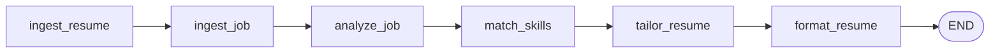
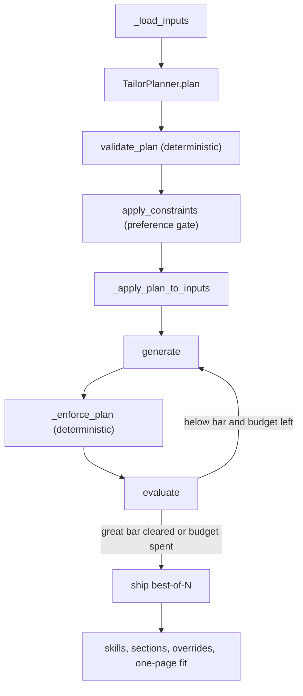
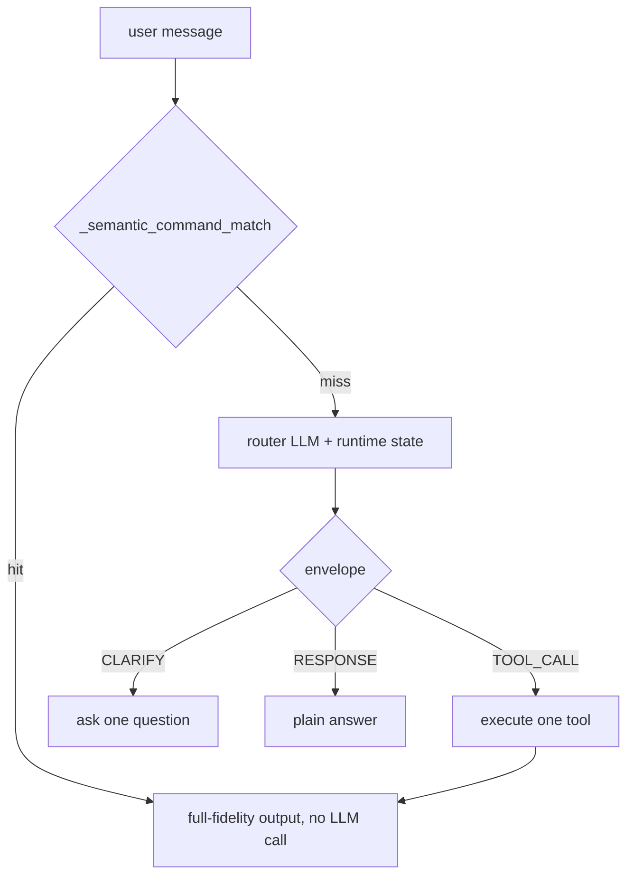
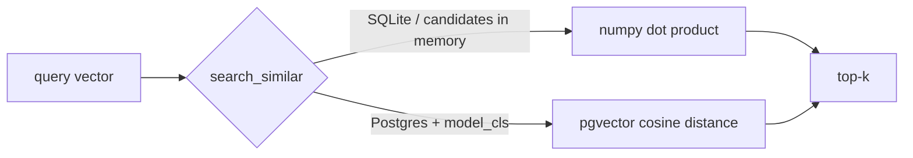
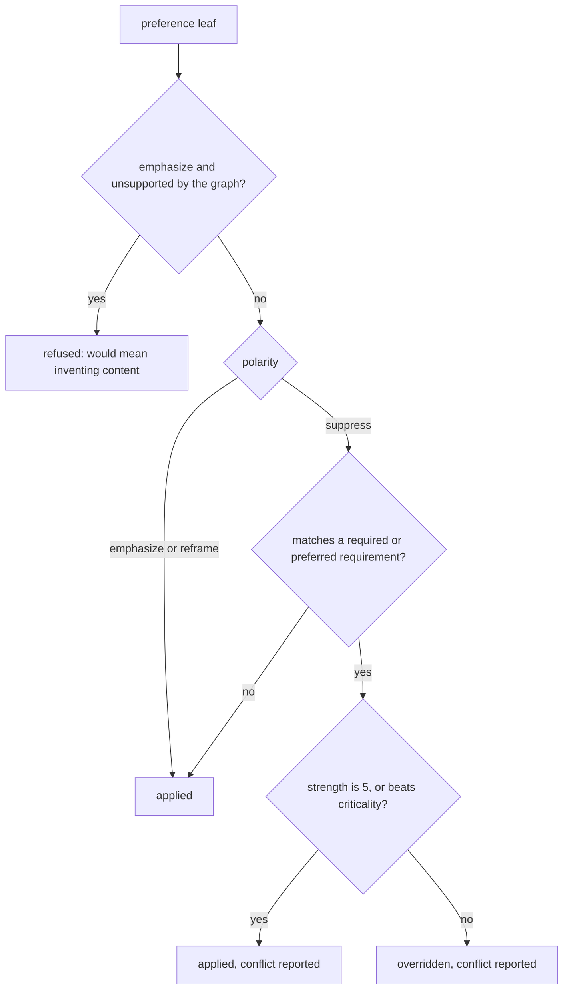

# ART — Architecture

How the system actually works: what it remembers, what it reasons over, and how a job
description becomes a tailored resume.

This document describes **merged behaviour**, traced into the code rather than taken from
the issue that proposed it. Where `CHANGELOG.md` and the code disagree, the code wins and
the disagreement is stated. Work that is specified but not shipped lives in the
[In flight](#in-flight) section at the end, and nowhere else.

Companion documents: [`benchmark.md`](benchmark.md) (what the numbers mean),
[`../eval/README.md`](../eval/README.md) (how to run the harnesses).

---

## 1. Orientation

ART turns a candidate's scattered career evidence — a resume file, GitHub repos, a
LinkedIn profile, and whatever they say in chat — into a **skills knowledge graph**, then
tailors that graph into a one-page, ATS-friendly resume for one specific job. Every
tailoring run is planned as **typed, per-item edit actions**, executed under deterministic
guards, scored by an algorithmic ATS engine, and logged as a
`(context, actions, propensity, reward)` tuple.

Two vocabularies organise everything below:

- **Memory units** — what the system carries *between* turns and *between* jobs.
- **Reasoning units** — what turns those memories plus a job description into a resume.

### Concept → module map

| Concept | Kind | Code | Written by | Read by |
|---|---|---|---|---|
| Skills knowledge graph | memory | `knowledge_graph/builder.py`, `UserSkill`/`Project`/`Experience` in `database/models.py` | `agents/parser.py`, `ingestion/*`, `services.apply_artifact_decision` | `agents/matcher.py`, `agents/tailor.py::_assemble_kg_evidence` |
| Chat → KG extraction | memory (write path) | `agents/knowledge_extractor.py` | `services.apply_artifact_decision` (explicit accept only) | the graph above |
| JobCard (per finished job) | memory | `agents/job_card.py`, `JobCard` model | `services.rebuild_job_card` | `agents/tailor.py::_select_job_cards` → planner prompt |
| Decision log | memory | `UserJobResult.tailoring_decisions`, built by `tailor_planner.decision_log_entry` | `agents/tailor.py::tailor` | `agents/chat.py` (`EXPLAIN`), `agents/job_card.py`, future policy work |
| Preference store (leaves) | memory | `agents/preferences.py`, `UserPreference` model | `services.apply_preference_decision` | `services.get_active_persona` |
| Persona index (traits) | memory | `agents/persona.py`, `PersonaTrait` + `Persona` models | `services.rebuild_persona` | `agents/tailor.py::_compile_preference_constraints` |
| Layout overrides | memory | `agents/layout.py`, `UserJobResult.layout_overrides` | `PUT /api/jobs/{id}/layout` only | `agents/tailor.py::tailor` |
| Chat history + compression | memory | `agents/chat.py`, `ChatMessage` model | `services.save_chat_message` | the chat router prompt |
| JD profile | memory (job side) | `agents/jd_profile.py`, `JDProfile` model | `services.rebuild_jd_profile` | `agents/keyword_weights.py`, `agents/arbitration.py` |
| Outer pipeline | reasoning | `graph/pipeline.py` (LangGraph) | — | `cli.py`, `agents/chat.py` |
| Analyze / match | reasoning | `agents/job_analyzer.py`, `agents/matcher.py` | — | writes `JobSkill`, `UserJobResult` |
| Planner | reasoning | `agents/tailor_planner.py` | — | `agents/tailor.py` |
| Generate → evaluate loop | reasoning | `agents/tailor.py` (LangGraph) | — | `agents/formatter.py` |
| Chat router + action set | reasoning | `agents/chat.py` | — | everything above |
| KG retrieval seam | retrieval | `database/vector_search.py`, `agents/skill_embeddings.py` | `ensure_skill_embeddings`, `ensure_job_embedding` | matcher, skill scorer, JobCard ranking |
| Preference extraction | retrieval (push) | `agents/preferences.py::extract_preference_notes` | `services.propose_preferences` | arbitration |
| Arbitration | reasoning | `agents/arbitration.py` | — | `agents/tailor_planner.py::apply_constraints` |
| Exploration policy | policy | `agents/tailor_planner.py::_choose_strategy` | — | decision log |
| Deterministic ordering | invariant | `database/db.py::next_seq` / `latest_result` | every write site | every `created_at`-ordered read |

**There are three LangGraph graphs, not one.** `graph/pipeline.py` composes the whole flow
(`ingest_resume → ingest_job → analyze_job → match_skills → tailor_resume → format_resume`)
and is used by `cli.py` and `agents/chat.py`. The web API does **not** use it —
`web/routers/jobs_router.py` calls `JobAnalyzerAgent`, `SkillMatcherAgent` and
`ResumeTailorAgent` directly. The second is the generate↔evaluate loop *inside*
`ResumeTailorAgent`, and every surface reaches that one. The third is the
`extract → reason → decide` subgraph in `agents/knowledge_extractor.py` (§2.2), which
degrades to running the same nodes in sequence if LangGraph is unavailable.

---

## 2. The memory units

### 2.1 The skills knowledge graph

`SkillGraphBuilder` (`knowledge_graph/builder.py`) builds an in-memory `networkx.DiGraph`
for **one user** — every query is scoped by `user_id`, which is issue #73's fix, not an
optimisation. Nodes are `Skill:`, `Project:` and `Experience:`; edges are
`Project --USES--> Skill` and `Experience --DEMONSTRATES--> Skill`, derived by substring
matching a skill name against the item's own text (with a guard so short names like `C`
need surrounding whitespace).

The durable half lives in the database. `UserSkill` carries the evidence:

```json
{
  "user_skill_id": "…", "user_id": "…", "skill_id": "…",
  "proficiency": 4,
  "evidence_source": "github",
  "evidence_detail": "alexrivera/semsearch",
  "confidence_score": 0.85,
  "is_core": false,
  "source_context": "chat:1f0c…"
}
```

- **Written by** `agents/parser.py` (resume, LinkedIn), `ingestion/github.py`, and
  `services.apply_artifact_decision` for chat-captured artifacts.
- **Read by** `agents/matcher.py` (skill matching) and `agents/tailor.py` (the mandatory
  evidence step, §4).
- **Lifetime** — permanent, user-scoped, and deliberately **not** cascaded from jobs:
  `source_context` is free-form text, never a foreign key, so deleting a job or its chat
  history cannot remove a knowledge-graph row.
- **When missing** — `evidence_for_skills` returns `{}`, every downstream step is a no-op,
  and the planner payload is byte-for-byte what it would be without the graph.

`agents/project_scorer.py` reuses the graph as a *degree* signal: `linked_skills` — how
many distinct skills evidence a project — is one of its complexity sub-signals, so a
project that anchors many skills ranks above one that anchors none.

### 2.2 Chat → knowledge graph (issue #21)

`agents/knowledge_extractor.py` is a **Chain-of-Note** pipeline composed as a small
LangGraph `StateGraph`: `extract → reason → decide`.

- `extract` writes grounded notes about what the transcript claims. **Every note needs a
  verbatim evidence quote**; an ungrounded note is dropped, never offered.
- `reason` judges each note against the facts already in the user's graph
  (`load_known_facts`).
- `decide` is **deterministic, not a model call**. On an exact name match the rules win
  outright: a match that changes nothing becomes `no_op` (so a hallucinated `add` can
  never duplicate a row), a match that changes something becomes `supersede`. The model
  keeps authority only where equality *cannot* match — a promotion or rename changes the
  very name the check keys on — and even then its `supersede` is honoured only if its
  `target` resolves to a real fact of the same type.

Both model passes go through the `llm.get_extractor` seam (§4.3), so output is
schema-validated; there is no `json.loads` on this path and a test parses the module's AST
to keep it that way. If LangGraph is unavailable the same nodes run in sequence.

Nothing here writes to the database. `services.apply_artifact_decision` is the only write
path and it is reached only by an explicit user accept (`/save` in chat, or
`POST /api/chat/{job_id}/artifacts/decide`).

### 2.3 JobCards — one card per completed job (issue #137)

The axis that scales for this product is **jobs per user**, not turns per session. A
JobCard is the sufficient statistic that survives from one job to the next.

```json
{
  "version": 1,
  "job": {"title": "Data & AI Engineer", "company": "Arizent",
          "terminal_status": "tailored", "verification_status": "pending"},
  "role_family": "ai_engineering",
  "ats": {"composite": 88.0, "baseline_composite": 59.7, "delta": 28.3,
          "skill_coverage": 100.0, "keyword_coverage": 68.2},
  "emphasized": {"experiences": ["Machine Learning Engineer"],
                 "projects": ["SemanticSearch-Lite"],
                 "skills": ["PyTorch", "FastAPI"], "led_with": "experience"},
  "rejected_items": [{"item_key": "proj:streamboard", "op": "delete",
                      "source": "user", "status": "active"}],
  "user_score": 4,
  "runs": 2,
  "timestamps": {"created_at": "…", "updated_at": "…"}
}
```

*(Field names and shape from `agents/job_card.py::compile_card_payload`; the `ats` values
are the real ones from the `arizent_data_ai_engineer` task in the plumbing run recorded in
[`benchmark.md §3`](benchmark.md#3-a-worked-run) — a plumbing number, so it describes the
harness, not a rewrite. `emphasized`, `rejected_items` and `user_score` are illustrative.)*

Three properties define this module:

1. **A card is a projection, not a summary.** `compile_card_payload` rearranges
   `UserJobResult` and the job's final state. No LLM sees the transcript, so two compiles
   of the same rows are byte-identical under `payload_digest`. The single exception is
   `role_family`, a cached, versioned classify through the extraction seam — cached
   precisely so a rebuild is not a model call.
2. **The negation signal is the point.** `rejected_items` records what the user took
   *out*, derived from `delete`/`replace` ops in the decision log, keeping only each
   item's **latest** action (deleted once and restored next run is not a standing
   rejection) and tagged `user` versus `planner`. A planner dropping an item to fit a
   budget is a per-job optimisation and must never be promoted to a stated preference.
3. **Selection is bounded and multi-key.** `select_cards` blends role-family match,
   JD-embedding similarity, fact-level `index_keys` overlap and recency; `render_cards`
   caps the result at a token budget, so prompt cost is flat in the number of accumulated
   jobs. A **user-sourced rejection is never dropped to fit the budget.**

Rejections are deliberately absent from `index_keys`: a similarity index cannot represent
"not this", so rejections ride *on* the card and are pushed with it.

- **Written by** `services.rebuild_job_card`, event-driven, hooked in `tailor()` right
  after the result commits and again in `_record_tailor_score` (the 1–5 score arrives
  after the run that built the card).
- **Read by** `agents/tailor.py::_select_job_cards` → the `PRIOR SIMILAR JOBS` block in the
  planner prompt.
- **When missing** — a first-time user pays nothing, not even the role classify, and the
  planner prompt is byte-identical to the pre-#137 prompt. A test pins that.

### 2.4 The decision log

`UserJobResult.tailoring_decisions` is an append-only JSON list. One entry per tailoring
run, built by `tailor_planner.decision_log_entry`:

```json
{
  "timestamp": "2026-08-14T11:24:22.913",
  "revision_notes": "",
  "planner": "llm",
  "exploration_mode": false,
  "n_attempts": 2,
  "knobs": {"default_revise_strategy": "keyword_weave",
            "allow_replace": true, "allow_delete": true},
  "actions": [
    {"section": "project", "item_key": "proj:semanticsearch-lite",
     "label": "SemanticSearch-Lite", "op": "revise",
     "strategy": "keyword_weave", "strategy_source": "llm",
     "llm_strategy": "keyword_weave",
     "keywords": ["vector search", "embeddings"],
     "rationale": "The posting leads with retrieval; this project is the candidate's only shipped retrieval system.",
     "propensity": 1.0,
     "persona": {"has_active_suppress_target": false,
                 "has_active_emphasize_target": false,
                 "has_active_reframe_target": false, "trait_keys": []}}
  ],
  "context": {"n_experiences": 4, "n_projects": 3, "n_replacement_pool": 1,
              "n_missing_skills": 7, "n_priority_keywords": 6,
              "baseline_composite": 59.7, "is_revision": false, "attempts": 2,
              "n_graph_evidence": 5, "n_job_cards": 0, "n_preferences": 0},
  "reward": {"composite": 88.0, "baseline_composite": 59.7, "delta": 28.3,
             "skill_coverage": 100.0, "keyword_coverage": 68.2,
             "section_presence": 100.0, "role_level": 75.0}
}
```

*(Shape and field names from `decision_log_entry` and `tailor()`'s `context_features`. The
`reward` block and `context.baseline_composite` are the real numbers from the plumbing
worked run in [`benchmark.md §3`](benchmark.md#3-a-worked-run); the actions, the rationale
and the remaining context counts are illustrative — a plumbing run's planner is stubbed.)*

- **Written by** `agents/tailor.py::tailor`, on every run, on every surface.
- **Read by** `agents/chat.py` (`EXPLAIN` renders the rationales), `agents/job_card.py`
  (rejections and the final `user_score`), and — in future — the policy work of §6.
- **`constraints`** is added as a key **only when non-empty**, so a user with no
  preferences produces the byte-for-byte pre-#129 entry.
- **When missing** — the column defaults to `[]`; `EXPLAIN` says there is nothing to
  explain and a JobCard compiles with no rejections and a null `user_score`.

Two logging decisions are load-bearing for anything trained on this data. A chat-approved
plan logs `propensity: null` rather than `1.0` — a human's choice is off-policy and
attributing it to the policy would bias an importance-weighted estimate. And
`exploration_mode` / `n_attempts` are recorded explicitly so best-of-N data (a reward that
is a max over N draws) is never pooled with N=1 exploration data.

### 2.5 The preference store and the persona index

Two tiers, one lossless index over the other.

**Leaves (`UserPreference`, issue #129).** One row per standing preference — not an array
on the profile, because an array makes superseding one entry a read-modify-write of the
whole blob and forces the edit API to address entries by list index.

```json
{
  "preference_id": "…", "user_id": "…",
  "text": "the recipe app was just a class project, don't lead with it",
  "polarity": "suppress", "target_type": "project",
  "target_key": "proj:recipe-app", "target_term": "recipe app",
  "scope_type": "global", "scope_value": null,
  "strength": 4, "status": "active",
  "supersedes_id": null, "confidence": 0.82,
  "provenance": {"source": "chat", "job_id": "…"},
  "edited": false, "extraction_version": 1
}
```

**Nothing is ever deleted.** A contradicted preference goes `superseded`, a withdrawn one
`retracted`, and both stay on the table — negation must not expire, and the transitions
are what a learned preference weight would be induced from.

**Traits (`PersonaTrait` + `Persona`, issue #133).** One deterministic abstraction level
that **preserves every leaf**. A trait holds `leaf_ids` and `superseded_leaf_ids` and *no
preference content of its own*, so the index can never disagree with what it indexes.
`group_key` is `polarity|target_type|scope_type[:scope_value]` — a pure function of typed
leaf fields, so the same leaves always produce the same trait and a new leaf never
re-shuffles the others. That stability is not tidiness: trait membership is a policy
context feature, and emergent clustering over a small growing set would churn assignments
on nearly every insert.

The `Persona` row is a **cache; the leaves are the authority.** `get_active_persona`
**never writes** — a leaf-digest mismatch means the stored row is stale, so it is ignored
and the persona is recompiled in memory for that call. A missed rebuild costs
inspectability until the next write and can never cost a preference.

**The write barrier.** `tailor()` only reads. Proposing never writes. `/decide` is the
only path in. The reason is sharper here than anywhere else in the system: these
preferences are *inferred*, so a pipeline allowed to write this table would suppress an
item, observe the suppression, infer a standing preference from it, and cite that back as
the user's own instruction. Tests pin it.

### 2.6 Layout overrides (issue #118)

`UserJobResult.layout_overrides` is nullable JSON, `{section_order, skills, bullets}`,
every key optional. It encodes **arrangement**, not content — so unlike `edited_tex`
(which `tailor()` nulls on every re-tailor by design) it stays valid when the content
beneath it changes and survives a re-tailor.

`agents/layout.py` is pure, and its reconciliation rule is the same in all three
dimensions: an entry naming something no longer present is dropped, and something present
that the override does not name is appended in pipeline order. **That second rule is the
safety property** — the reconciler only ever permutes, so a stale override can never
silently remove content from a resume. Identity is by text, never by ordinal, with a
deterministic Jaccard ≥ 0.6 fallback for the revised-in-place case.

The pipeline reads it and never writes it, for the same laundering reason as §2.5. Two
tests pin that.

### 2.7 Chat history and its compression

`ChatMessage` rows are per `(user, job)`, with `job_id` NULL for the landing conversation.
`agents/chat.py` keeps an in-process `self.history` and compresses it:

- `_COMPRESS_AT` (default 30) messages triggers compression; `_COMPRESS_KEEP` (default 8)
  survive verbatim.
- The older messages are summarised by one LLM call at temperature 0, with a
  **proportional per-message character budget** so a long message is not hard-truncated.
- A **prior summary is rolled forward** into the next summarisation, so context survives
  repeated compression.
- The summary is persisted through `services.save_chat_summary`.
- `_build_context_window` selects the most recent messages that fit under
  `ART_CONTEXT_BUDGET` (default 6000 tokens, approximated as `len(content) // 4`, minus a
  reservation for the system prompt and the injected summary).

Compression failure is caught and logged; the conversation continues uncompressed.

### 2.8 The JD profile (the job side)

`JDProfile` is the job's counterpart to the candidate's knowledge graph: one row per job
holding the compiled `payload` (requirements + title terms), its `payload_hash`, the
`extraction_key`, `extraction_version`, `role_level`, and the `weights` blob #125 fills.

```json
{
  "requirements": [
    {"text": "Build and maintain ETL pipelines in Python",
     "type": "required", "criticality": 5,
     "terms": ["python", "etl"], "source_section": "responsibilities",
     "confidence": 0.9, "ordinal": 0, "edited": false}
  ],
  "title_terms": ["data", "ai", "engineer"]
}
```

Three properties matter:

- **Determinism is enforced by the cache, not the model.** `extraction_key` is a
  whitespace-normalised digest of the JD text plus `PROFILE_VERSION`, and it
  short-circuits before extraction. "Two runs produce byte-identical profiles" can only
  mean the second run never reaches a model, and the load-bearing test counts extractor
  invocations rather than comparing payloads.
- **Source order is a pinned invariant.** `requirements[]` keeps the posting's order and
  each row carries its `ordinal`. Ordinal position is one of the importance signals in
  §5, and it is the only one that cannot be recovered later.
- **A human correction is never silently overwritten.** `merge_edits` carries `edited`
  requirements through a re-extraction, matching by **text** (never ordinal), stashing the
  pre-edit text as `original_text`. Re-extraction is explicit (`force=True`) and versioned.

---

## 3. The reasoning units

### 3.1 The outer pipeline



`graph/pipeline.py`, used by `cli.py` and `agents/chat.py`. The web API composes the same
three agents directly. Node by node:

| Node | Input | Output | Failure mode | Deterministic? |
|---|---|---|---|---|
| `ingest_resume` | resume path | parsed rows in the DB | `require_active_user()` **fails closed** (`NoActiveUserError`) rather than resolving to an arbitrary user | LLM extraction, then deterministic dedupe/heal |
| `ingest_job` | text or file | raw JD text | file-read errors propagate | deterministic |
| `analyze_job` | JD text | `JobDescription` + `JobSkill` rows, `JDProfile` | extraction failure degrades to no profile; the job still analyzes | three LLM calls — metadata, JD skills, and the JD profile. Only the profile is cached (on `extraction_key`), so re-analysing an unchanged posting still re-extracts metadata and skills |
| `match_skills` | user + job | `UserJobResult` with `matched_skills`, `missing_skills`, baseline `score_breakdown` | — | deterministic given embeddings; `seq` assigned here (§7) |
| `tailor_resume` | the result row | tailored content | any generation error becomes `{"error": …}` and formatting is skipped | the loop in §3.2 |
| `format_resume` | tailored content | LaTeX source | skipped when content errored | deterministic |

`analyze_job` and `match_skills` are where the reward's *baseline* is fixed. `matcher.py`
sorts job skills by descending weight, then required-first, then name before rendering
them into downstream prompts — without that, the same profile against the same JD sent the
model a different prompt on SQLite than on Postgres (found by replay mode; see
[`benchmark.md §2`](benchmark.md#2-the-three-execution-modes)).

### 3.2 Inside the tailor stage: plan → generate → evaluate



**`_load_inputs`** prepares every generator input in one session, and is shared by
`tailor()` and `plan_preview()` so a chat proposal sees exactly the inputs the eventual run
will use. In order: filter and dedupe experiences → relevance-rank them and attach
per-experience `bullet_budget` → score projects and split into selected + replacement pool
→ **the mandatory KG evidence step** (§4) → the contextual keyword plan → JobCard selection
→ prior tailored content → layout overrides → **the mandatory persona step** (§5).

Both "mandatory" steps run unconditionally, empty profile included. A tier consulted only
when something upstream decides it is relevant is a tier that silently stops binding.

**Plan (`agents/tailor_planner.py`).** One LLM call emits a raw action list; everything
after it is deterministic. One action per item:

```json
{"section": "project", "item_key": "proj:streamboard",
 "op": "replace", "replacement_key": "proj:semanticsearch-lite",
 "rationale": "The posting is retrieval-heavy; StreamBoard is a dashboard.",
 "propensity": 1.0}
```

Ops are `keep | revise | replace | delete`; revision strategies are
`keyword_weave | quantify | tighten | reframe`.

`validate_plan` coerces an untrusted list into something execution can trust blindly:
unknown item keys dropped, duplicates keep the first, unknown ops fall back to `revise`,
`replace` is projects-only and pool-only (otherwise it degrades to `revise`), every input
item ends up with exactly one action, and **`_refuse_empty_sections` coerces one delete back
to `keep` whenever a plan would delete every item in a section**, so no plan can empty the
resume. Any LLM or parse failure
degrades to `default_plan` — one `revise` per item, never a delete or replace, safe to run
blind.

On a re-tailor the planner plans a **delta against the current tailored resume**, which is
the source of truth, rather than regenerating from scratch. That was the root cause of the
"new feedback, same resume" bug (#91).

**Generate.** The generator LLM (temperature 0.3) executes the plan under strict prompt
rules: revise don't rewrite, never fabricate, respect bullet budgets and per-item keyword
assignments. Then `_enforce_plan` supplies what a prompt cannot guarantee:

- items the plan deleted or replaced are dropped from the output **even if the model
  regenerated them**;
- `keep` items restore their prior *tailored* bullets verbatim, trimmed to budget — `keep`
  means keep the tailoring (#115). The experience and project branches differ only in
  their first-run fallback, and that difference is documented as deliberate.

**Evaluate.** `ATSScoringEngine.score_tailored` scores each attempt with the same engine
that scored the baseline, so the two are directly comparable:

| Component | Weight | What it measures |
|---|---|---|
| `skill_coverage` | 0.45 | required/matched skills present in the resume text |
| `keyword_coverage` | 0.30 | JD keywords covered, weighted by importance × supportability (§5.3) |
| `section_presence` | 0.15 | profile completeness |
| `role_level` | 0.10 | seniority alignment between JD and resume |

Alongside the composite the node computes **keyword placement precision** (a keyword
counts only when it lands in the item it was assigned to, not anywhere in the document),
**faithfulness drift** (mean token overlap between a revised bullet and its closest source
bullet, floor `FAITHFULNESS_MIN = 0.2`), and **over-repeated terms**
(`MAX_TERM_MENTIONS = 3`, boundary-aware so `sql` never matches inside `mysql`). All three
feed the retry as targeted, per-item feedback.

The loop exits when an attempt clears the high "great" bar (`skill_coverage ≥ 90` **and**
`placement ≥ 0.80`) or the budget `MAX_RETRIES = 2` is spent. It ships **best-of-N by
composite, never the last attempt** — generation is stochastic and a retry can regress.

**LLM versus deterministic code — the split.** This is the most important thing in this
document:

| Decided by an LLM | Decided by deterministic code |
|---|---|
| which op each item gets (`keep`/`revise`/`replace`/`delete`) | whether that op is legal (pool membership, projects-only replace, never empty a section) |
| which replacement to propose | whether the replacement exists in the pool |
| the prose of every rewritten bullet | which items survive, which bullets are carried forward verbatim, bullet budgets, ordering |
| which keywords to weave | which item each keyword was assigned to, and whether it landed there |
| the revision strategy (unless exploring) | the strategy under exploration; the logged propensity |
| the rationale text | the score, the reward, and which attempt ships |
| JD requirement extraction; role-family classify | criticality clamping, source order, weights, arbitration |

Every LLM decision is followed by a deterministic gate that can overrule it. No
deterministic gate is followed by an LLM that can overrule *it*.

### 3.3 The chat router and its action set



Router-first by design. Deterministic fast paths handle command-like input with no model
call at all; everything else goes to a routing LLM restricted to a
`TOOL_CALL / CLARIFY / RESPONSE` envelope over an explicit tool list. Runtime state —
active profile, active job, and a **summary of the current tailored resume** — is injected
into the router prompt every turn, so the assistant answers about the resume that exists
instead of offering to look it up. Malformed router output is classified `RAW` and handled
rather than parsed optimistically.

Within a job chat, tailoring is a strict action set (`agents/chat.py`, lines 1042–1053):

| Action | Function | What it does |
|---|---|---|
| `PROPOSE_PLAN` | `_propose_retailor_plan` | show the per-item delta a re-tailor would apply, before spending a run |
| `APPLY_PLAN` | `_tailor_active_job(_plan_override=…)` | execute exactly the approved plan |
| `SHOW_DIFF` | `_show_tailoring_diff` | what the last run changed (ops only) |
| `EXPLAIN` | `_explain_tailoring` | the rationale behind each change, from the decision log |
| `REVERT` | `_revert_tailoring` | one-level undo via `tailored_resume_previous` |
| `SAVE_ARTIFACT` | `/save` | persist chat-mentioned skills/projects into the graph (§2.2) |
| `ASK_CLARIFY` | the router's `CLARIFY` envelope | one question, never combined with a tool call |

`tailor <request>` on an already-tailored job proposes the plan and asks for approval
(`1` applies, `2` cancels). Chat revisions are reviewable deltas, not regenerations.

A chat-approved plan is deliberately **not** gated against the preference constraints of
§5. It was approved by the same user, in that conversation, looking at those items — an
explicit present decision outranks a preference inferred from something they said earlier.

---

## 4. Knowledge-graph retrieval

### 4.1 The mandatory evidence step (issue #138)

Before #138 the graph informed skill *matching* but never the tailoring *decision*.
`_load_inputs` pre-selected projects by JD-keyword overlap, so a project evidencing a
**required** skill whose name the JD's own prose never repeats scored low, fell into the
replacement pool, and the planner never saw it.

Now, after project pre-selection, `_load_inputs` always:

1. reads the active JD's skills (`JobSkill → Skill.name`);
2. builds the user's graph and calls `evidence_for_skills`;
3. **promotes** a pooled project the graph ties to a JD skill no selected item covers into
   the candidate set (capped at `MAX_PROJECTS`, and dropped from the pool);
4. **annotates** each evidenced candidate with a `graph_evidence` list, which
   `tailor_planner._llm_plan` renders into the per-item payload with an instruction to
   treat it as strong relevance evidence — prefer keep/revise over delete, and never
   replace an item that uniquely evidences a required skill.

Promotion is **projects-only**, and that is deliberate: all experiences already reach the
planner (they are budgeted, not pooled), so for experiences the graph's value is
annotation. The whole step is wrapped in `try/except → {}`; a sparse graph means no
promotion, no `graph_evidence` keys, and a byte-identical payload.

### 4.2 The dual-path retrieval seam (issue #142)

`database/vector_search.py` is one `search_similar()` / `cosine_sim()` seam with two
backends:



The JSON `embedding` TEXT column stays the portable source of truth and is the only path
SQLite ever uses; `embedding_vec vector(384)` is a Postgres-only accelerator added by a
guarded migration. On SQLite with a `model_cls` and no candidates, `search_similar` emits
no vector SQL and returns `[]`.

That `[]` is a trap worth stating plainly, because the repo has walked into it twice.
`JobCard` ranking deliberately uses **candidates mode** — card vectors held in memory and
passed in — rather than the table-scan mode, because table-scan mode would have yielded
zero cards across local dev and the entire test suite while every test stayed green. Card
counts are tens per user, so numpy is free and ANN buys nothing. `embedding_vec` has no
production write path yet (§8, #60).

Vector caching lives in `agents/skill_embeddings.py`: `ensure_skill_embeddings` persists
per-skill vectors tagged with the model that produced them, and `ensure_job_embedding`
builds a JD centroid from the job's required-skill names. Both **sort their inputs before
encoding** — sentence-transformers batches by input order, so unsorted inputs varied the
padding a text was encoded against, run to run (§7).

### 4.3 Why retrieval is pull-based and persona is push-based

Facts are **pulled** from the graph on demand, because a fact is semantically close to the
query that wants it. A preference is **pushed** into the prompt, because a suppression is
semantically *distant* from what it suppresses — "that was just a class project" shares
almost nothing with the project it demotes. Similarity retrieval therefore structurally
misses the preferences that matter most. The literature this rests on measures the gap
directly: ImplexConv reports ~55.2% supportive-case retrieval F1 against **~14.8% opposed**.

The same asymmetry drives two other decisions above: JobCard `rejected_items` are excluded
from `index_keys` (§2.3), and the persona index is lossless rather than a fixed-size
summary (§2.5).

`llm.get_extractor(role, schema)` is the shared structured-extraction seam — it wraps
`get_llm(role).with_structured_output(PydanticModel)` with a bounded validation retry, then
re-raises so each call site's existing `try/except → []` graceful degradation still holds.
All eight extractors were migrated off `JsonOutputParser` onto it. Because extraction stays
on the LangChain path, one LangSmith trace covers extraction, chat and tailoring uniformly.

---

## 5. Preferences, persona, and arbitration

### 5.1 From language to a typed preference

`agents/preferences.py` runs **one** LLM pass through the extraction seam, then a
deterministic compile, then deterministic supersession.

One pass, not Chain-of-Note's two. `agents/knowledge_extractor.py` needs a reason pass
because a rename changes the very name its equality check keys on; that has no analogue
here. A preference's identity is its **target**, resolved against a supplied catalog
(`target_catalog`), so two preferences about `proj:recipe-app` are about the same thing
however differently they are worded — and `resolve_against_existing` can be deterministic.

The module writes nothing. `services.propose_preferences` returns candidates;
`services.apply_preference_decision` is the only write, and both re-check ownership
because a proposal is client-held round-tripped state whose ids are untrusted.

### 5.2 The persona tier

`agents/persona.py` is pure — no LLM, no database, no clock:
`group_key → build_traits → compile_persona → persona_digest`, plus the `persona_in_scope`
read filter.

Trait labels are **deterministic templates**, not a cached LLM classify. This amends the
issue's own infrastructure note: `group_key` is already deterministic and low-cardinality,
so a classify would buy a nicer phrase at the cost of making "two compiles produce
byte-identical output" a claim about a *cache* rather than about the code. The tier
contains no model call at all.

The `group_key` deliberately **excludes `scope_value` for `job` scope** — keying on the job
id would mint one trait per application, and a grouping whose every trait has exactly one
leaf indexes nothing. `role_family` *does* carry its value, because "downplays projects
when targeting ML roles" and the same for research roles are two dispositions a user
genuinely holds separately.

Traits reach the planner as **prompt grouping and nothing else**. Arbitration and the gate
both read leaves, so the resulting plan is provably unaffected by the grouping; only the
proposal distribution moves. Omitting the traits argument renders byte-identically to
pre-#133.

### 5.3 Arbitration

`agents/arbitration.py` is pure and deterministic by construction — which is what makes
"two runs over the same `(preferences, JD profile, KG)` produce an identical constraint
set" a one-line assertion rather than a hope about temperature.



The precedence chain in order:

1. **Truthfulness first.** An `emphasize` naming something the knowledge graph does not
   hold is *refused* — recorded in `refused[]` and dropped before arbitration. This is the
   fabrication boundary and it is not negotiable. It refuses the instruction up front
   rather than relaxing `FAITHFULNESS_MIN` downstream.
2. **Hard preferences (`strength == 5`) always win**, and the requirement they block is
   *reported*, never silently dropped.
3. **Soft preferences (1–4) are weighed against `criticality`.** The preference loses when
   the requirement is at least as central as the preference is firm.
4. **Ties resolve toward the JD** — the artifact's purpose is getting the interview. With
   rule 3 that makes the test `strength > criticality`.

**Only `suppress` is arbitrated.** `emphasize` and `reframe` cannot remove a requirement's
evidence from the resume — they promote or rewrite content that stays — so there is nothing
for a requirement to contest. Narrowing arbitration to the polarity that can actually cost
the match keeps the conflict report meaningful.

A worked verdict:

```json
{
  "applied": [
    {"preference_id": "…", "text": "don't lead with the recipe app",
     "polarity": "suppress", "target_key": "proj:recipe-app",
     "strength": 4, "trait_key": "suppress|project|global"}
  ],
  "conflicts": [
    {"preference_id": "…", "text": "leave Kubernetes off",
     "polarity": "suppress", "target_term": "kubernetes", "strength": 3,
     "requirement_text": "Experience deploying services on Kubernetes",
     "requirement_type": "required", "criticality": 5,
     "winner": "jd",
     "effect": "Overridden — the job requires this, so it was kept."}
  ],
  "refused": [
    {"preference_id": "…", "text": "lead with my Rust work",
     "polarity": "emphasize", "target_term": "rust",
     "reason": "unsupported_by_knowledge_graph",
     "detail": "Nothing in your profile evidences this, so honoring it would mean inventing content."}
  ]
}
```

*(Shape and the literal `effect` / `detail` strings from `compile_constraints`; the
preference texts are illustrative.)*

### 5.4 Prompt block **and** deterministic gate

Neither is sufficient alone. `render_constraints` builds the prompt block — the proposal
distribution. `tailor_planner.apply_constraints` is the guarantee:

- `suppress` on a bound item forces `op = delete`;
- `emphasize` on a bound item forbids `delete`/`replace` and pins the strategy to
  `reframe`;
- `reframe` pins the strategy when the item is being revised, and **never** converts `keep`
  into `revise` — `keep` carries a re-tailor's prior bullets forward verbatim, and a
  reframe is not a mandate to discard the user's existing tailoring.

The gate runs on the **deterministic fallback plan too**: that path runs precisely when the
model failed, which is no reason for standing preferences to stop binding. Then
`_refuse_empty_sections` runs *again*, because the gate's deletes can empty a section the
validated plan did not.

Two things the tier deliberately loses to:

- **The empty-section invariant outranks it.** "Drop the retail job" when it is the user's
  only experience is coerced back to `keep`. The same rule applies to skills: a suppression
  set broad enough to erase every skill is far likelier to be an extraction error than an
  instruction (`_suppress_skills` returns the original list rather than an empty one).
- **A chat-approved plan is not gated at all** (§3.3).

Skill-targeted suppressions have no item action to bind to, so they are applied separately
in `tailor()` against `skills_ranked` — after the carry-forward branch, so a preference
stated *since* the last run still takes effect on a re-tailor that reuses the prior order.

`apply_constraints` also returns an `unenforced[]` list: every applied constraint that
bound to nothing on this resume. Reporting those is deliberate — an applied preference
that quietly did nothing is exactly the silent-symptom failure this tier exists to remove.

### 5.5 Keyword weights: where the JD profile becomes a reward

`agents/keyword_weights.py` computes `w(t) = importance_in_JD(t) × supportability(t)` and
`services.resolve_keyword_weights` persists it onto `JDProfile.weights`.

- **Importance** reads the #121 profile: requirement `type` (required 1.0 / preferred 0.55
  / incidental 0.15), `criticality` (1–5 → 0.6–1.0), section placement, ordinal position
  (linear decay to a 0.75 floor), saturating in-JD repetition (cap 1.25×), and the job
  title — which carries both a base floor and the largest multiplier in the module (2.0×).
- **Supportability** tiers each term against the candidate's evidence (`build_support_index`):
  **strong** 1.0 (tokens of a skill the graph ties to a project or experience, plus the
  vocabulary of that logged work), **adjacent** 0.5 (a claimed skill nothing backs, or a
  lexical naming variant like `pytorch`/`torch`), **none** 0.0.

**The zero bucket is structural, not a tuning choice.** A term with no candidate evidence
weighs exactly 0.0, so the reward can never pay for covering it — fabrication stops being
merely a weak strategy and becomes a strictly worthless one. Its *importance* is still
recorded as non-zero, keeping "we do not pay for fabrication" distinct from "this term does
not matter".

Weights fall back to uniform in two cases: no weights supplied (a pre-#121 job or a failed
extraction), and *every* term weighing zero (a candidate with an empty graph) — `0/0` is
not a score. `matched_keywords` / `missing_keywords` stay **unweighted** in both modes,
because that list is the keyword planner's input and weighting it would silently change the
insertion plan.

---

## 6. Exploration and learning

### 6.1 What is logged

Every run appends the `(context, actions, propensity, reward)` tuple of §2.4. The reward is
the algorithmic ATS breakdown of the *shipped* attempt, plus — after a chat revision — an
explicit **1–5 user score**, written into that run's entry by `_record_tailor_score`
(one-shot: any other message dismisses the prompt).

### 6.2 ε-greedy exploration (issue #112)

Before #112 every logged propensity was `1.0`, because the policy was deterministic: the
same context always produced the same strategy. **A log with no action variance cannot
train a bandit.**

`_choose_strategy(item, knobs, rng, explore)` is the single source of truth for the
strategy decision *and* its propensity — both `default_plan` and `validate_plan` route
through it, so the logged density can never drift from the distribution that produced the
action.

- The greedy arm is **context-dependent**: `default_revise_strategy` (`keyword_weave`) for
  items carrying assigned keywords, `tighten` for items without. Propensity is computed
  against the arm that is greedy *for that item*, not a single global default.
- `P(greedy) = 1 − ε + ε/4`, `P(other) = ε/4` over the four strategies.
- Sampling is **per item and independent**, so each action carries its own propensity —
  the granularity per-edit reward attribution needs.
- ε defaults to 0.2 via `TAILOR_EXPLORE_EPSILON`; the RNG is injected into
  `TailorPlanner.__init__` so exploration is reproducible under a seed.

An illustrative draw at ε = 0.2 for an item with assigned keywords (greedy =
`keyword_weave`):

```json
{"item_key": "exp:nimbus-analytics|machine-learning-engineer",
 "op": "revise", "strategy": "quantify",
 "strategy_source": "sampled", "llm_strategy": "keyword_weave",
 "propensity": 0.05}
```

Three constraints hold this together:

1. **Scope is the `strategy` field only, for `op == "revise"`.** Exploring over
   `delete`/`replace` risks structurally damaging a resume for exploration's sake.
2. **The sampler overrides the LLM** on an exploration run. Without the override we would
   log a known density for a decision whose distribution we cannot observe. The LLM stays
   the proposal distribution for `op`, `replacement_key` and `keywords`, and its own pick
   is retained as `llm_strategy` — free off-policy data on its implicit policy.
3. **Exploration forces N = 1** (`_max_attempts()`). Best-of-N makes the logged reward a
   max over N draws rather than a sample of `E[reward | plan]`, and N is itself an outcome
   — a strong first draw exits early, a weak one spends the budget — so conditioning on the
   reward would condition on a collider. No post-hoc logging of per-attempt scores fixes
   that.

User-in-the-loop paths never explore: a run carrying `revision_notes` takes the greedy arm
at propensity 1.0 (sampling `tighten` when someone asked for more numbers is user-hostile),
`plan_preview()` opts out, and a chat-approved plan logs `null`.

### 6.3 What is *not* learned

**No policy update loop is closed.** Nothing in the repo reads the decision log and changes
what the planner does. Concretely, today:

- the strategy knobs (`default_revise_strategy`, `allow_replace`, `allow_delete`) are fixed
  defaults, recorded per run so the log is usable later;
- exploration is **off by default** (`TAILOR_EXPLORATION_MODE`), and turning it on suspends
  the best-of-N guarantee — a real product regression, which is why it must be time-boxed;
- the 1–5 user score is collected and stored, and is read only by the JobCard compile;
- there is no off-policy evaluation, no learned preference weight, and no per-edit reward.

The system is instrumented for a contextual bandit. It is not running one.

---

## 7. Determinism and reproducibility

This section exists because the repo has paid for its absence four separate times, and
every instance had the same shape: **an ordering not fully determined by content, relied on
as if it were.**

### 7.1 Insertion ordinals and `latest_result` (issue #180)

`created_at` has no tiebreaker, and on Windows `utcnow()` is coarse enough that 200
consecutive calls can return one value. Reads ordered only on it returned tied rows in
arbitrary order — a conversation could render with the assistant's reply above the user's
question.

Six tables (`ChatMessage`, `Experience`, `Education`, `Achievement`, `Project`,
`UserJobResult`) now carry a `seq` insertion ordinal, assigned at write time through one
shared `database/db.py::next_seq` helper at all 12 write sites. Insertion order is the only
thing that carries the meaning here — two identical chat messages are legitimately
identical, and nothing in a resume row says which of two entries came first in the source
document — so it is **recorded rather than inferred**.

Reads order on `(seq IS NULL, seq, created_at, <pk>)`. The leading term is load-bearing:
SQLite and Postgres disagree about where NULLs sort, so an unassigned row would land in a
different place on the two engines. There is deliberately **no unique constraint** on
`seq` — `save_chat_message` is documented never to raise, so a constraint violation there
would silently drop a user's message; a race degrades to the old behaviour instead of
losing data.

`database/db.py::latest_result` replaced eight copies of
`max(results, key=lambda r: r.created_at)`. That form returns the first maximal element in
iteration order, and the order came from an unordered `select()` — so "the latest tailoring
result", which decides the score shown for a job and the content exported for it, could
resolve differently between runs and engines. It now resolves on the run ordinal, so the
winner is determined by **the run that produced it**.

The backfill cannot restore true order for fully-tied legacy rows and says so: they get
contiguous ordinals frozen at backfill and deterministic thereafter, and a test asserts
that limit rather than papering over it.

### 7.2 Deterministic skill selection (issue #158)

The same profile against the same JD rendered a different skills section every run. Four
causes, in descending blast radius:

1. **The benchmark's own stub embedder** seeded numpy from `abs(hash(t.lower()))`, and PEP
   456 randomises `str` hashing per process — so every run drew completely different
   vectors for the same skill name. `semantic` carries the largest weight (0.30) in the
   skill scorer, which is exactly why the skills section moved while every lexical metric
   held still. Now seeded from `blake2b`.
2. **First-wins merges in `_rank_skills`** over an unordered `select(UserSkill)`. Several
   rows share a canonical name (one per evidence source), so row order decided which cached
   embedding fed the semantic score. Both merges now resolve *after* the loop from a
   representative chosen by content: `min(candidates, key=(Skill.name, category))`.
3. **Encode batch composition** in `ensure_skill_embeddings` — now sorted by name, keyed on
   the text alone, deliberately not on `skill_id` (equal names produce equal vectors, and a
   uuid tiebreak differs in every fresh database).
4. **The JD centroid** in `ensure_job_embedding` — `phrases.sort()` pins both the batch and
   the float summation order of the mean.

Sorting by raw name is plain codepoint order, so `PostgreSQL` beats `Postgres`
(`'S' < 's'`). That is deterministic, which is the requirement — it is *not* a quality
judgement about which alias should win, and the tests assert the actual behaviour rather
than an intuition about it.

### 7.3 What determinism buys

Two consecutive plumbing runs produce byte-identical metrics **and** byte-identical
rendered `.tex` on both engines, and the two engines agree with each other. That is what
makes the replay mode of [`benchmark.md §2`](benchmark.md#2-the-three-execution-modes)
possible, and it is a precondition for any policy tuned against these metrics: a metric
that moves on its own cannot be optimised.

Two residuals are named rather than hidden. `BulletSimilarityCache` batch composition still
depends on *which* texts are already cached, so a differently-warmed cache can encode a
text in a different batch; it cannot make one process disagree with itself, which is what
replay needs. And rows tying on `(name, category)` are left in arbitrary order on purpose,
because equal names carry equal vectors and only the opaque `skill_id` differs.

---

## In flight

Open issues — specified but **not shipped**. Nothing below describes a capability the system
has. The two entries that use the present tense (#181, #175) report *defects* in code that
does exist, and are here because their fixes have not landed.

**Objective and scoring**
- **#123** will add a deterministic numeric/entity consistency gate over tailored bullets.
- **#124** will add a calibrated NLI layer; there is no NLI infrastructure in the repo today.
- **#126** will score requirement coverage by entailment alongside literal term matching, and is blocked on #124.
- **#127** will replace the early-stop rule with `net(a) = ΔATS − λ·Δcost`, consuming the redundancy suite as `Δcost`. λ has not been calibrated.
- **#151** will decompose `skill_coverage` into required/preferred components.
- **#152** will learn every scoring weight against an external target.
- **#163** will rank keyword-insertion candidates by importance × supportability instead of the current TF-IDF; `agents/keyword_planner.py` is untouched by #125 so its behaviour is byte-identical to pre-#125.
- **#181** reports that `_detect_level`'s substring matching mislabels 128 of the 150 corpus postings and the benchmark profile itself; `role_level` (weight 0.10) has been comparing two independently wrong labels.

**Policy and learning**
- **#113** will add a marginal net-value controller scoring per prefix, with net-value keep/revert.
- **#114** is the epic sequencing the policy arc (#112 → #113 → #51).
- **#116** will revise only the planned items instead of regenerating the whole resume.
- **#117** will bias the planner toward `keep` on revision runs.
- **#119** covers the training-phase prerequisites for the ε-greedy policy: per-item context, a collection schedule, and coverage targets.
- **#51 Phase 2** will induce the planner's policy from the logged tuples and evaluate it off-policy before deployment.

**Retrieval and infrastructure**
- **#60** will add the production write path for `embedding_vec` (dual-write on ingest plus a backfill), which is what would let ranking use pgvector rather than in-memory candidates.
- **#175** reports that `conftest`'s `isolated_engine` patches 5 of the 16 modules that bind `engine` at import, so a test touching an unpatched module silently reads the wrong database.

**Surfaces**
- **#147** will add the inline chat-panel UI for knowledge-artifact suggestions, and carries the deferred UI for #21, #129 and #133 — all of which shipped API-only.
- **#87** will make the rendered resume view editable.
- **#136** will add an explorable knowledge-graph visualization.
- **#157** will log project-selection features and outcomes so the project-scorer weights become learnable.
