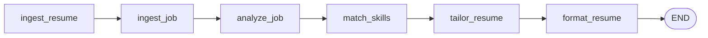
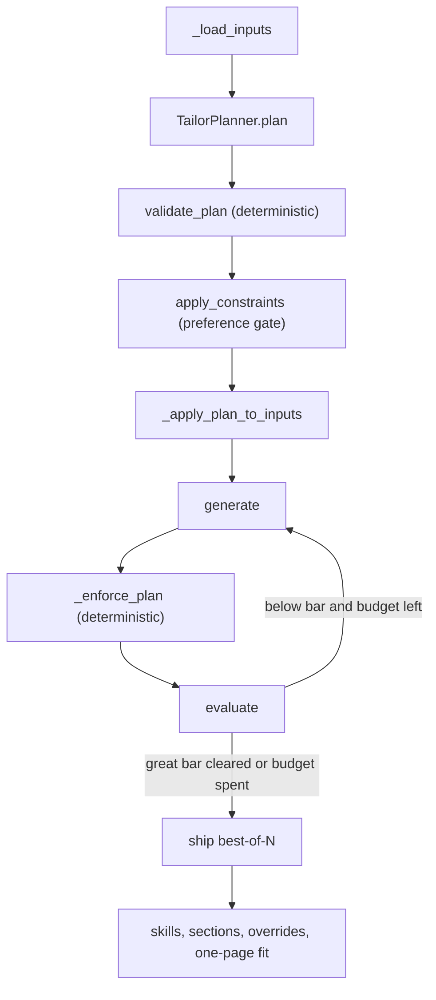
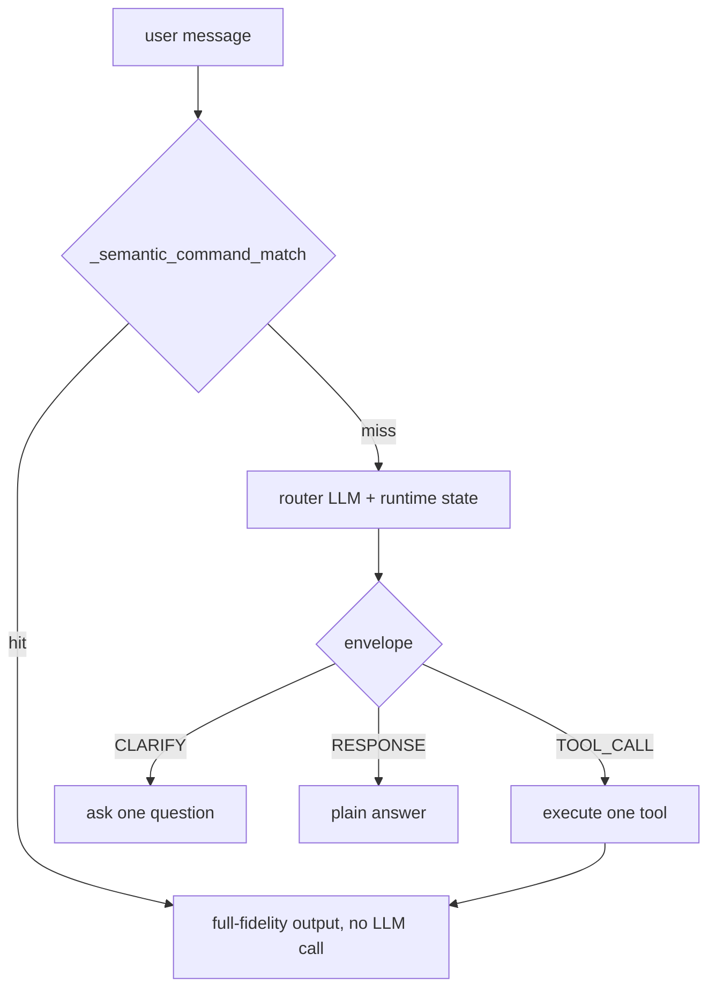
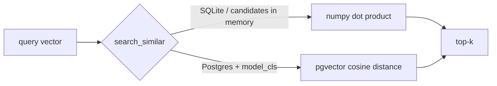
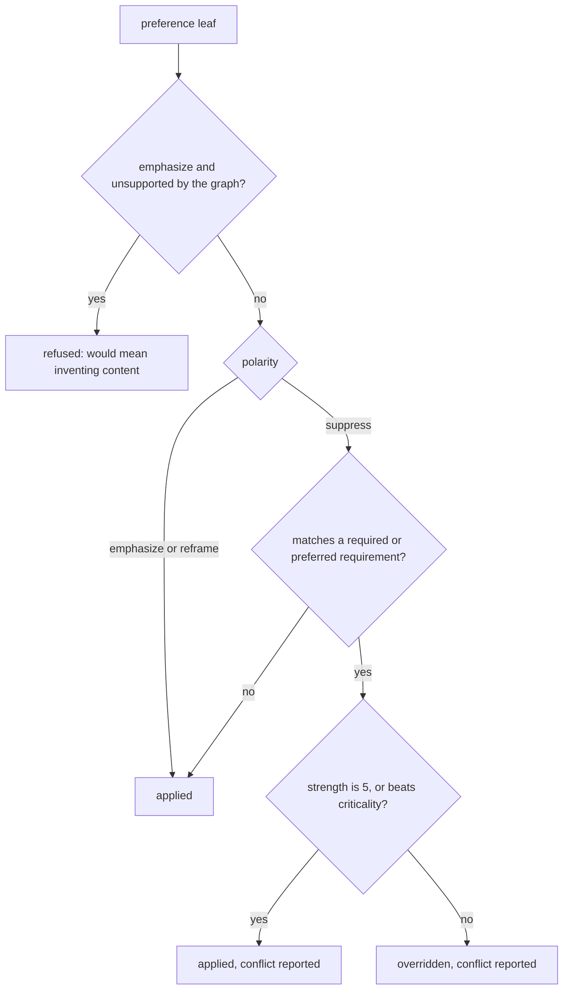
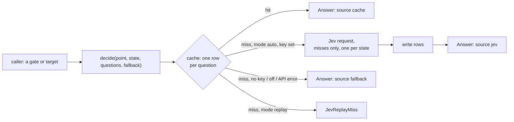

# ART — Architecture

How the system actually works: what it remembers, what it reasons over, and how a job
description becomes a tailored resume.

This document describes **merged behaviour**, traced into the code rather than taken from
the issue that proposed it. Where `CHANGELOG.md` and the code disagree, the code wins and
the disagreement is stated. Work that is specified but not shipped lives in the
[In flight](#in-flight) section at the end, and nowhere else.

Companion documents: [`benchmark.md`](benchmark.md) (what the numbers mean),
[`../eval/README.md`](../eval/README.md) (how to run the harnesses).

> **Target architecture: [`harness.md`](harness.md) (epic #207).** ART is moving to a local,
> model-free package driven by the user's coding agent, and most of that has merged. There are
> now two paths over one database:
> - **The legacy path (§§2–7)** is the web app and `cli.py`: LLM agents plan, generate and
>   evaluate. It still works as before, and the hosted web app gets no new features.
> - **The harness path (§8)** is `art-mcp` and `art`: the host's model writes, and ART checks.
>   The generate → evaluate loop (§3.2) becomes host-written plan programs run by an executor,
>   the ATS composite is report-only (never a reward, §6), planning prompts give way to
>   `suggest_actions`, and the editor is `art ui` in local mode.
>
> This file keeps describing merged behaviour, and is updated as each harness issue lands. It
> was last brought level with `CHANGELOG.md` through #244.

---

## 1. Orientation

ART turns a candidate's scattered career evidence — a resume file, GitHub repos, a
LinkedIn profile, and whatever they say in chat — into a **skills knowledge graph**, then
tailors that graph into a one-page, ATS-friendly resume for one specific job. Every
tailoring run is planned as **typed, per-item edit actions**, executed under deterministic
guards, scored by an algorithmic ATS engine, and logged as a
`(context, actions, propensity, reward)` tuple.

Two vocabularies organise everything below:

- **Memory units** — what the system carries *between* turns and *between* jobs.
- **Reasoning units** — what turns those memories plus a job description into a resume.

### Concept → module map

| Concept | Kind | Code | Written by | Read by |
|---|---|---|---|---|
| Skills knowledge graph | memory | `knowledge_graph/builder.py`, `UserSkill`/`Project`/`Experience` in `database/models.py` | `agents/parser.py`, `ingestion/*`, `services.apply_artifact_decision` | `agents/matcher.py`, `agents/tailor.py::_assemble_kg_evidence` |
| Chat → KG extraction | memory (write path) | `agents/knowledge_extractor.py` | `services.apply_artifact_decision` (explicit accept only) | the graph above |
| JobCard (per finished job) | memory | `agents/job_card.py`, `JobCard` model | `services.rebuild_job_card` | `agents/tailor.py::_select_job_cards` → planner prompt |
| Decision log | memory | `UserJobResult.tailoring_decisions`, built by `tailor_planner.decision_log_entry` | `agents/tailor.py::tailor` | `agents/chat.py` (`EXPLAIN`), `agents/job_card.py`, future policy work |
| Preference store (leaves) | memory | `agents/preferences.py`, `UserPreference` model | `services.apply_preference_decision` | `services.get_active_persona` |
| Persona index (traits) | memory | `agents/persona.py`, `PersonaTrait` + `Persona` models | `services.rebuild_persona` | `agents/tailor.py::_compile_preference_constraints` |
| Layout overrides | memory | `agents/layout.py`, `UserJobResult.layout_overrides` | `PUT /api/jobs/{id}/layout` only | `agents/tailor.py::tailor` |
| Chat history + compression | memory | `agents/chat.py`, `ChatMessage` model | `services.save_chat_message` | the chat router prompt |
| JD profile | memory (job side) | `agents/jd_profile.py`, `JDProfile` model | `services.rebuild_jd_profile` | `agents/keyword_weights.py`, `agents/arbitration.py` |
| Outer pipeline | reasoning | `graph/pipeline.py` (LangGraph) | — | `cli.py`, `agents/chat.py` |
| Analyze / match | reasoning | `agents/job_analyzer.py`, `agents/matcher.py` | — | writes `JobSkill`, `UserJobResult` |
| Planner | reasoning | `agents/tailor_planner.py` | — | `agents/tailor.py` |
| Generate → evaluate loop | reasoning | `agents/tailor.py` (LangGraph) | — | `agents/formatter.py` |
| Chat router + action set | reasoning | `agents/chat.py` | — | everything above |
| KG retrieval seam | retrieval | `database/vector_search.py`, `agents/skill_embeddings.py` | `ensure_skill_embeddings`, `ensure_job_embedding` | matcher, skill scorer, JobCard ranking |
| Preference extraction | retrieval (push) | `agents/preferences.py::extract_preference_notes` | `services.propose_preferences` | arbitration |
| Arbitration | reasoning | `agents/arbitration.py` | — | `agents/tailor_planner.py::apply_constraints` |
| Exploration policy | policy | `agents/tailor_planner.py::_choose_strategy` | — | decision log |
| Deterministic ordering | invariant | `database/db.py::next_seq` / `latest_result` | every write site | every `created_at`-ordered read |
| Tool contract + adapters | harness | `harness/contract.py`, `harness/mcp_server.py`, `harness/cli.py`, `harness/entry.py` | — | the host's coding agent, scripts, tests |
| Tailoring tree | harness (memory) | `harness/tree.py`, `TailorNode` / `JobHead` / `TreeEvent` / `PlanProgram` | `harness/executor.py`, the editor | `get_head`, `history`, `art ui` |
| Executor + acceptance rule | harness (reasoning) | `harness/executor.py`, `harness/acceptance.py`, `harness/program.py` | — | `execute_plan`, `patch_plan` |
| Jev decisions engine | harness (judgment) | `harness/decisions/` (client, cache, engine, recordings) | the points below | every gate or target a Jev answer feeds |
| Bullet library, baselines | harness (memory) | `harness/library.py`, `BulletVariant` / `TrackBaseline` / `JobRoleFamily` | `upsert_items` (kind `variant`), `promote_bullet`, `approve_variant`, `save_baseline` | `suggest_actions`, `open_job`, the executor |
| Memory gate | harness (memory write path) | `harness/memory.py`, `harness/decisions/memory_gate.py` | `observe`, `record_preference`, the `user-prompt` hook | `art_briefing`, `art_pins`, the executor's pins |
| Skill retrieval | retrieval | `agents/skill_matching.py`, `knowledge_graph/builder.py` | — | `kg_default_content`, `open_job` |
| Export and import | harness (storage) | `harness/export_import.py` | `art export`, `art import` | the user |
| The clock | invariant | `database/clock.py` | every `created_at` and "now" | every datetime comparison |

**There are three LangGraph graphs, not one.** `graph/pipeline.py` composes the whole flow
(`ingest_resume → ingest_job → analyze_job → match_skills → tailor_resume → format_resume`)
and is used by `cli.py` and `agents/chat.py`. The web API does **not** use it —
`web/routers/jobs_router.py` calls `JobAnalyzerAgent`, `SkillMatcherAgent` and
`ResumeTailorAgent` directly. The second is the generate↔evaluate loop *inside*
`ResumeTailorAgent`, and every surface reaches that one. The third is the
`extract → reason → decide` subgraph in `agents/knowledge_extractor.py` (§2.2), which
degrades to running the same nodes in sequence if LangGraph is unavailable.

---

## 2. The memory units

### 2.1 The skills knowledge graph

`SkillGraphBuilder` (`knowledge_graph/builder.py`) builds an in-memory `networkx.DiGraph`
for **one user** — every query is scoped by `user_id`, which is issue #73's fix, not an
optimisation. Nodes are `Skill:`, `Project:` and `Experience:`; edges are
`Project --USES--> Skill` and `Experience --DEMONSTRATES--> Skill`, derived by substring
matching a skill name against the item's own text (with a guard so short names like `C`
need surrounding whitespace).

The durable half lives in the database. `UserSkill` carries the evidence:

```json
{
  "user_skill_id": "…", "user_id": "…", "skill_id": "…",
  "proficiency": 4,
  "evidence_source": "github",
  "evidence_detail": "alexrivera/semsearch",
  "confidence_score": 0.85,
  "is_core": false,
  "source_context": "chat:1f0c…"
}
```

- **Written by** `agents/parser.py` (resume, LinkedIn), `ingestion/github.py`, and
  `services.apply_artifact_decision` for chat-captured artifacts.
- **Read by** `agents/matcher.py` (skill matching) and `agents/tailor.py` (the mandatory
  evidence step, §4).
- **Lifetime** — permanent, user-scoped, and deliberately **not** cascaded from jobs:
  `source_context` is free-form text, never a foreign key, so deleting a job or its chat
  history cannot remove a knowledge-graph row.
- **When missing** — `evidence_for_skills` returns `{}`, every downstream step is a no-op,
  and the planner payload is byte-for-byte what it would be without the graph.

`agents/project_scorer.py` reuses the graph as a *degree* signal: `linked_skills` — how
many distinct skills evidence a project — is one of its complexity sub-signals, so a
project that anchors many skills ranks above one that anchors none.

**Project context.** The graph also holds `Education:` and `Achievement:` nodes and two
stored edges: `Project --PART_OF--> Experience | Education` (where the project was done)
and `Achievement --AWARDED_FOR--> Project` (a hackathon placing). They live on the rows —
`Project.experience_id` / `education_id` (at most one) and `Achievement.project_id` —
and `Project.context_status` (`unreviewed` / `linked` / `personal`) separates a project
the user confirmed as their own from one nobody has reviewed; two null ids cannot.

- **Written by** `agents/project_context.py` only: `set_project_context` and
  `link_achievement`, reached through the `set_project_context` and `link_achievement`
  harness tools on an explicit user confirmation. `suggest_project_contexts` proposes
  links from two deterministic rules (an employer's distinctive name word in the repo
  name or its full name in the description; a course code, mapped to the degree at the
  matching level, graduate at 200+) and never writes — the same write barrier as §2.2
  and §2.5.
- **Kept valid** by heal and delete: a merge repoints links onto the surviving row; deleting
  a role or degree returns its projects to `unreviewed`; deleting a project unties its
  award.
- **Read by** the builder (edges), `harness/tools.py` (a project's `context`, a role's or
  degree's `projects`, an award's `project`; a role is findable by its projects' names),
  and `agents/tailor.py` (§4.1).
- **When missing** — no stored links means the Skill/Project/Experience subgraph, the
  evidence, and the planner payload and prompt are byte-for-byte what they were before.

### 2.2 Chat → knowledge graph (issue #21)

`agents/knowledge_extractor.py` is a **Chain-of-Note** pipeline composed as a small
LangGraph `StateGraph`: `extract → reason → decide`.

- `extract` writes grounded notes about what the transcript claims. **Every note needs a
  verbatim evidence quote**; an ungrounded note is dropped, never offered.
- `reason` judges each note against the facts already in the user's graph
  (`load_known_facts`).
- `decide` is **deterministic, not a model call**. On an exact name match the rules win
  outright: a match that changes nothing becomes `no_op` (so a hallucinated `add` can
  never duplicate a row), a match that changes something becomes `supersede`. The model
  keeps authority only where equality *cannot* match — a promotion or rename changes the
  very name the check keys on — and even then its `supersede` is honoured only if its
  `target` resolves to a real fact of the same type.

Both model passes go through the `llm.get_extractor` seam (§4.3), so output is
schema-validated; there is no `json.loads` on this path and a test parses the module's AST
to keep it that way. If LangGraph is unavailable the same nodes run in sequence.

Nothing here writes to the database. `services.apply_artifact_decision` is the only write
path and it is reached only by an explicit user accept (`/save` in chat, or
`POST /api/chat/{job_id}/artifacts/decide`).

### 2.3 JobCards — one card per completed job (issue #137)

The axis that scales for this product is **jobs per user**, not turns per session. A
JobCard is the sufficient statistic that survives from one job to the next.

```json
{
  "version": 1,
  "job": {"title": "Data & AI Engineer", "company": "Arizent",
          "terminal_status": "tailored", "verification_status": "pending"},
  "role_family": "ai_engineering",
  "ats": {"composite": 79.4, "baseline_composite": 52.1, "delta": 27.3,
          "skill_coverage": 100.0, "keyword_coverage": 64.6},
  "emphasized": {"experiences": ["Machine Learning Engineer"],
                 "projects": ["SemanticSearch-Lite"],
                 "skills": ["PyTorch", "FastAPI"], "led_with": "experience"},
  "rejected_items": [{"item_key": "proj:streamboard", "op": "delete",
                      "source": "user", "status": "active"}],
  "user_score": 4,
  "runs": 2,
  "timestamps": {"created_at": "…", "updated_at": "…"}
}
```

*(Field names and shape from `agents/job_card.py::compile_card_payload`; the `ats` values
are the real ones from the `arizent_data_ai_engineer` task in the plumbing run recorded in
[`benchmark.md §3`](benchmark.md#3-a-worked-run) — a plumbing number, so it describes the
harness, not a rewrite. `emphasized`, `rejected_items` and `user_score` are illustrative.)*

Three properties define this module:

1. **A card is a projection, not a summary.** `compile_card_payload` rearranges
   `UserJobResult` and the job's final state. No LLM sees the transcript, so two compiles
   of the same rows are byte-identical under `payload_digest`. The single exception is
   `role_family`, a cached, versioned classify through the extraction seam — cached
   precisely so a rebuild is not a model call.
2. **The negation signal is the point.** `rejected_items` records what the user took
   *out*, derived from `delete`/`replace` ops in the decision log, keeping only each
   item's **latest** action (deleted once and restored next run is not a standing
   rejection) and tagged `user` versus `planner`. A planner dropping an item to fit a
   budget is a per-job optimisation and must never be promoted to a stated preference.
3. **Selection is bounded and multi-key.** `select_cards` blends role-family match,
   JD-embedding similarity, fact-level `index_keys` overlap and recency; `render_cards`
   caps the result at a token budget, so prompt cost is flat in the number of accumulated
   jobs. A **user-sourced rejection is never dropped to fit the budget.**

Rejections are deliberately absent from `index_keys`: a similarity index cannot represent
"not this", so rejections ride *on* the card and are pushed with it.

- **Written by** `services.rebuild_job_card`, event-driven, hooked in `tailor()` right
  after the result commits and again in `_record_tailor_score` (the 1–5 score arrives
  after the run that built the card).
- **Read by** `agents/tailor.py::_select_job_cards` → the `PRIOR SIMILAR JOBS` block in the
  planner prompt.
- **When missing** — a first-time user pays nothing, not even the role classify, and the
  planner prompt is byte-identical to the pre-#137 prompt. A test pins that.

### 2.4 The decision log

`UserJobResult.tailoring_decisions` is an append-only JSON list. One entry per tailoring
run, built by `tailor_planner.decision_log_entry`:

```json
{
  "timestamp": "2026-08-14T11:24:22.913",
  "revision_notes": "",
  "planner": "llm",
  "exploration_mode": false,
  "n_attempts": 2,
  "knobs": {"default_revise_strategy": "keyword_weave",
            "allow_replace": true, "allow_delete": true},
  "actions": [
    {"section": "project", "item_key": "proj:semanticsearch-lite",
     "label": "SemanticSearch-Lite", "op": "revise",
     "strategy": "keyword_weave", "strategy_source": "llm",
     "llm_strategy": "keyword_weave",
     "keywords": ["vector search", "embeddings"],
     "rationale": "The posting leads with retrieval; this project is the candidate's only shipped retrieval system.",
     "propensity": 1.0,
     "persona": {"has_active_suppress_target": false,
                 "has_active_emphasize_target": false,
                 "has_active_reframe_target": false, "trait_keys": []}}
  ],
  "context": {"n_experiences": 4, "n_projects": 3, "n_replacement_pool": 1,
              "n_missing_skills": 7, "n_priority_keywords": 6,
              "baseline_composite": 52.1, "is_revision": false, "attempts": 2,
              "n_graph_evidence": 5, "n_job_cards": 0, "n_preferences": 0},
  "reward": {"composite": 79.4, "baseline_composite": 52.1, "delta": 27.3,
             "skill_coverage": 100.0, "keyword_coverage": 64.6,
             "section_presence": 100.0, "role_level": 0.0}
}
```

*(Shape and field names from `decision_log_entry` and `tailor()`'s `context_features`. The
`reward` block and `context.baseline_composite` are the real numbers from the plumbing
worked run in [`benchmark.md §3`](benchmark.md#3-a-worked-run); the actions, the rationale
and the remaining context counts are illustrative — a plumbing run's planner is stubbed.)*

- **Written by** `agents/tailor.py::tailor`, on every run, on every surface.
- **Read by** `agents/chat.py` (`EXPLAIN` renders the rationales), `agents/job_card.py`
  (rejections and the final `user_score`), and — in future — the policy work of §6.
- **`constraints`** is added as a key **only when non-empty**, so a user with no
  preferences produces the byte-for-byte pre-#129 entry.
- **When missing** — the column defaults to `[]`; `EXPLAIN` says there is nothing to
  explain and a JobCard compiles with no rejections and a null `user_score`.

Two logging decisions are load-bearing for anything trained on this data. A chat-approved
plan logs `propensity: null` rather than `1.0` — a human's choice is off-policy and
attributing it to the policy would bias an importance-weighted estimate. And
`exploration_mode` / `n_attempts` are recorded explicitly so best-of-N data (a reward that
is a max over N draws) is never pooled with N=1 exploration data.

### 2.5 The preference store and the persona index

Two tiers, one lossless index over the other.

**Leaves (`UserPreference`, issue #129).** One row per standing preference — not an array
on the profile, because an array makes superseding one entry a read-modify-write of the
whole blob and forces the edit API to address entries by list index.

```json
{
  "preference_id": "…", "user_id": "…",
  "text": "the recipe app was just a class project, don't lead with it",
  "polarity": "suppress", "target_type": "project",
  "target_key": "proj:recipe-app", "target_term": "recipe app",
  "scope_type": "global", "scope_value": null,
  "strength": 4, "status": "active",
  "supersedes_id": null, "confidence": 0.82,
  "provenance": {"source": "chat", "job_id": "…"},
  "edited": false, "extraction_version": 1
}
```

**Nothing is ever deleted.** A contradicted preference goes `superseded`, a withdrawn one
`retracted`, and both stay on the table — negation must not expire, and the transitions
are what a learned preference weight would be induced from.

**Traits (`PersonaTrait` + `Persona`, issue #133).** One deterministic abstraction level
that **preserves every leaf**. A trait holds `leaf_ids` and `superseded_leaf_ids` and *no
preference content of its own*, so the index can never disagree with what it indexes.
`group_key` is `polarity|target_type|scope_type[:scope_value]` — a pure function of typed
leaf fields, so the same leaves always produce the same trait and a new leaf never
re-shuffles the others. That stability is not tidiness: trait membership is a policy
context feature, and emergent clustering over a small growing set would churn assignments
on nearly every insert.

The `Persona` row is a **cache; the leaves are the authority.** `get_active_persona`
**never writes** — a leaf-digest mismatch means the stored row is stale, so it is ignored
and the persona is recompiled in memory for that call. A missed rebuild costs
inspectability until the next write and can never cost a preference.

**The write barrier.** `tailor()` only reads. Proposing never writes. `/decide` is the
only path in. The reason is sharper here than anywhere else in the system: these
preferences are *inferred*, so a pipeline allowed to write this table would suppress an
item, observe the suppression, infer a standing preference from it, and cite that back as
the user's own instruction. Tests pin it.

**The harness path (#202)** adds one more way in: the memory gate (`harness/memory.py`) reads
the user's own message, never ART's or the host's output, so nothing launders. It stays bounded
by the same worry: it writes only at strength 4 or less, never replaces a preference the user
holds, never writes a strength-5 preference or a negative pin (those go to the host for the
user to confirm through `record_preference`), and stamps what it wrote
(`provenance.source == "memory_gate"`).

### 2.6 Layout overrides (issue #118)

`UserJobResult.layout_overrides` is nullable JSON, `{section_order, skills, bullets}`,
every key optional. It encodes **arrangement**, not content — so unlike `edited_tex`
(which `tailor()` nulls on every re-tailor by design) it stays valid when the content
beneath it changes and survives a re-tailor.

`agents/layout.py` is pure, and its reconciliation rule is the same in all three
dimensions: an entry naming something no longer present is dropped, and something present
that the override does not name is appended in pipeline order. **That second rule is the
safety property** — the reconciler only ever permutes, so a stale override can never
silently remove content from a resume. Identity is by text, never by ordinal, with a
deterministic Jaccard ≥ 0.6 fallback for the revised-in-place case.

The pipeline reads it and never writes it, for the same laundering reason as §2.5. Two
tests pin that.

### 2.7 Chat history and its compression

`ChatMessage` rows are per `(user, job)`, with `job_id` NULL for the landing conversation.
`agents/chat.py` keeps an in-process `self.history` and compresses it:

- `_COMPRESS_AT` (default 30) messages triggers compression; `_COMPRESS_KEEP` (default 8)
  survive verbatim.
- The older messages are summarised by one LLM call at temperature 0, with a
  **proportional per-message character budget** so a long message is not hard-truncated.
- A **prior summary is rolled forward** into the next summarisation, so context survives
  repeated compression.
- The summary is persisted through `services.save_chat_summary`.
- `_build_context_window` selects the most recent messages that fit under
  `ART_CONTEXT_BUDGET` (default 6000 tokens, approximated as `len(content) // 4`, minus a
  reservation for the system prompt and the injected summary).

Compression failure is caught and logged; the conversation continues uncompressed.

### 2.8 The JD profile (the job side)

`JDProfile` is the job's counterpart to the candidate's knowledge graph: one row per job
holding the compiled `payload` (requirements + title terms), its `payload_hash`, the
`extraction_key`, `extraction_version`, `role_level`, and the `weights` blob #125 fills.

```json
{
  "requirements": [
    {"text": "Build and maintain ETL pipelines in Python",
     "type": "required", "criticality": 5,
     "terms": ["python", "etl"], "source_section": "responsibilities",
     "confidence": 0.9, "ordinal": 0, "edited": false}
  ],
  "title_terms": ["data", "ai", "engineer"]
}
```

Three properties matter:

- **Determinism is enforced by the cache, not the model.** `extraction_key` is a
  whitespace-normalised digest of the JD text plus `PROFILE_VERSION`, and it
  short-circuits before extraction. "Two runs produce byte-identical profiles" can only
  mean the second run never reaches a model, and the load-bearing test counts extractor
  invocations rather than comparing payloads.
- **Source order is a pinned invariant.** `requirements[]` keeps the posting's order and
  each row carries its `ordinal`. Ordinal position is one of the importance signals in
  §5, and it is the only one that cannot be recovered later.
- **A human correction is never silently overwritten.** `merge_edits` carries `edited`
  requirements through a re-extraction, matching by **text** (never ordinal), stashing the
  pre-edit text as `original_text`. Re-extraction is explicit (`force=True`) and versioned.

---

## 3. The reasoning units

### 3.1 The outer pipeline


```mermaid
flowchart LR
    A[ingest_resume] --> B[ingest_job]
    B --> C[analyze_job]
    C --> D[match_skills]
    D --> E[tailor_resume]
    E --> F[format_resume]
    F --> G([END])
```

`graph/pipeline.py`, used by `cli.py` and `agents/chat.py`. The web API composes the same
three agents directly. Node by node:

| Node | Input | Output | Failure mode | Deterministic? |
|---|---|---|---|---|
| `ingest_resume` | resume path | parsed rows in the DB | `require_active_user()` **fails closed** (`NoActiveUserError`) rather than resolving to an arbitrary user | LLM extraction, then deterministic dedupe/heal |
| `ingest_job` | text or file | raw JD text | file-read errors propagate | deterministic |
| `analyze_job` | JD text | `JobDescription` + `JobSkill` rows, `JDProfile` | extraction failure degrades to no profile; the job still analyzes | three LLM calls — metadata, JD skills, and the JD profile. Only the profile is cached (on `extraction_key`), so re-analysing an unchanged posting still re-extracts metadata and skills |
| `match_skills` | user + job | `UserJobResult` with `matched_skills`, `missing_skills`, baseline `score_breakdown` | — | deterministic given embeddings; `seq` assigned here (§7) |
| `tailor_resume` | the result row | tailored content | any generation error becomes `{"error": …}` and formatting is skipped | the loop in §3.2 |
| `format_resume` | tailored content | LaTeX source | skipped when content errored | deterministic |

`analyze_job` and `match_skills` are where the reward's *baseline* is fixed. `matcher.py`
sorts job skills by descending weight, then required-first, then name before rendering
them into downstream prompts — without that, the same profile against the same JD sent the
model a different prompt on SQLite than on Postgres (found by replay mode; see
[`benchmark.md §2`](benchmark.md#2-the-three-execution-modes)).

### 3.2 Inside the tailor stage: plan → generate → evaluate


```mermaid
flowchart TD
    LI["_load_inputs"] --> PL["TailorPlanner.plan"]
    PL --> VA["validate_plan (deterministic)"]
    VA --> GA["apply_constraints (preference gate)"]
    GA --> AP["_apply_plan_to_inputs"]
    AP --> GEN[generate]
    GEN --> EF["_enforce_plan (deterministic)"]
    EF --> EV[evaluate]
    EV -->|"below bar and budget left"| GEN
    EV -->|"great bar cleared or budget spent"| BEST["ship best-of-N"]
    BEST --> POST["skills, sections, overrides, one-page fit"]
```

**`_load_inputs`** prepares every generator input in one session, and is shared by
`tailor()` and `plan_preview()` so a chat proposal sees exactly the inputs the eventual run
will use. In order: filter and dedupe experiences → relevance-rank them and attach
per-experience `bullet_budget` → score projects and split into selected + replacement pool
→ **the mandatory KG evidence step** (§4) → the contextual keyword plan → JobCard selection
→ prior tailored content → layout overrides → **the mandatory persona step** (§5).

Both "mandatory" steps run unconditionally, empty profile included. A tier consulted only
when something upstream decides it is relevant is a tier that silently stops binding.

**Plan (`agents/tailor_planner.py`).** One LLM call emits a raw action list; everything
after it is deterministic. One action per item:

```json
{"section": "project", "item_key": "proj:streamboard",
 "op": "replace", "replacement_key": "proj:semanticsearch-lite",
 "rationale": "The posting is retrieval-heavy; StreamBoard is a dashboard.",
 "propensity": 1.0}
```

Ops are `keep | revise | replace | delete`; revision strategies are
`keyword_weave | quantify | tighten | reframe`.

`validate_plan` coerces an untrusted list into something execution can trust blindly:
unknown item keys dropped, duplicates keep the first, unknown ops fall back to `revise`,
`replace` is projects-only and pool-only (otherwise it degrades to `revise`), every input
item ends up with exactly one action, and **`_refuse_empty_sections` coerces one delete back
to `keep` whenever a plan would delete every item in a section**, so no plan can empty the
resume. Any LLM or parse failure
degrades to `default_plan` — one `revise` per item, never a delete or replace, safe to run
blind.

On a re-tailor the planner plans a **delta against the current tailored resume**, which is
the source of truth, rather than regenerating from scratch. That was the root cause of the
"new feedback, same resume" bug (#91).

**Generate.** The generator LLM (temperature 0.3) executes the plan under strict prompt
rules: revise don't rewrite, never fabricate, respect bullet budgets and per-item keyword
assignments. Then `_enforce_plan` supplies what a prompt cannot guarantee:

- items the plan deleted or replaced are dropped from the output **even if the model
  regenerated them**;
- `keep` items restore their prior *tailored* bullets verbatim, trimmed to budget — `keep`
  means keep the tailoring (#115). The experience and project branches differ only in
  their first-run fallback, and that difference is documented as deliberate.

**Evaluate.** `ATSScoringEngine.score_tailored` scores each attempt with the same engine
that scored the baseline, so the two are directly comparable:

| Component | Weight | What it measures |
|---|---|---|
| `skill_coverage` | 0.45 | required/matched skills present in the resume text |
| `keyword_coverage` | 0.30 | JD keywords covered, weighted by importance × supportability (§5.3) |
| `section_presence` | 0.15 | profile completeness |
| `role_level` | 0.10 | seniority alignment between JD and resume |

Alongside the composite the node computes **keyword placement precision** (a keyword
counts only when it lands in the item it was assigned to, not anywhere in the document),
**faithfulness drift** (mean token overlap between a revised bullet and its closest source
bullet, floor `FAITHFULNESS_MIN = 0.2`), and **over-repeated terms**
(`MAX_TERM_MENTIONS = 3`, boundary-aware so `sql` never matches inside `mysql`). All three
feed the retry as targeted, per-item feedback.

The loop exits when an attempt clears the high "great" bar (`skill_coverage ≥ 90` **and**
`placement ≥ 0.80`) or the budget `MAX_RETRIES = 2` is spent. It ships **best-of-N by
composite, never the last attempt** — generation is stochastic and a retry can regress.

**LLM versus deterministic code — the split.** This is the most important thing in this
document:

| Decided by an LLM | Decided by deterministic code |
|---|---|
| which op each item gets (`keep`/`revise`/`replace`/`delete`) | whether that op is legal (pool membership, projects-only replace, never empty a section) |
| which replacement to propose | whether the replacement exists in the pool |
| the prose of every rewritten bullet | which items survive, which bullets are carried forward verbatim, bullet budgets, ordering |
| which keywords to weave | which item each keyword was assigned to, and whether it landed there |
| the revision strategy (unless exploring) | the strategy under exploration; the logged propensity |
| the rationale text | the score, the reward, and which attempt ships |
| JD requirement extraction; role-family classify | criticality clamping, source order, weights, arbitration |

Every LLM decision is followed by a deterministic gate that can overrule it. No
deterministic gate is followed by an LLM that can overrule *it*.

### 3.3 The chat router and its action set


```mermaid
flowchart TD
    M[user message] --> FP{"_semantic_command_match"}
    FP -->|hit| OUT["full-fidelity output, no LLM call"]
    FP -->|miss| RP["router LLM + runtime state"]
    RP --> EN{envelope}
    EN -->|TOOL_CALL| T[execute one tool]
    EN -->|CLARIFY| Q[ask one question]
    EN -->|RESPONSE| A[plain answer]
    T --> OUT
```

Router-first by design. Deterministic fast paths handle command-like input with no model
call at all; everything else goes to a routing LLM restricted to a
`TOOL_CALL / CLARIFY / RESPONSE` envelope over an explicit tool list. Runtime state —
active profile, active job, and a **summary of the current tailored resume** — is injected
into the router prompt every turn, so the assistant answers about the resume that exists
instead of offering to look it up. Malformed router output is classified `RAW` and handled
rather than parsed optimistically.

Within a job chat, tailoring is a strict action set (`agents/chat.py`, lines 1042–1053):

| Action | Function | What it does |
|---|---|---|
| `PROPOSE_PLAN` | `_propose_retailor_plan` | show the per-item delta a re-tailor would apply, before spending a run |
| `APPLY_PLAN` | `_tailor_active_job(_plan_override=…)` | execute exactly the approved plan |
| `SHOW_DIFF` | `_show_tailoring_diff` | what the last run changed (ops only) |
| `EXPLAIN` | `_explain_tailoring` | the rationale behind each change, from the decision log |
| `REVERT` | `_revert_tailoring` | one-level undo via `tailored_resume_previous` |
| `SAVE_ARTIFACT` | `/save` | persist chat-mentioned skills/projects into the graph (§2.2) |
| `ASK_CLARIFY` | the router's `CLARIFY` envelope | one question, never combined with a tool call |

`tailor <request>` on an already-tailored job proposes the plan and asks for approval
(`1` applies, `2` cancels). Chat revisions are reviewable deltas, not regenerations.

A chat-approved plan is deliberately **not** gated against the preference constraints of
§5. It was approved by the same user, in that conversation, looking at those items — an
explicit present decision outranks a preference inferred from something they said earlier.

---

## 4. Knowledge-graph retrieval

### 4.1 The mandatory evidence step (issue #138)

Before #138 the graph informed skill *matching* but never the tailoring *decision*.
`_load_inputs` pre-selected projects by JD-keyword overlap, so a project evidencing a
**required** skill whose name the JD's own prose never repeats scored low, fell into the
replacement pool, and the planner never saw it.

Now, after project pre-selection, `_load_inputs` always:

1. reads the active JD's skills (`JobSkill → Skill.name`);
2. builds the user's graph and calls `evidence_for_skills`;
3. **promotes** a pooled project the graph ties to a JD skill no selected item covers into
   the candidate set (capped at `MAX_PROJECTS`, and dropped from the pool);
4. **annotates** each evidenced candidate with a `graph_evidence` list, which
   `tailor_planner._llm_plan` renders into the per-item payload with an instruction to
   treat it as strong relevance evidence — prefer keep/revise over delete, and never
   replace an item that uniquely evidences a required skill.

Promotion is **projects-only**, and that is deliberate: all experiences already reach the
planner (they are budgeted, not pooled), so for experiences the graph's value is
annotation. The whole step is wrapped in `try/except → {}`; a sparse graph means no
promotion, no `graph_evidence` keys, and a byte-identical payload.

Project context (§2.1) adds two things, both only where the user has confirmed a link:

- **A role evidences a skill through its projects.** `evidence_for_skills` adds
  `experiences_via_projects` (`Experience <-PART_OF- Project -USES-> Skill`), kept apart
  from `experiences` because it is weaker than the role's own text naming the skill. The
  experience reaches the planner with `graph_evidence_via_projects: [{skill, project}]`.
- **A project says where it was done.** It carries `context`: `{"kind": "work" |
  "coursework", "under": <role or degree>}` or `{"kind": "personal"}`. The planner prompt
  gains one rule, only when some item carries either field: work outranks coursework, and a
  skill shown through a project is credited to the project, not the role.

### 4.2 The dual-path retrieval seam (issue #142)

`database/vector_search.py` is one `search_similar()` / `cosine_sim()` seam with two
backends:


```mermaid
flowchart LR
    Q[query vector] --> S{"search_similar"}
    S -->|"SQLite / candidates in memory"| N["numpy dot product"]
    S -->|"Postgres + model_cls"| P["pgvector cosine distance"]
    N --> R[top-k]
    P --> R
```

The JSON `embedding` TEXT column stays the portable source of truth and is the only path
SQLite ever uses; `embedding_vec vector(384)` is a Postgres-only accelerator added by a
guarded migration. On SQLite with a `model_cls` and no candidates, `search_similar` emits
no vector SQL and returns `[]`.

That `[]` is a trap worth stating plainly, because the repo has walked into it twice.
`JobCard` ranking deliberately uses **candidates mode** — card vectors held in memory and
passed in — rather than the table-scan mode, because table-scan mode would have yielded
zero cards across local dev and the entire test suite while every test stayed green. Card
counts are tens per user, so numpy is free and ANN buys nothing. `embedding_vec` has no
production write path yet (In flight, #60).

Vector caching lives in `agents/skill_embeddings.py`: `ensure_skill_embeddings` persists
per-skill vectors tagged with the model that produced them, and `ensure_job_embedding`
builds a JD centroid from the job's required-skill names. Both **sort their inputs before
encoding** — sentence-transformers batches by input order, so unsorted inputs varied the
padding a text was encoded against, run to run (§7).

### 4.3 Why retrieval is pull-based and persona is push-based

Facts are **pulled** from the graph on demand, because a fact is semantically close to the
query that wants it. A preference is **pushed** into the prompt, because a suppression is
semantically *distant* from what it suppresses — "that was just a class project" shares
almost nothing with the project it demotes. Similarity retrieval therefore structurally
misses the preferences that matter most. The literature this rests on measures the gap
directly: ImplexConv reports ~55.2% supportive-case retrieval F1 against **~14.8% opposed**.

The same asymmetry drives two other decisions above: JobCard `rejected_items` are excluded
from `index_keys` (§2.3), and the persona index is lossless rather than a fixed-size
summary (§2.5).

`llm.get_extractor(role, schema)` is the shared structured-extraction seam — it wraps
`get_llm(role).with_structured_output(PydanticModel)` with a bounded validation retry, then
re-raises so each call site's existing `try/except → []` graceful degradation still holds.
All eight extractors were migrated off `JsonOutputParser` onto it. Because extraction stays
on the LangChain path, one LangSmith trace covers extraction, chat and tailoring uniformly.

### 4.4 Skill retrieval without a model (issue #233)

The harness path has no embedding model by default, and the legacy substring link rule
was wrong in a way that mattered: `Java` linked to any text containing `JavaScript`. Two
model-free pieces in `agents/skill_matching.py` replace it, and the legacy builder uses
the same ones.

- **Word-boundary links.** `SkillGraphBuilder._connect_entities` links a skill to a bullet
  or project text through `SkillMatcher`. A name matches on boundaries that treat `+`, `#`
  and `.` as part of it, so `C` is not inside `C++`, `NET` is not inside `.NET`, `Java` is
  not inside `JavaScript`, and `Node.js` is one token; a hyphen is not a name character, so
  "Java-based" names Java. The alias map (`SKILL_ALIASES`) applies to both the skill and the
  text, so a bullet that says "torch" links PyTorch. A name of one or two characters (`R`, `C`,
  `Go`) matches only in its own capitalization, never beside `&`, and `Go` never opens a
  sentence; short aliases such as `tf` are not expanded because they are fragments of other
  words.
- **Bullet provenance.** Each `USES` / `DEMONSTRATES` edge carries `bullets`, the indices of
  the bullets that name the skill, numbered as the harness numbers its cites
  (`<item key>#b<n>`). A link that rests only on a role's title or a project's name has an
  empty list. `evidence_for_skills` returns them as `bullets` (`{key, index, cite}`) and adds
  `education_via_projects`, each only when non-empty, and looks a skill up through the alias
  map. Nothing on the legacy tailoring path reads these yet; they exist for citations (#198)
  and the bullet library (#199).
- **Requirement keywords to skills.** `match_requirement_terms` maps each required and
  preferred requirement's `terms` (the host fills them when it opens a job) onto the user's
  skills, exactly or through the alias map, required before preferred and most critical first.
  A term that names no skill is reported, never guessed, and the host resolves it (`kg_search`,
  or asks the user). `kg_default_content(..., requirements=...)` ranks the matched skills first,
  restores one the TF-IDF cap dropped, and holds the list to the skills cap; `open_job` returns
  `skill_matches` and `unmatched_terms`. With no requirements, or none that match, the
  ranking is the TF-IDF one exactly.

Matching is literal. There is no stemming and no fuzzy match beyond the alias map, so coverage
of unusual spellings is the host's job, which is the point of reporting the unmatched.

---

## 5. Preferences, persona, and arbitration

### 5.1 From language to a typed preference

`agents/preferences.py` runs **one** LLM pass through the extraction seam, then a
deterministic compile, then deterministic supersession.

One pass, not Chain-of-Note's two. `agents/knowledge_extractor.py` needs a reason pass
because a rename changes the very name its equality check keys on; that has no analogue
here. A preference's identity is its **target**, resolved against a supplied catalog
(`target_catalog`), so two preferences about `proj:recipe-app` are about the same thing
however differently they are worded — and `resolve_against_existing` can be deterministic.

The module writes nothing. `services.propose_preferences` returns candidates;
`services.apply_preference_decision` is the only write, and both re-check ownership
because a proposal is client-held round-tripped state whose ids are untrusted.

### 5.2 The persona tier

`agents/persona.py` is pure — no LLM, no database, no clock:
`group_key → build_traits → compile_persona → persona_digest`, plus the `persona_in_scope`
read filter.

Trait labels are **deterministic templates**, not a cached LLM classify. This amends the
issue's own infrastructure note: `group_key` is already deterministic and low-cardinality,
so a classify would buy a nicer phrase at the cost of making "two compiles produce
byte-identical output" a claim about a *cache* rather than about the code. The tier
contains no model call at all.

The `group_key` deliberately **excludes `scope_value` for `job` scope** — keying on the job
id would mint one trait per application, and a grouping whose every trait has exactly one
leaf indexes nothing. `role_family` *does* carry its value, because "downplays projects
when targeting ML roles" and the same for research roles are two dispositions a user
genuinely holds separately.

Traits reach the planner as **prompt grouping and nothing else**. Arbitration and the gate
both read leaves, so the resulting plan is provably unaffected by the grouping; only the
proposal distribution moves. Omitting the traits argument renders byte-identically to
pre-#133.

### 5.3 Arbitration

`agents/arbitration.py` is pure and deterministic by construction — which is what makes
"two runs over the same `(preferences, JD profile, KG)` produce an identical constraint
set" a one-line assertion rather than a hope about temperature.


```mermaid
flowchart TD
    P[preference leaf] --> T{"emphasize and unsupported by the graph?"}
    T -->|yes| REF["refused: would mean inventing content"]
    T -->|no| POL{polarity}
    POL -->|"emphasize or reframe"| APP[applied]
    POL -->|suppress| REQ{"matches a required or preferred requirement?"}
    REQ -->|no| APP
    REQ -->|yes| STR{"strength is 5, or beats criticality?"}
    STR -->|yes| WIN["applied, conflict reported"]
    STR -->|no| LOSE["overridden, conflict reported"]
```

The precedence chain in order:

1. **Truthfulness first.** An `emphasize` naming something the knowledge graph does not
   hold is *refused* — recorded in `refused[]` and dropped before arbitration. This is the
   fabrication boundary and it is not negotiable. It refuses the instruction up front
   rather than relaxing `FAITHFULNESS_MIN` downstream.
2. **Hard preferences (`strength == 5`) always win**, and the requirement they block is
   *reported*, never silently dropped.
3. **Soft preferences (1–4) are weighed against `criticality`.** The preference loses when
   the requirement is at least as central as the preference is firm.
4. **Ties resolve toward the JD** — the artifact's purpose is getting the interview. With
   rule 3 that makes the test `strength > criticality`.

**Only `suppress` is arbitrated.** `emphasize` and `reframe` cannot remove a requirement's
evidence from the resume — they promote or rewrite content that stays — so there is nothing
for a requirement to contest. Narrowing arbitration to the polarity that can actually cost
the match keeps the conflict report meaningful.

A worked verdict:

```json
{
  "applied": [
    {"preference_id": "…", "text": "don't lead with the recipe app",
     "polarity": "suppress", "target_key": "proj:recipe-app",
     "strength": 4, "trait_key": "suppress|project|global"}
  ],
  "conflicts": [
    {"preference_id": "…", "text": "leave Kubernetes off",
     "polarity": "suppress", "target_term": "kubernetes", "strength": 3,
     "requirement_text": "Experience deploying services on Kubernetes",
     "requirement_type": "required", "criticality": 5,
     "winner": "jd",
     "effect": "Overridden — the job requires this, so it was kept."}
  ],
  "refused": [
    {"preference_id": "…", "text": "lead with my Rust work",
     "polarity": "emphasize", "target_term": "rust",
     "reason": "unsupported_by_knowledge_graph",
     "detail": "Nothing in your profile evidences this, so honoring it would mean inventing content."}
  ]
}
```

*(Shape and the literal `effect` / `detail` strings from `compile_constraints`; the
preference texts are illustrative.)*

### 5.4 Prompt block **and** deterministic gate

Neither is sufficient alone. `render_constraints` builds the prompt block — the proposal
distribution. `tailor_planner.apply_constraints` is the guarantee:

- `suppress` on a bound item forces `op = delete`;
- `emphasize` on a bound item forbids `delete`/`replace` and pins the strategy to
  `reframe`;
- `reframe` pins the strategy when the item is being revised, and **never** converts `keep`
  into `revise` — `keep` carries a re-tailor's prior bullets forward verbatim, and a
  reframe is not a mandate to discard the user's existing tailoring.

The gate runs on the **deterministic fallback plan too**: that path runs precisely when the
model failed, which is no reason for standing preferences to stop binding. Then
`_refuse_empty_sections` runs *again*, because the gate's deletes can empty a section the
validated plan did not.

Two things the tier deliberately loses to:

- **The empty-section invariant outranks it.** "Drop the retail job" when it is the user's
  only experience is coerced back to `keep`. The same rule applies to skills: a suppression
  set broad enough to erase every skill is far likelier to be an extraction error than an
  instruction (`_suppress_skills` returns the original list rather than an empty one).
- **A chat-approved plan is not gated at all** (§3.3).

Skill-targeted suppressions have no item action to bind to, so they are applied separately
in `tailor()` against `skills_ranked` — after the carry-forward branch, so a preference
stated *since* the last run still takes effect on a re-tailor that reuses the prior order.

`apply_constraints` also returns an `unenforced[]` list: every applied constraint that
bound to nothing on this resume. Reporting those is deliberate — an applied preference
that quietly did nothing is exactly the silent-symptom failure this tier exists to remove.

### 5.5 Keyword weights: where the JD profile becomes a reward

`agents/keyword_weights.py` computes `w(t) = importance_in_JD(t) × supportability(t)` and
`services.resolve_keyword_weights` persists it onto `JDProfile.weights`.

- **Importance** reads the #121 profile: requirement `type` (required 1.0 / preferred 0.55
  / incidental 0.15), `criticality` (1–5 → 0.6–1.0), section placement, ordinal position
  (linear decay to a 0.75 floor), saturating in-JD repetition (cap 1.25×), and the job
  title — which carries both a base floor and the largest multiplier in the module (2.0×).
- **Supportability** tiers each term against the candidate's evidence (`build_support_index`):
  **strong** 1.0 (tokens of a skill the graph ties to a project or experience, plus the
  vocabulary of that logged work), **adjacent** 0.5 (a claimed skill nothing backs, or a
  lexical naming variant like `pytorch`/`torch`), **none** 0.0.

**The zero bucket is structural, not a tuning choice.** A term with no candidate evidence
weighs exactly 0.0, so the reward can never pay for covering it — fabrication stops being
merely a weak strategy and becomes a strictly worthless one. Its *importance* is still
recorded as non-zero, keeping "we do not pay for fabrication" distinct from "this term does
not matter".

Weights fall back to uniform in two cases: no weights supplied (a pre-#121 job or a failed
extraction), and *every* term weighing zero (a candidate with an empty graph) — `0/0` is
not a score. `matched_keywords` / `missing_keywords` stay **unweighted** in both modes,
because that list is the keyword planner's input and weighting it would silently change the
insertion plan.

---

## 6. Exploration and learning

### 6.1 What is logged

Every run appends the `(context, actions, propensity, reward)` tuple of §2.4. The reward is
the algorithmic ATS breakdown of the *shipped* attempt, plus — after a chat revision — an
explicit **1–5 user score**, written into that run's entry by `_record_tailor_score`
(one-shot: any other message dismisses the prompt).

### 6.2 ε-greedy exploration (issue #112)

Before #112 every logged propensity was `1.0`, because the policy was deterministic: the
same context always produced the same strategy. **A log with no action variance cannot
train a bandit.**

`_choose_strategy(item, knobs, rng, explore)` is the single source of truth for the
strategy decision *and* its propensity — both `default_plan` and `validate_plan` route
through it, so the logged density can never drift from the distribution that produced the
action.

- The greedy arm is **context-dependent**: `default_revise_strategy` (`keyword_weave`) for
  items carrying assigned keywords, `tighten` for items without. Propensity is computed
  against the arm that is greedy *for that item*, not a single global default.
- `P(greedy) = 1 − ε + ε/4`, `P(other) = ε/4` over the four strategies.
- Sampling is **per item and independent**, so each action carries its own propensity —
  the granularity per-edit reward attribution needs.
- ε defaults to 0.2 via `TAILOR_EXPLORE_EPSILON`; the RNG is injected into
  `TailorPlanner.__init__` so exploration is reproducible under a seed.

An illustrative draw at ε = 0.2 for an item with assigned keywords (greedy =
`keyword_weave`):

```json
{"item_key": "exp:nimbus-analytics|machine-learning-engineer",
 "op": "revise", "strategy": "quantify",
 "strategy_source": "sampled", "llm_strategy": "keyword_weave",
 "propensity": 0.05}
```

Three constraints hold this together:

1. **Scope is the `strategy` field only, for `op == "revise"`.** Exploring over
   `delete`/`replace` risks structurally damaging a resume for exploration's sake.
2. **The sampler overrides the LLM** on an exploration run. Without the override we would
   log a known density for a decision whose distribution we cannot observe. The LLM stays
   the proposal distribution for `op`, `replacement_key` and `keywords`, and its own pick
   is retained as `llm_strategy` — free off-policy data on its implicit policy.
3. **Exploration forces N = 1** (`_max_attempts()`). Best-of-N makes the logged reward a
   max over N draws rather than a sample of `E[reward | plan]`, and N is itself an outcome
   — a strong first draw exits early, a weak one spends the budget — so conditioning on the
   reward would condition on a collider. No post-hoc logging of per-attempt scores fixes
   that.

User-in-the-loop paths never explore: a run carrying `revision_notes` takes the greedy arm
at propensity 1.0 (sampling `tighten` when someone asked for more numbers is user-hostile),
`plan_preview()` opts out, and a chat-approved plan logs `null`.

### 6.3 What is *not* learned

**No policy update loop is closed.** Nothing in the repo reads the decision log and changes
what the planner does. Concretely, today:

- the strategy knobs (`default_revise_strategy`, `allow_replace`, `allow_delete`) are fixed
  defaults, recorded per run so the log is usable later;
- exploration is **off by default** (`TAILOR_EXPLORATION_MODE`), and turning it on suspends
  the best-of-N guarantee — a real product regression, which is why it must be time-boxed;
- the 1–5 user score is collected and stored, and is read only by the JobCard compile;
- there is no off-policy evaluation, no learned preference weight, and no per-edit reward.

The system is instrumented for a contextual bandit. It is not running one.

---

## 7. Determinism and reproducibility

This section exists because the repo has paid for its absence four separate times, and
every instance had the same shape: **an ordering not fully determined by content, relied on
as if it were.**

### 7.1 Insertion ordinals and `latest_result` (issue #180)

`created_at` has no tiebreaker, and on Windows `utc_now()` is coarse enough that 200
consecutive calls can return one value. Reads ordered only on it returned tied rows in
arbitrary order — a conversation could render with the assistant's reply above the user's
question.

Six tables (`ChatMessage`, `Experience`, `Education`, `Achievement`, `Project`,
`UserJobResult`) now carry a `seq` insertion ordinal, assigned at write time through one
shared `database/db.py::next_seq` helper at all 12 write sites. Insertion order is the only
thing that carries the meaning here — two identical chat messages are legitimately
identical, and nothing in a resume row says which of two entries came first in the source
document — so it is **recorded rather than inferred**.

Reads order on `(seq IS NULL, seq, created_at, <pk>)`. The leading term is load-bearing:
SQLite and Postgres disagree about where NULLs sort, so an unassigned row would land in a
different place on the two engines. There is deliberately **no unique constraint** on
`seq` — `save_chat_message` is documented never to raise, so a constraint violation there
would silently drop a user's message; a race degrades to the old behaviour instead of
losing data.

`database/db.py::latest_result` replaced eight copies of
`max(results, key=lambda r: r.created_at)`. That form returns the first maximal element in
iteration order, and the order came from an unordered `select()` — so "the latest tailoring
result", which decides the score shown for a job and the content exported for it, could
resolve differently between runs and engines. It now resolves on the run ordinal, so the
winner is determined by **the run that produced it**.

The backfill cannot restore true order for fully-tied legacy rows and says so: they get
contiguous ordinals frozen at backfill and deterministic thereafter, and a test asserts
that limit rather than papering over it.

### 7.2 Deterministic skill selection (issue #158)

The same profile against the same JD rendered a different skills section every run. Four
causes, in descending blast radius:

1. **The benchmark's own stub embedder** seeded numpy from `abs(hash(t.lower()))`, and PEP
   456 randomises `str` hashing per process — so every run drew completely different
   vectors for the same skill name. `semantic` carries the largest weight (0.30) in the
   skill scorer, which is exactly why the skills section moved while every lexical metric
   held still. Now seeded from `blake2b`.
2. **First-wins merges in `_rank_skills`** over an unordered `select(UserSkill)`. Several
   rows share a canonical name (one per evidence source), so row order decided which cached
   embedding fed the semantic score. Both merges now resolve *after* the loop from a
   representative chosen by content: `min(candidates, key=(Skill.name, category))`.
3. **Encode batch composition** in `ensure_skill_embeddings` — now sorted by name, keyed on
   the text alone, deliberately not on `skill_id` (equal names produce equal vectors, and a
   uuid tiebreak differs in every fresh database).
4. **The JD centroid** in `ensure_job_embedding` — `phrases.sort()` pins both the batch and
   the float summation order of the mean.

Sorting by raw name is plain codepoint order, so `PostgreSQL` beats `Postgres`
(`'S' < 's'`). That is deterministic, which is the requirement — it is *not* a quality
judgement about which alias should win, and the tests assert the actual behaviour rather
than an intuition about it.

### 7.3 What determinism buys

Two consecutive plumbing runs produce byte-identical metrics **and** byte-identical
rendered `.tex` on both engines, and the two engines agree with each other. That is what
makes the replay mode of [`benchmark.md §2`](benchmark.md#2-the-three-execution-modes)
possible, and it is a precondition for any policy tuned against these metrics: a metric
that moves on its own cannot be optimised.

Two residuals are named rather than hidden. `BulletSimilarityCache` batch composition still
depends on *which* texts are already cached, so a differently-warmed cache can encode a
text in a different batch; it cannot make one process disagree with itself, which is what
replay needs. And rows tying on `(name, category)` are left in arbitrary order on purpose,
because equal names carry equal vectors and only the opaque `skill_id` differs.

---

## 8. The harness path

The harness path is `art-mcp` (the MCP server) and `art` (the JSON CLI), both over one tool
contract and one SQLite store. It is the target of [`harness.md`](harness.md); this section
records what has merged. It shares the database, the knowledge graph (§2.1), preferences
(§2.5) and the ordering invariants (§7) with the legacy path, and shares none of its
generative code: nothing under `harness/` imports `llm`, `langchain_*`, `anthropic` or
`openai` (`tests/test_harness_boundary.py`). The host's model reads and writes; ART stores,
checks and, for a few bounded questions, asks TypeSafe's Jev.

### 8.1 Adapters and the contract

`harness/contract.py` declares every tool once, with pydantic input and output models and
errors carried as an `error` field. It currently holds **27 tools**, in five groups:

| Group | Tools |
|---|---|
| Context and memory | `art_briefing`, `art_pins`, `observe`, `record_preference` |
| Retrieval | `kg_search`, `list_items`, `get_item`, `get_profile` |
| Ingest, project context, library | `ingest_schema`, `upsert_items`, `suggest_project_contexts`, `set_project_context`, `link_achievement`, `promote_bullet`, `approve_variant`, `save_baseline`, `update_profile` |
| Jobs | `open_job`, `list_jobs`, `suggest_actions` |
| Execute and history | `execute_plan`, `patch_plan`, `get_head`, `history`, `diff_nodes`, `checkout`, `render` |

`harness/mcp_server.py` serves the contract over stdio and `harness/cli.py` prints one JSON
document per call; `tests/test_harness_contract.py` holds both to identical results. The `art`
console script (`harness/entry.py`) adds what is not a tool: `art hook` (the plugin hooks),
`art hooks codex` (installs them for Codex), `art jev` (§8.3), `art export` and `art import`
(§8.9), and `art ui`. A write tool returns `read_only` on a remote or Postgres store unless the
process was started with `--allow-writes`; local SQLite is writable. `record_feedback` and
`check_draft` are named in `harness.md` and are **not built** (#252).

### 8.2 The tree, the executor and the acceptance rule

Every committed version is a `TailorNode` whose parent is the version it revised
(`harness/tree.py`), with one `JobHead` per job and a persistent `TreeEvent` feed that `art ui`
reads. A commit is guarded by HEAD (`StaleParent`), so a stale plan or an editor edit cannot
silently overwrite a newer version. `UserJobResult` stays the materialized current state, so the
legacy readers keep working.

`harness/executor.py::execute_plan` runs a host-written program (`harness/program.py`):

1. **Arbitration** refuses nodes that break a hard preference, name something the graph does
   not hold, or cite a tombstoned or unknown item, an unapproved variant or another user's.
2. **Each node, in section order**, is applied to a copy and judged by
   `harness/acceptance.py::accept` on the metric vectors before and after. The rule has three
   parts: no hard gate gains a violation, no guard regresses past its tolerance, and at least
   one target improves (a delete the user or a preference requested is exempt from the third). A
   node that fails is reverted and the independent ones continue. There is no scalar and no
   weight; the vectors are compared metric by metric.
3. **Finalize** checks the whole page: the preferences (including the whole-page negative-pin
   check, §8.4), non-empty sections, skills cap and floor, section order, and the per-bullet and
   page line budget. Any violation means nothing commits, and the host gets the violations with
   trade hints.
4. **Commit** writes a node with the metric vector and provenance, or `dry_run` stops short.

The vector's roles (`metric_vector`):

| Role | Metrics |
|---|---|
| Hard gates | `preferences` (hard preferences and negative pins), `faithfulness` (lexical drift plus the Jev support check), `citations`, `bullet_lines`, `consistency` |
| Guards | `stuffing`, `verb_entropy`, `mtld`, `duplication`, `variant_drift` |
| Targets | `coverage`, `relevance_density`, `semantic_coverage` (present only when Jev answered) |
| Report only | `ats`, the composite. `accept` never reads it: it is monotone in text, so a rule on it would approve stuffing |

Tolerances are `DEFAULT_TOLERANCES`, provisional constants that a node may tighten and never
loosen; none is fitted yet (#127). The Jev-backed checks reach `acceptance.py` as injected
callables on `Context` (`support_checker`, `pin_checker`, `pin_page_checker`,
`coverage_checker`), which is what keeps that module model-free.

### 8.3 The Jev decisions engine

`harness/decisions/` is the only network call under `harness/`, and not a generative one: Jev
answers a typed question about a narrow state with probabilities and cannot write text.


```mermaid
flowchart LR
    C[caller: a gate or target] --> D["decide(point, state, questions, fallback)"]
    D --> K{"cache: one row<br/>per question"}
    K -->|hit| A[Answer: source cache]
    K -->|miss, mode auto, key set| J[Jev request,<br/>misses only, one per state]
    J --> W[write rows] --> A2[Answer: source jev]
    K -->|miss, no key / off / API error| F[Answer: source fallback]
    K -->|miss, mode replay| X[JevReplayMiss]
```

- **Questions** (`questions.py`) are `Noul` (a yes-probability), `Choice` (up to 255 options,
  with a `no_match` where "none" is a real answer) and `Score` (2 to 10 levels). Each carries a
  version (`support@v1`) that is part of its hash, so rewording one visibly invalidates its
  recordings. Limits are enforced when a question is built. An `Answer` is normalized: value,
  probabilities, `source` (`cache`, `jev` or `fallback`) and a reason.
- **The client** (`client.py`) posts to TypeSafe with an injectable transport, a timeout (30 s;
  8 s and one retry inside a hook), and bounded backoff on 429 and 529 only; 401, 422 and anything
  else fail at once. The model is pinned (`jev-1.13.0`; `ART_JEV_MODEL` overrides) because a
  moving alias would silently change what every cached answer means. The key is
  `TYPESAFE_API_KEY`, else the OS keyring (service `art-mcp`, user `typesafe-api-key`) when the
  optional `keyring` package is installed, and is never logged, stored or shown in a repr.
- **The cache** (`cache.py`, the `JevDecision` table) is one row **per question**, keyed on
  `sha256(state, question, requested model)`, storing the question, the answer, the resolved
  model version, the question's share of the request's tokens and the decision point. The state
  (the bullet or message text) is **not** stored, but the question is, and some questions carry
  text: the variant choice's options are the approved bullets, the memory gate's target options are
  the names of the user's skills, roles and projects, and a coverage question holds the posting's
  requirement. A request sends only the questions the cache lacks, batched
  per state, so a node pays for the bullets it changed and a rerun asks nothing. A failed cache
  write is logged and never raised; an unreadable row is a miss.
- **Modes** (`ART_JEV_MODE`, `engine.mode`): `off` never touches the cache or the API and always
  returns the fallback (the privacy switch); `replay` reads the cache only, and a miss raises
  `JevReplayMiss`, never a live call and never a quiet fallback, so a stale recording fails
  loudly; `auto` (the default) is cache, then Jev if a key is set, then the fallback on no key or
  any API error. An unrecognized value means `off`, so a typo cannot send text anywhere.
- **Recordings** (`recordings.py`) are the cache's rows as versioned JSON: questions and answers,
  never the state. The committed ones come from synthetic profiles, so they are test fixtures; a
  recording exported from a real store can name the user's items and bullets (above) and is personal, so `art jev export` prints a notice on stderr.
  `art jev status` reports the mode,
  whether a key is set (never the key) and the cached decisions per point; `export` and `import`
  move them.
- **Tests never reach the network.** The suite is hermetic (#249, `tests/_hermetic.py`): it starts with
  no credentials, `.env` loading off and every outbound connection but loopback and the test Postgres
  refused, and `tests/conftest.py` also sets `ART_JEV_MODE=off`. The one live test is
  `@pytest.mark.integration` and receives the developer's key through the `live_secrets` fixture. Decisions are replayed from the committed
  recordings under `eval/*_labels/`.
- **Thresholds belong to the caller.** The engine never treats Jev's reported confidence as
  calibrated; each decision point fits its own cutoffs (§8.8).

Every point below degrades the same way: with no key, mode `off` or an API error, the Jev part is
`unchecked` and **adds nothing**, the result is byte-identical to the one before the point existed,
and the fallback (where there is one) runs.

### 8.4 The decision points

Six decision points ship (`harness/decisions/`), listed here with their question versions. Each feeds a
gate, a target, a suggestion or the memory gate, and each falls back to a deterministic rule or to
nothing.

| Point (version) | Asks | State sent | Feeds | Cutoffs | Fallback |
|---|---|---|---|---|---|
| `support@v1` (#193, #237) | `choice`: `supported`, `adds_unsupported`, `contradicts` | `{evidence, original?, bullet}` for each changed cited bullet | the `faithfulness` hard gate; `review` | block ≥ 0.85, review ≥ 0.35, on 1 − p(supported) | lexical drift alone |
| `negative_pin@v1` (#232) | `noul` per (text, pin): does it mention the topic | `{text, kind}`; the pin's topic is in the question | the `preferences` hard gate; `review` | block ≥ 0.85, review ≥ 0.15 | the term match alone |
| `requirement_covered@v2`, `education_covered@v1` (#126) | `noul` per (bullet or education entry, requirement) | `{bullet}` or `{text, kind: education}` | the `semantic_coverage` target | covered ≥ 0.65 | the target is absent |
| `memory_gate@v1`, `@v2` (#202, #244) | `noul`, `choice`, `score`, `choice` over the user's catalog | the message; v2 adds the previous assistant turn | `observe` and the `user-prompt` hook | 0.25 / 0.65 / 0.75; v2 0.20 / 0.65 / 0.75 | the prefilter alone |
| `variant_choice@v1` (#199) | `choice` over an item's approved variants plus `no_match` | job title, top 8 requirements, item title | `suggest_actions` | mass off `no_match` ≥ 0.50 | term overlap (#229) |
| `track_baseline@v1` (#199) | `choice` over saved tracks plus `none` | job title, top 8 requirements | `open_job`'s baseline | own pick ≥ 0.50 | role-family lookup (#229) |

(`requirement_covered@v1` is kept as `LEGACY_VERSION` for the benchmark recordings. The memory
gate's three cutoffs are `TAU_LO`, `TAU_HI` and `TAU_TARGET`.)

**Support check.** For each changed bullet that cites evidence, the evidence is the text of the
cited source bullets and nothing else from the graph, plus the text of the approved variant the
bullet names. A verbatim source bullet or variant, and an uncited bullet, are never sent. The
score is the sum of the two blocking labels, which is 1 − p(supported): the larger label alone let
through a bullet whose mass split between `adds_unsupported` and `contradicts`. The lexical
`faithfulness` check keeps gating beside it.

**Negative pins.** The term match is literal and always runs; Jev only adds hits. A changed
bullet or item field gets one `noul` per pin, asked positively ("does this text mention or refer
to …"), never "does it avoid", because Jev reads negation literally. The pin's own statement
supplies the topic with its directive stripped, or the bare term when a negation or comparison
would remain. Per node only changed text is checked; **finalize checks the whole final page**
through `Context.pin_page_checker`, so a paraphrase already in the base version cannot render. A
hit at or over the block cutoff reads exactly like a term hit (`negative_pin:<pin>@<key> :: …`)
and de-duplicates with it; the band between the two cutoffs comes back as `review`.

**Semantic coverage.** `coverage` is substring matching, so a bullet can cover a requirement
without naming its words and a woven keyword can count without showing anything.
`semantic_coverage` asks, per bullet and per education entry, whether it shows the candidate meets
each required or preferred requirement (incidental ones are left out), by that text alone and never
the page. A requirement is covered when any one bullet or entry reaches the cutoff, and the target
is `100 × Σ criticality(covered) ÷ Σ criticality(eligible)`. It sits beside the literal `coverage`
and is never combined with it. Their disagreement per requirement is the host's signal:
`semantic_only` (covered, but not in the posting's words, so a weave candidate) and `literal_only`
(the words are there and nothing shows it, the stuffing signature). A finished degree is shown
without its date, because Jev reads a past date as a future one; ART never asks Jev to do date
arithmetic.

**The memory gate** is §8.6. **Variant choice and the track baseline** are §8.7.

Not shipped (#252), though `harness.md` § 4 lists them as planned: eligibility rules (a job-scoped rule is
still answered by the host), semantic duplicates for the duplication guard (that guard is token
Jaccard), action ranking (`suggest_actions`' valid actions carry uniform propensities) and the role
family for JobCards.

### 8.5 The consistency gate (issue #123)

A cited bullet may not assert a number, date, duration, money figure or name that its evidence does
not contain. This is the numeral half of faithfulness: Jev is documented as weak on numbers, so the
check is regex and word lists with no model (`agents/checks.py::consistency_check`).

- **Claims** are reduced to canonical keys, so `1,000,000`, `1M` and `one million` agree, as do
  `2 years` and `24 months`, and `40k requests/min` and `40,000 requests per minute`. Names are
  technologies, non-generic acronyms, CamelCase and digit or symbol names, and mid-sentence
  capitalised words. Aliases, plurals and derived forms (`Dockerized`) count as present.
- **Evidence** is the source bullets the cite resolves to, plus the bullet's own item's source
  bullets and header. A number in an unrelated item does not count. A bullet naming an approved
  variant also gets that variant's text.
- **Skipped** are verbatim source bullets, verbatim approved variants and uncited bullets (the
  citations gate owns the last).
- **Strict on derivations**: "200 to 800 users" does not license "4x growth". Its known limits are
  all misses, not false blocks: a lowercase name outside the technology list and number words inside
  compounds (`three-tier`) are not read.

It is the `consistency` hard gate (`consistency:<short bullet>:<token>`), which like every gate
blocks only a violation a node newly adds. Finalize does not re-check it. `eval/metrics.py` reports
a `consistency` family beside the other metrics, never combined with them.

### 8.6 The memory gate (issues #202, #244)

A host left to itself under-calls memory tools, and a model-written compaction summary is where a
negated preference is lost. ART reads every user message through `harness/memory.py::observe`,
records standing preferences through `record_preference`, and returns the strength-5 ones word for
word through `art_pins`. It extends §2.5's write barrier rather than replacing it: the gate's input
is the user's own message, never ART's or the host's output.

- **Prefilter** (deterministic). Cue words mark a candidate; anything else is dropped with no call.
  It also sets a `negated` flag from negation cues, the backstop for Jev's weakness on double and
  embedded negation, and reads the scope the wording claims. A message over 1,200 characters is
  pasted material.
- **Jev** answers four positive questions in one request per candidate: is it a lasting preference
  about the resume; emphasize, suppress, format rule or none; strength on #129's five levels; which
  catalog item it concerns (every skill, role, project and the five sections, up to 254, plus
  `no_match`). Jev picks the target from the list and cannot name one.
- **Routing** (`route`, pure): below `TAU_LO` drop; from there to `TAU_HI`, or whenever a condition
  below fails, hand to the host with the guess; at or above `TAU_HI` write if the target is an item
  (never a whole section) picked at `TAU_TARGET` or more and **named in the message**, the direction
  agrees with the negation flag, the strength is 4 or less, the message is one statement of at most
  300 characters, and a job-scoped message has a known job.
- **The code rules** only ever remove writes. A strength-5 preference or a negative pin is never
  written (it becomes a gate that refuses plans, so the user confirms it through
  `record_preference`); neither is a section target, a format rule, a replacement of a preference the
  user holds or a role-scoped one; and nothing is written to a read-only store. `HARD_MASS` holds
  back a message with a quarter of its mass on level 5. Thresholds are fitted as if these rules did
  not exist (§8.8).
- **v2 reads the previous assistant turn.** A message such as "never list that again" cannot be read
  without what "that" is. `unresolved_reference` flags an anaphoric phrase, a bare pronoun when no
  catalog item is named, or a short yes or no; only then does `observe` look for the turn: the
  `previous_turn` a host passes, else the hook's `transcript_path` (`harness/transcript.py`, which
  reads from the end of the file, keeps the last assistant message's text only, at most 600
  characters of its end, and bounds itself in bytes, lines and time; every failure is `None`). With a
  turn the same four questions run as `memory_gate@v2` under their own cutoffs, and with none
  readable v1 runs and its cached answers still hit. A decision records `version` and `context`
  (`none`, `used`, `missing`); the turn itself is never logged.
- **Surfaces.** The `user-prompt` hook (`harness/hooks.py`) runs `observe` on every prompt and adds
  one line when a message may be a preference or when ART saved one, with an 8-second Jev timeout,
  and prints nothing on any failure. The `SessionStart` hook for source `compact` re-injects the
  pins. Decisions are logged without the message to `$ART_DATA_DIR/memory_gate.jsonl`.

### 8.7 The bullet library and track baselines (issues #229, #199)

Tailoring works in three layers: raw facts (the graph), approved phrasings (the library) and rules
(preferences). Three additive tables, created by `create_all`, hold the middle layer
(`harness/library.py`):

- **`BulletVariant`**: item key, text, tags (`track`, `job_id`), status `draft` or `approved`,
  cites, a rendered line count when a LaTeX engine exists, and the source node.
- **`TrackBaseline`**: one tree node pinned per (user, track).
- **`JobRoleFamily`**: a job's role family and how it was found, kept from `open_job` to the first
  plan.

**Getting text in and out.** `upsert_items` kind `variant` imports the user's curated bullets,
**approved**, because the user wrote them. `promote_bullet` makes a **draft** from a committed
bullet, and `approve_variant` is the only path to `approved`, owner only. Nothing approves itself
and there is no score-based promotion. A draft is never offered to a plan. `save_baseline(node,
track)` pins a node (the track is lowercased with spaces and hyphens as `_`; saving again replaces
it).

**Starting from approved text.** `suggest_actions` judges each experience and project on a version:
the best approved variant with its score and `source` (`jev`, `cache` or `fallback`), or `no_match`,
and the valid actions with uniform propensities. A plan bullet names a variant with `from_variant`
(an approved variant of that very item, or arbitration refuses it) and inherits its cites. Writing
from raw facts is for `no_match`.

- **Fallback pick.** The share of the bullet's content tokens that are job terms, each at its keyword
  weight over the heaviest's, so uniform weights equal `relevance_density`; a score under
  `VARIANT_MATCH_FLOOR` (0.10) is `no_match`.
- **Jev pick** (`variant_choice@v1`): one request per (job, item with approved variants). The gate is
  the probability Jev puts on any variant (one minus its `no_match`), not on its own choice, because
  two good phrasings of one bullet split its probability and neither would reach the cutoff while
  `no_match` stayed low. The pick is its likeliest variant; `propensity` is the whole distribution.
- **Baseline.** `open_job` takes a `metadata.role_family`, else a deterministic title keyword map
  (`agents/job_card.TITLE_ROLE_FAMILIES`), else `other`, and never the LLM classifier. A host family
  that names a saved track exactly wins without a question (`source: host`); with any saved track, one
  Jev `choice` (`track_baseline@v1`) decides (`jev`, `cache`); otherwise the track named after the
  family is used (`fallback`). A job with no history starts from a copy of that node's content, with
  skills re-ranked against this posting, job-scoped rule fields reset and this posting's answers
  applied (`executor.baseline_content`); the first node's provenance records the baseline. With no
  match the start is the whole graph, as before. `harness/library.py::choose_baseline` is the one
  place a baseline is chosen, so `open_job` and the first plan agree.
- **Gates on variant text.** A bullet verbatim an approved variant is the user's own wording, so the
  support check and the consistency gate skip it as they skip a verbatim source bullet; a lightly
  edited one is checked with the variant it names as extra evidence. **Negative pins still apply with
  no exception**, and the coverage check, which asks per bullet text, treats variant text like any.
- **The `variant_drift` guard.** The largest normalized token-level Levenshtein distance between a
  bullet and the variant it names (edits over the longer token count, lowercased, edge punctuation
  ignored), 0 when none names one. The tolerance is 0.35, chosen by arithmetic (a swapped verb or a
  woven keyword is 0.1 to 0.25, a rewrite that keeps only the topic is 0.5 and up), not fitted. Unlike
  the relative guards it is judged against the tolerance itself on the node's own bullets
  (`_ABSOLUTE`), so a node cannot borrow its parent's headroom.
- **Reporting.** `library_reuse` (bullets, verbatim, edited, share) is report-only, never a target or
  a gate.

### 8.8 How a threshold is fitted

Every Jev point's cutoffs follow one procedure, so a new point can be added by pattern. The
constants live beside their decision point (`support.py`, `negative_pins.py`, `coverage.py`,
`memory_gate.py`, `library.py`); gathering them into one versioned policy artifact is open (#241).

1. **A labelled set** under `eval/<point>_labels/` (`pairs.json`, or `variants.json` and
   `baselines.json`), built from the synthetic profiles in `eval/profiles/` and never from a real
   person's data, with a category for each way a decision goes wrong (a paraphrase, a near miss, a
   keyword trap, a negation). Each category needs at least 6 cases. Labels are proposed, written to
   `REVIEW.md` with the disagreements with Jev first, and confirmed by the user; #199's two sets are
   still marked planner-reviewed, pending the user's spot-check.
2. **One recording.** `eval/fit_<point>_threshold.py record` asks every case once through ART's own
   engine (`jev-1.13.0`) against a private SQLite store, with no prefilter where one exists so its
   cost can be measured, and exports the answers to `recordings.json`. It is the only step that needs
   a key, and the recording carries no resume text.
3. **An offline fit.** `analyze` imports the recording into a fresh store, replays every case in
   `replay` mode and **refuses to report unless the hit rate is 100%**, then writes `REPORT.md` (the
   grid, the recommendation, per-category results) and `REVIEW.md`. Correcting a label and rerunning
   `analyze` refits with no call.
4. **The rule**, in priority order: first the cost that must be zero (a false block, a poor-fit pick,
   a wrong automatic write), then recall, then the grid value nearest the **middle of the gap**
   between the worst case that must stay on the wrong side and the weakest that must stay on the
   right one, ties to the higher. The first two fits, support (#237) and negative pins (#232),
   instead take the lowest value one grid step above the worst false candidate; #126 found that
   headroom protects one side of a gap only, and the later fits (#126, #202, #199, #244) use mid-gap.
5. **The 0.5 floor.** A threshold that triggers a write or a pick (`HI_FLOOR`, `TAU_FLOOR`) is only
   considered from 0.5: acting needs Jev to call the case more likely than not.
6. **Fit as if the code rules did not exist.** Every deterministic rule that can only remove an
   action (strength 5, the section rule, the negation backstop, the host override, the drift guard) is
   switched off during the fit, so a message the rules happen to stop still counts as a wrong write.
   The rules are defence in depth and never grounds for a looser threshold, and a test shows the fit
   does not move when they change.
7. **The pin rule** (#244). A context variant's write thresholds are never looser than the
   evidence-backed ones of the version it extends while its own would-be write set is thinner:
   `TAU_HI_V2` is `max(fit, TAU_HI)`. A threshold fitted on three would-be writes sits wherever the
   rule leaves it, which is not evidence that a looser cut is safe.
8. **Drift tests.** Each constant has a comment with its fit and a test that the constant equals the
   fit's output on the committed recordings, that the 0.5 floor holds, that the committed `REPORT.md`
   and `REVIEW.md` are current and that `analyze` runs offline. Changing the model, a question or a
   label therefore fails a test until the fit is rerun and the constant updated deliberately.

The fits are thin where the sets are easy, and each report says where: the variant gap is 0.04 wide
(the worst poor-fit mass is 0.46 and the lowest right pick 0.51), the memory gate's `TAU_HI` gap is
0.05, and the coverage cutoff sits 0.04 over its worst false cover. Refit when the model or a
question changes.

### 8.9 Export and import (issue #195)

`art export` writes one zip and `art import` loads it; both print one JSON document. They are
**not tools**: a host should not be able to restore over a store or read a hosted database by itself.

- **The bundle** holds `manifest.json`, `tables/<table>.json` for 28 tables in primary-key order (26
  covering the profile, the graph, preferences, jobs, results, the tree and the library, plus
  `jevdecision` and `blocklinecache` with `--include-cache`) and a copy of `applications/`. Zip
  entries carry a fixed timestamp, so two exports of one store differ only in `exported_at`. A test
  fails when a table is neither exported nor named in `NOT_EXPORTED` (`aiusage`,
  `institutioncanonical`).
- **Primary keys are kept**, so tree parents, `<key>#b<n>` cites, baseline node ids and variant ids
  stay valid. Tables insert in foreign-key order.
- **No secrets.** `password_hash`, `github_access_token` and `supabase_uid` are not columns of a
  bundle, and a string that looks like a key, token or database password anywhere in a row becomes
  `[REDACTED]`.
- **Import is cautious.** The user is `--user-id` or the bundle's own, never guessed; a fallback
  profile is refused; the destination is local SQLite only and `DATABASE_URL` is never read; a user
  who has data is refused unless `--merge` (add, never overwrite) or `--replace --confirm-replace`;
  everything is one transaction and `--dry-run` rolls it back.
- **`--from-supabase`** reads one profile from a web-app Postgres database through the same reader,
  in a read-only transaction verified before the first read, with SELECTs only. It tolerates an older
  schema: a missing table or column is skipped and noted, text ids and JSON columns are read through
  their text, and a row missing a required column or parent is dropped with a warning.
- **The round trip** (export, import into an empty store, export again, identical but for
  `exported_at`) is the acceptance test, and it runs from Postgres to SQLite on the Postgres leg.

### 8.10 Time and installs (issue #210)

Every "now" is timezone-aware UTC through `database/clock.py`: `utc_now()`, `as_utc()` (a naive value
is read as UTC, which is what every earlier writer meant) and `parse_utc()` for an ISO string. A test
fails on any `utcnow(` or `default_factory=datetime…`. sqlmodel 0.0.47 maps a `datetime` field to a
type that refuses a naive value on write and returns an aware one on read **whatever the column
holds**, so there is no migration: SQLite rows stay naive text and existing Postgres columns stay
`timestamp without time zone`, while a Postgres database created fresh gets `timestamptz`. Both read
back the same. `database/db.py::pin_utc_session` runs `SET TIME ZONE 'UTC'` on every Postgres
connection, so a naive column never depends on the host's zone. JSON timestamps now end in `+00:00`.

CI and the Docker image install `requirements-core.txt -c requirements-lock.txt`, so an upstream
release cannot turn them red with no change here, and `scripts/check_lock_drift.py` (a CI job, and
`tests/test_lock_drift.py`) fails when a requirement is absent from the lock or outside its pin. `pip`
ignores a constraint for a package the lock does not list, which is why the check exists. The lock is
generated on Windows with Python 3.11 and installed on Linux with 3.12; `uvloop` is the one core
dependency it does not pin.

---

## In flight

Open issues, specified but **not shipped**. Nothing below describes a capability the system
has. The entries that use the present tense (#181, #185) report *defects* in code that does
exist, and are here because their fixes have not landed.

**The harness pivot (epic #207, [`harness.md`](harness.md))** sequences all of it into phases
H0–H5; § 18 there has the phase table with each issue's status. Everything in H0 and H1,
the tree, executor, library and gates of H2, all of H3 and the editor of H3b (#204) is merged and
described in §8. What follows is what is left.

**Objective and scoring**
- **#127** will fit per-guard tolerances on the #172 anchor set. Until then
  `DEFAULT_TOLERANCES` are hand-set and provisional (§8.2). There is no λ and no scalar objective, and the
  ATS composite is report-only. It waits on the anchor set (#172 chunk 7).
- **#241** will give every fitted threshold and the guard tolerances one versioned home. Today each Jev
  point keeps its constants beside its code (§8.8).
- **#151** will split `skill_coverage` into required and preferred components, each a separate
  target metric.
- **#163** will rank keyword-insertion candidates by importance × supportability instead of the
  current TF-IDF. `agents/keyword_planner.py` is untouched, so its behaviour is the pre-#125 one.
- **#152** will learn guard tolerances and ranker weights against the human anchor set.
- **#181** reports that `_detect_level`'s substring matching mislabels 128 of the 150 corpus
  postings and the benchmark profile itself; `role_level` (weight 0.10) has been comparing two
  independently wrong labels.
- **#185** reports that `select_skills` appends its inferred core floor past the cap, so it can return
  `MAX_SKILLS + CORE_FLOOR_K` (22) skills against a cap of 18. The harness path trims to the cap only
  when requirement keywords matched a skill (§4.4); a first plan that sets no `skills` of its own can
  therefore fail finalize with `skills_cap`.
- **#252** tracks what is planned and not built. Jev points (§8.4): eligibility rules, an embedding or Jev
  reading of semantic duplicates, action ranking for `suggest_actions`, and a role family for JobCards;
  their fallbacks are what runs. Tools (§8.1): `record_feedback` and `check_draft`.

**Policy and learning**
- **#114** is the epic sequencing the policy arc onto H2–H5.
- **#117** will make revisions minimal-delta through keep-biased `suggest_actions`, an edit-distance
  guard against the parent node, and plans that branch from HEAD. Only the last exists (§8.2).
  `variant_drift` is a different guard: it measures a bullet against the approved variant it names.
- **#119** covers the training-phase prerequisites, collected only in the benchmark host runner (#206).
- **#51** is now offline selection over the action space: no online bandit, per-metric off-policy
  estimates, and conditional on the H4 result.
- **#174** will build action-ranking pairs labelled by metric dominance, the anchor set and tree siblings.
- **#116** was closed as not planned: the executor touches only planned items by construction.

**Evaluation**
- **#206** will add the host runner and its arms (A, B, B′, C); **#172** (chunk 7, the human anchor set),
  **#173** (the re-tailor and preference tasks) and **#178** (profile-bound conversations) feed it.

**Retrieval and infrastructure**
- **#60** (the pgvector write path) is in the Icebox. The local default is SQLite with an FTS5/numpy
  fallback (#194).

**Surfaces**
`art ui` (#204) is merged. These issues remain:
- **#205** will add the editor chat panel (an Agent SDK session with `art-mcp`, and an API-key fallback).
- **#147** will add the inline chat-panel UI for knowledge-artifact suggestions, in that panel. It carries
  the deferred UI for #21, #129 and #133, all of which shipped API-only.
- **#87** will make the rendered resume view editable.
- **#136** will add an explorable knowledge-graph visualization.
- **#82** and **#84** restructure the web UI's flow and tab order.
- **#157** will log project-selection features and outcomes on tree nodes, so the project-scorer
  weights become learnable against the anchor set.
