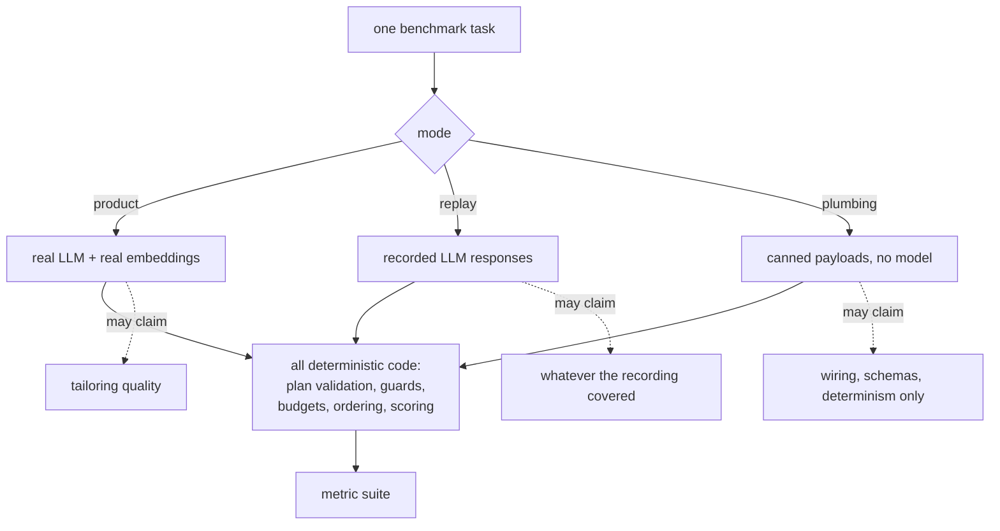

# ART — The Benchmark

What the tailoring benchmark measures, how one posting travels through it, and what a
number from it is and is not allowed to claim.

This is the **explanation**. [`../eval/README.md`](../eval/README.md) is the **operational
reference** — commands, dataset field tables, the replay contract, the ability→dataset
coverage map. Everything here links into it rather than restating it.

Companion document: [`architecture.md`](architecture.md) — the system being measured.

---

## 1. What the benchmark is for

`eval/tailoring_benchmark.py` answers one question: **how much does tailoring improve a
resume against a real job posting?** It answers it as a pre/post delta on an algorithmic
ATS composite — the same `ATSScoringEngine` the product itself scores with, so the number
the benchmark reports is the number the pipeline was optimising.

The composite (`agents/ats_scorer.py::_WEIGHTS`):

| Component | Weight |
|---|---|
| `skill_coverage` | 0.45 |
| `keyword_coverage` | 0.30 |
| `section_presence` | 0.15 |
| `role_level` | 0.10 |

**It drives the real HTTP API, not the pipeline.** One task is
`POST /api/jobs/` → `POST /api/jobs/{id}/description` → `POST /api/jobs/{id}/analyze` →
`POST /api/jobs/{id}/tailor` → `GET /api/jobs/{id}/export?format=tex`, through FastAPI
routes on an isolated temp database, with registration and login first. Calling
`ResumeTailorAgent.tailor()` directly would have been simpler and would have measured less:
the harness's very first run found a production bug this way — `POST /api/jobs/{id}/analyze`
passed a `job_id` that `analyze_and_save` ignored, so every web-created job matched with
**zero skills** and tailored with no skill signal. A harness that skipped the route could
not have seen it. The same class recurred under #177, when six of 150 tasks returned a 500
instead of a resume because the export route interpolated a raw job title into a latin-1
`Content-Disposition` header.

Isolation is real: production data, the local `~/.art` profile pointer, and the deployed
site are never touched. `eval/eval_db.py` gives each *run* a throwaway database — Postgres
when `ART_TEST_DATABASE_URL` is set, a SQLite file otherwise — dropped afterwards, with
straggler connections terminated first.

---

## 2. The three execution modes

**The mode is part of every number.** It is printed in a framed banner before and after
every run, recorded in the results JSON as `mode` + `mode_claim`, stamped on **each
per-task row**, and written as a CSV column — because a CSV row loaded into a notebook is
where a plumbing number most easily loses the context that it is one.



| Mode | What runs | What its numbers may claim |
|---|---|---|
| `product` | Real LLM + real embeddings, the deployed path | Tailoring quality. The only mode whose numbers describe the product. |
| `replay` | Recorded LLM responses; all real deterministic code and real embeddings | Everything the recording covered, deterministically, at near-zero marginal cost |
| `plumbing` (the old `--stub`) | Canned payloads, no model | Wiring, schemas, determinism. **Explicitly not tailoring quality** |

### Why this exists — the #171 story

`--stub` mode **never rewrote a bullet.** `_stub_tailored` returned each experience's and
project's *source* bullets unchanged, so every rendered "tailored" bullet was byte-identical
to the ingested fixture. Every benchmark number in `CHANGELOG.md` up to that point —
`ats_delta`, `baseline_composite`, `tailored_composite`, the redundancy metrics — was
therefore a property of the harness and the deterministic post-processing (bullet budget,
one-page fitting, ordering, skill selection), **not of the tailoring the product performs.**

The stub was not buggy. It did exactly what it was written to do. The defect was that its
output was reported as an efficacy claim, and decisions had been made against it.

That property is now **pinned by tests rather than merely fixed around**: two tests assert
plumbing mode returns source bullets verbatim — one on the canned payload, one over the
rendered artifacts the metrics are computed from (containment, not equality: post-processing
legitimately *drops* bullets, 18 source → 16–17 rendered, but never rewrites one). A stub
that later learned to fake rewriting would fail loudly rather than quietly restoring a
plausible number that measures nothing.

The gap the modes make sayable, measured on the same three tasks (#171, pre-#177 corpus):

| metric | plumbing | product |
|---|---|---|
| `ats_delta` | 28.6 (22.9–31.6) | **37.0** (33.4–42.0) |
| `baseline_composite` | 58.0 | 48.5 |
| `skills_rendered` | 9.3 (8–10) | **18.0 (18–18)** |
| `leading_verb_entropy` | 0.970 | 0.871 |
| `mean_new_information` | 0.998 | 0.951 |
| `max_pairwise_cosine` | — (no encoder) | 0.551 |

Three of the four redundancy modes move meaningfully under real tailoring, and semantic
duplication is measurable **at all** only in product/replay. The metrics were fine; the
stub was too simple to exercise them.

Plumbing mode is also **structurally blind to a whole bug class**: `_stub_payload` routes on
prompt *markers* and never reads prompt content, so no plumbing run — however deterministic,
on however many engines — can observe a prompt changing. Replay mode caught exactly that:
replaying a SQLite recording on Postgres missed on the third task's planner prompt, because
`SkillMatcherAgent.match` loaded job skills with an unordered `select(JobSkill)` and that
order was rendered verbatim into the planner prompt. The same profile against the same JD
was sending the model **a different prompt per engine**.

### Replay's contract in one line

Replay reproduces every deterministic line of the pipeline plus real embeddings; it does
**not** reproduce a different task list or order (JobCard injection makes task sequence
load-bearing), and a prompt change invalidates its cassette by design — which makes every
prompt edit an explicitly re-measured event, at a real if small API cost. A cassette miss is
**fatal and never falls through to a live call**, and misses are tallied on the session
because several call sites catch every exception and would otherwise turn a miss into a
silently empty parse. Full contract: [`../eval/README.md`](../eval/README.md#replay-contract).

`--judge` is silently limited to product mode (`judge=judge and mode == MODE_PRODUCT` in
`run_benchmark`), so asking for it in replay or plumbing yields a `null` judge score rather
than an error.

---

## 3. A worked run

One real task, end to end.

**Mode: plumbing.** Run on 2026-08-14, `python eval/tailoring_benchmark.py --mode plumbing
--limit 3`, on the current 150-posting corpus. Every number below is from that run's
`eval/results/tailoring_benchmark_20260814T112422.json`. **Because it is plumbing, no bullet
was rewritten** — these numbers describe the harness and the deterministic post-processing.

The task, `eval/jd_dataset/arizent_data_ai_engineer.json`:

```json
{
  "id": "arizent_data_ai_engineer",
  "source": "simplify-newgrad/New Grad",
  "company": "Arizent",
  "title": "Data & AI Engineer",
  "role_family": "ai_engineering",
  "level": "entry",
  "posted": "2026-08-12",
  "verified": true,
  "verification": ["own ATS"],
  "url": "https://jobs.smartrecruiters.com/…"
}
```

The candidate is `eval/profiles/benchmark_profile.md` — Alex Rivera, four years across
backend services, ML systems and data infrastructure: **4 experiences, 4 projects, 32
skills** as `eval/profile_fixture.py` parses them. `MAX_PROJECTS = 3`, so three projects are
selected and the fourth becomes the replacement pool the planner may swap from.

One caveat before the numbers, because it applies to every plumbing figure in this repo:
**plumbing and product are not measuring the same candidate.** The derived fixture parse
yields 32 skills; the *real* parser extracts **36** from the same markdown, because it picks
skills out of bullet text and not just the explicit Skills line. Deriving the fixture from
the profile (#171) narrowed that gap without closing it.

### The flow

1. **register + login** — one throwaway account (`benchmark@example.com`) on the isolated
   database.
2. **upload resume** — the profile markdown goes through the real ingest route, producing
   `Experience`, `Project` and `UserSkill` rows.
3. **create job + paste description** — `POST /api/jobs/` then `/description`.
4. **analyze** — `JobAnalyzerAgent` extracts JD skills and the `JDProfile`;
   `SkillMatcherAgent` writes the `UserJobResult` with the **baseline** breakdown.
5. **tailor** — the full plan → generate → evaluate loop of
   [`architecture.md §3.2`](architecture.md#32-inside-the-tailor-stage-plan--generate--evaluate).
6. **export** — `GET /api/jobs/{id}/export?format=tex`, written to
   `eval/results/renders/<ts>/arizent_data_ai_engineer.tex`.
7. **score** — `eval/metrics.py::compute_task_metrics` reads the full tailored content and
   untruncated matched skills straight from the isolated database.

### What it scored

```json
{
  "baseline_composite": 59.7,
  "tailored_composite": 88.0,
  "delta": 28.3,
  "skill_coverage":   {"baseline": 36.7, "tailored": 100.0, "delta": 63.3},
  "keyword_coverage": {"baseline": 69.1, "tailored":  68.2, "delta": -0.9},
  "section_presence": {"baseline": 100.0, "tailored": 100.0, "delta": 0.0},
  "role_level":       {"baseline": 75.0, "tailored":  75.0, "delta": 0.0}
}
```

Read that carefully, because three of the four components carry a lesson:

- **`skill_coverage` does all the work** (+63.3 of a +28.3 weighted composite). The
  baseline scores the whole ingested profile as flat text; the tailored side scores a
  document that names the matched skills explicitly.
- **`keyword_coverage` went *down* 0.9 points**, and that is not a bug. Coverage is
  monotone non-decreasing *in text added to a given document* — which is why the objective
  cannot detect over-tailoring, and why #127 exists. But the baseline and tailored sides
  are not the same document: the baseline flattens the entire profile, while
  `flatten_tailored_text` reads only `experience`, `projects` and `skills` from the
  tailored content. Tailoring **drops** content, so this component can fall. "Monotone in
  edits" and "monotone from baseline to tailored" are different claims, and only the first
  one is true.
- **`role_level` did not move, and its value is suspect anyway.** #181 reports that
  `_detect_level` matches seniority keywords as bare substrings and returns the highest
  tier found anywhere in the text: only 22 of the 150 corpus postings read at the tier they
  are filed under, and the benchmark profile itself reads as `lead` because one bullet says
  "saving **staff** ten hours weekly". This 75.0 is a comparison between two independently
  wrong labels.

The other families for the same task:

| family | value |
|---|---|
| `skills.rendered_count` | 15 of 32 profile skills (`selection_ratio` 0.469, `within_cap_bounds` true) |
| `skills.matched_recall` | 1.0 |
| `experience_allocation.allocation_correlation` | 0.0 |
| `redundancy.max_bullet_df` | 0.125 (16 bullets; `python`, `react`, `docker`, `fastapi` each in 2) |
| `redundancy.leading_verb_entropy` | 0.969 |
| `redundancy.mtld` | 237.81 |
| `redundancy.mean_new_information` | 1.0 |
| `redundancy.max_pairwise_cosine` | absent — no encoder in plumbing mode |

`allocation_correlation` of exactly 0.0 is the plumbing signature: the stub returns every
source bullet verbatim, so bullet-word share tracks the source resume rather than JD
relevance. The run's three tasks aggregate to `ats_delta` mean **24.5** (22.5–28.3),
`baseline_composite` mean 63.7, `tailored_composite` mean 88.2 — consistent with the
150-task plumbing baseline in §5.

---

## 4. The metric families

`eval/metrics.py::compute_task_metrics` returns four families plus an opt-in judge. For
each: what it rewards, and how it could be gamed.

### `ats`

Condenses the engine's baseline and tailored breakdowns into per-component deltas plus the
composite delta. **Rewards** covering the JD's skills and keywords in a complete resume at
a matching seniority.

**Gaming:** 0.75 of the composite is coverage, and coverage is monotone non-decreasing in
text added to the document — so the optimal policy against this objective alone is "edit
maximally", which is degenerate and trivially saturated. That is why #122 exists (a
separable cost term) and why #127 will make the objective peaked. Weighted keyword scoring
(#125) closes the fabrication half of the hole: a term with no candidate evidence weighs
exactly 0.0, so stuffing an unsupported keyword is not merely a weak strategy but a
strictly worthless one — pinned by a test that stuffs the keyword and asserts the score
**does not move**, with a control proving a supported keyword still does. It did not change
the monotonicity, only the gradient.

### `experience_allocation`

Spearman correlation between each experience's JD relevance and its share of bullet words —
does text volume track relevance? **Rewards** giving the most relevant role the most space.

**Gaming:** trivially, by starving low-relevance roles to one bullet each. The bullet-budget
floor (`MIN_EXP_BULLETS = 2`) is a product guard against exactly that, not a metric guard.
The correlation is also unstable at four experiences — a single swap moves it a long way.

### `skills`

`rendered_count`, `selection_ratio` (rendered / total profile skills), `within_cap_bounds`
(between `MIN_SKILLS` and `MAX_SKILLS`), `matched_recall` (did every matched skill make the
section?), `category_count`. **Rewards** a selective, organised skills section rather than
an alphabetical dump.

**Gaming:** `matched_recall` is maximised by rendering everything, and `selection_ratio` is
minimised by rendering almost nothing; they pull in opposite directions on purpose, and
neither is a quality judgement about *which* skills were picked. `skill_selection_tasks/` is
the only dataset in the repo carrying a labelled `relevant` answer key, and it is **not
wired into this benchmark**.

### `redundancy` (`agents/redundancy.py`)

Four separable failure modes, because counting skill terms — all the benchmark did before
#122 — sees one and a half of them:

| mode | metric | note |
|---|---|---|
| term stuffing | `max_bullet_df`, `stuffed_terms` | bullet-level **document frequency**, not raw counts: "Python" three times in one bullet is a badly written bullet; "Python" once in each of eight bullets is stuffing |
| semantic duplication | `max_pairwise_cosine`, `duplicate_pair_count` | needs an encoder; **omitted, not zeroed**, when absent |
| lexical monotony | `leading_verb_entropy`, `mtld` | entropy over each bullet's opening token — resume bullets open with a verb by convention, so no POS tagger |
| dilution | `mean_new_information` | fraction of content tokens absent from *earlier bullets of the same item* |

**Gaming:** entropy is raised by varying opening verbs without varying content; MTLD is only
reliable from ~100 tokens and a resume runs ~100–300 across all bullets, so it removes TTR's
*systematic* length bias without being a precision instrument at this scale. Semantic
duplication is the only one an LLM cannot cheaply satisfy by surface variation — and it is
the one that goes missing in plumbing mode. Returning `{}` below two bullets is deliberate:
one bullet cannot duplicate anything, and `0.0` would read as "verified clean".

### `llm_judge` (opt-in, product only)

`--judge` adds 1–5 scores with rationales on `relevance_balance`, `redundancy` and
`faithfulness` (`eval/llm_judge.py`). Malformed judge output is rejected rather than parsed.

**Gaming:** it is a model scoring a model, so it inherits the generator's blind spots, and
it is not reproducible across days. One finding from a review of an open-source hiring agent
is recorded for whenever this grows: **rationale fields must precede the number** in the
output schema. Score-first schemas make the model commit to a value before writing a word of
justification, turning the evidence field into post-hoc rationalisation.

---

## 5. The corpus

**150 postings, 30 in each of five role families** — data science, data engineering, ML
engineering, software engineering, AI engineering. 100 entry-level / 50 intern, **129
distinct companies**, 30 distinct companies within every family, no two tasks sharing a
description.

### Why the old corpus was invalid

It contradicted the product it measured. `scripts/scrape_job_descriptions.py` put `intern`
on its **exclusion** regex — filtering out the exact population ART targets — and the 8
postings it produced included a *Senior* AI Engineer and a research engineer, while the
benchmark profile is a four-year mid-level candidate. `role_level` carries weight 0.10 and
was scored against that mismatch on every benchmark run in the repo's history.

Eight postings was also too few to say anything per-family. The stratified corpus is what
makes this visible (#177, mode plumbing, all 150 tasks):

| role family | n | `ats_delta` | baseline | tailored |
|---|---|---|---|---|
| ml_engineering | 30 | **30.1** | 59.3 | 89.5 |
| ai_engineering | 30 | **29.3** | 57.7 | 87.0 |
| software_engineering | 30 | **23.4** | 66.2 | 89.6 |
| data_engineering | 30 | **23.0** | 66.5 | 89.5 |
| data_science | 30 | **22.8** | 66.8 | 89.6 |

A 7.3-point spread in `ats_delta` and 9.1 in `baseline_composite`, with a legible mechanism:
the fixture candidate already matches DS/DE/SWE postings well and matches AI/ML postings
poorly, so tailoring has more headroom there. Pooled into one number — all the harness could
report before — that finding does not exist.

Pooled, the same run reports `ats_delta` mean **25.7** (3.8–45.0), `baseline_composite`
63.3, `tailored_composite` 89.0.

### How postings are sourced and verified

**Coverage is architectural, not a longer token list.** ART's scraper knew 5 Greenhouse + 2
Lever tokens; across ~110 hand-guessed tokens on three ATS platforms it could reach **6
entry-level AI-engineering postings and 5 data-science ones**, and 32 of 80 guessed tokens
404'd. `scripts/job_sources.py` instead reads the community GitHub boards first, mines their
apply links for the ATS tokens that *actually exist*, then reads those boards in full — 405
live tokens and 35,894 raw postings, 2,132 of them in-domain and verified. Aggregator rows
are a title and a link, so `scripts/job_descriptions.py` backfills bodies through a
URL-keyed SQLite cache (`eval/.jd_cache.db`, gitignored — a build artifact, not source).

**Every posting is structurally verified** (`scripts/job_verification.py`). A
lead-generation listing is not a job description, and tailoring against one measures the
pipeline's response to marketing copy. The signals are structural, never reputational — does
the employer run its own ATS, is the posting corroborated across independent feeds, does it
state a salary. Admission requires the body fetched from the live URL **and** either an ATS
host or ≥2 independent feeds.

`role_family` and `level` are **written to each file, not recomputed at load time**: a task
file must be reviewable and stable, and a classifier running at load time would silently
re-label the whole corpus when it changed.

Selection is deterministic *and* representative — sorting by company and taking the first N
would hand each 30-slot family to companies beginning with "A". Allocation round-robins over
employers. `--limit` samples the same way, across families rather than off the front of the
list; before #177 it returned `tasks[:limit]` over a company-alphabetical listing, which was
harmless at 8 tasks and a trap at 150.

### The rule that governs every figure in this repo

**A corpus change invalidates comparison against earlier runs.** Every benchmark figure in
`CHANGELOG.md` dated before 2026-08-11 was measured on the 8 mid-level-and-senior postings;
figures from 2026-08-11 onward are on these 150. Numbers either side of that line are not
comparable. Nothing was deleted — the older entries carry the warning instead.

A refresh **replaces** the corpus rather than layering on top of it; leaving stale files
behind is how senior postings would survive a domain restriction. Sizing: the JD is the
*item* and the profile is the *subject*, so a per-family claim's sample size is the number
of JDs in that family, and the default 30 detects a moderate paired effect (d ≈ 0.50).

The corpus is all current inventory, not multi-year, and its 50 intern postings are seasonal
— it was scraped in August, and the 2027 cycle opens in earnest around September–November.

---

## 6. Reading a result

Results land in `eval/results/` (gitignored): a JSON with per-task metrics plus aggregate
stats, a flat CSV, and per-task rendered `.tex`/`.json` under `results/renders/<timestamp>/`.
`eval/tailoring_benchmark.ipynb` drives runs and charts them.

**What a single delta establishes.** That this candidate, against this posting, under this
mode, scored N points higher after tailoring on a composite whose weights are hand-set and
whose `role_level` component is known to be mislabelled (#181). That is genuinely useful as
a regression signal and genuinely weak as an efficacy claim.

**What it does not establish.** That the resume reads better, that a recruiter would prefer
it, or that the improvement generalises to a different candidate — there is exactly **one**
profile in `eval/profiles/`, so every number in this repo is one candidate's experience of
the corpus. That is the gap #172 exists to close, and it is why the per-family table in §5
is a statement about *this* candidate's headroom rather than about the five role families.

**Checklist before quoting a number:**

1. Say the mode. A plumbing number is not a quality claim.
2. Say the corpus. Pre- and post-2026-08-11 figures are not comparable.
3. Say the profile. All of them are Alex Rivera today.
4. Say `n`. `--limit 3` and 150 tasks are different measurements of different things.
5. Check whether the run re-tailored. It did not — see below.

**Run-to-run variance.** In plumbing and replay there is none worth speaking of: two
consecutive runs produce byte-identical metrics *and* byte-identical renders, on both
engines, and the two engines agree with each other. That was hard-won (#158; see
[`architecture.md §7`](architecture.md#7-determinism-and-reproducibility)) and it is the
property that makes replay mode useful at all. Product mode runs at generator temperature
0.3 with best-of-N, so it varies; the only field that differs between two plumbing runs is
`job_id`, a fresh uuid4.

**Postgres parity (#149).** Production is Supabase Postgres. `eval/eval_db.py` picks
Postgres when `ART_TEST_DATABASE_URL` is set and SQLite otherwise, so the harness can measure
on the engine production runs rather than only on the one that is convenient. Ordering
divergence in particular is the failure this guards against — Postgres often returns
insertion order for small unmodified tables, so an unordered query can pass locally and
diverge in production after an `UPDATE` or `VACUUM`.

**The structural blind spot.** `_run_task` tailors **once** per task and never re-tailors.
Every re-tailor-only behaviour is therefore invisible to every aggregate this harness has
ever produced: the faithful-`keep` carry-forward (#115), the `_explainability` metadata bug
(#150, which fires only on the chat path), update durability, and the whole preference tier
in practice. Two consecutive issues recorded "the benchmark cannot observe this fix" before
a re-tailor arm was filed as #173. When a change ships with its benchmark numbers unmoved,
check whether the harness could have seen it before reading that as evidence of anything.

---

## 7. The satellite evals

The tailoring benchmark measures the end-to-end delta. Four narrower harnesses isolate
things it cannot see. Commands and task-file schemas are in
[`../eval/README.md`](../eval/README.md).

| Harness | Isolates | Metric | Run it instead when |
|---|---|---|---|
| `eval/jobcard_eval.py` | Is a completed job summarised *well enough* to plan the next one? Two arms plan the same next job — one reading the compiled card, one reading the raw finished result — compared as **typed ops per item**, not text | `card_quality` (a miss on a **user-rejected item that recurs** weighs 3×), `functional_equivalence`, `outcome_delta` / `relevance_delta`, plus a per-field ablation table | you changed `agents/job_card.py`, the card payload, or what reaches the `PRIOR SIMILAR JOBS` block |
| `eval/knowledge_updates_eval.py` | Does the graph **update** when a later chat turn contradicts an earlier fact, or go stale / duplicate the row? Each task is a closed world run through the real `apply_artifact_decision` path | `update_accuracy` — a stale graph and a duplicated row both score 0 | you changed `agents/knowledge_extractor.py`, the decide layer, or the supersede persistence |
| `eval/skill_selection_eval.py` | LLM-free comparison of skill-scorer weight presets over fixtures carrying a labelled `relevant` answer key | recall + rendered count per preset | you changed `agents/skill_scorer.py` weights |
| `tests/memory_evals/` | Chat recall across compression, as YAML scenarios | scenario pass/fail | you changed history compression or the router's grounding |

Two of these are **scripted by default**, and that is the point: the task file supplies the
notes and decisions, so what is pinned in CI is the *pipeline contract* — the deterministic
layer and the persistence — rather than a model's output on the day. That is what makes them
regression evals rather than benchmarks. `--live` swaps in real extractors to measure the
model itself.

Both in-suite wrappers (`tests/test_jobcard_eval.py`, `tests/test_knowledge_updates_eval.py`)
prove the eval **goes red** when the behaviour it checks is removed — the JobCard one by
dropping the negation signal, the KU one by neutering the supersede path. An eval that
cannot fail is not a test.

One reported result worth carrying: on the JobCard eval the **ATS composite delta is +0.0 on
every task**, because every ATS component is a coverage measure and honouring a rejection or
dropping an off-topic project leaves coverage unchanged. The eval therefore reports a
JD-keyword relevance-density arm beside it, which moves +0.104 on the negation task.
Reporting only the composite would have hidden the benefit; reporting only the density would
have hidden the null result.

---

## In flight

Specified but **not shipped**. Nothing below describes the harness today.

- **#172** (in progress) — the dataset foundation: stratified *profiles* (the benchmark has
  one candidate today), a distractor pool, a calibrated implicitness filter, and human
  anchors. This is the blocker on almost every "unmeasurable" cell in
  [`../eval/README.md`](../eval/README.md)'s coverage map, because a preference or a
  suppression only means something relative to a profile that holds the item being
  suppressed. It must also re-record the replay cassette once its profile set is final.
- **#173** — the re-tailor arm, plus update-durability, locality (does tailoring job B
  degrade job A?), suppression, and a three-way preference-adherence axis. This is what
  would make §6's structural blind spot go away.
- **#174** — action-ranking preference pairs: execution-derived labels over the planner's
  action space, scored by `net(a)`.
- **#178** — a per-profile simulated conversation corpus, so knowledge extraction and
  preference recall have profile-bound fixtures.
- **#181** — will fix `_detect_level`'s substring matching. Until it lands, `role_level`
  (weight 0.10) compares two independently wrong labels on both sides of every match.
- **#182** — cleanup after #172: collapse the duplicated `AGENTS.md` policy surface and
  retire the dead cassette, whose three task ids no longer exist in the #177 corpus.
