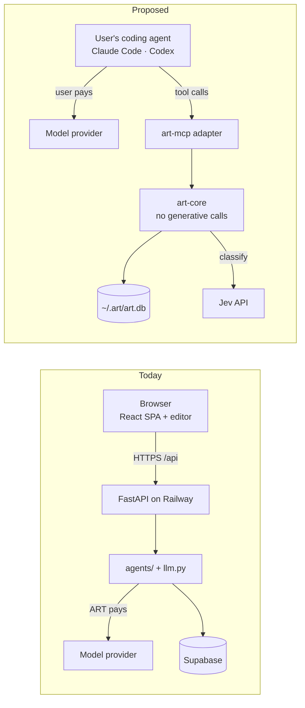
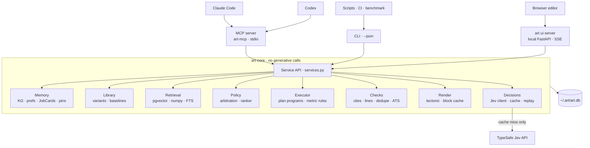
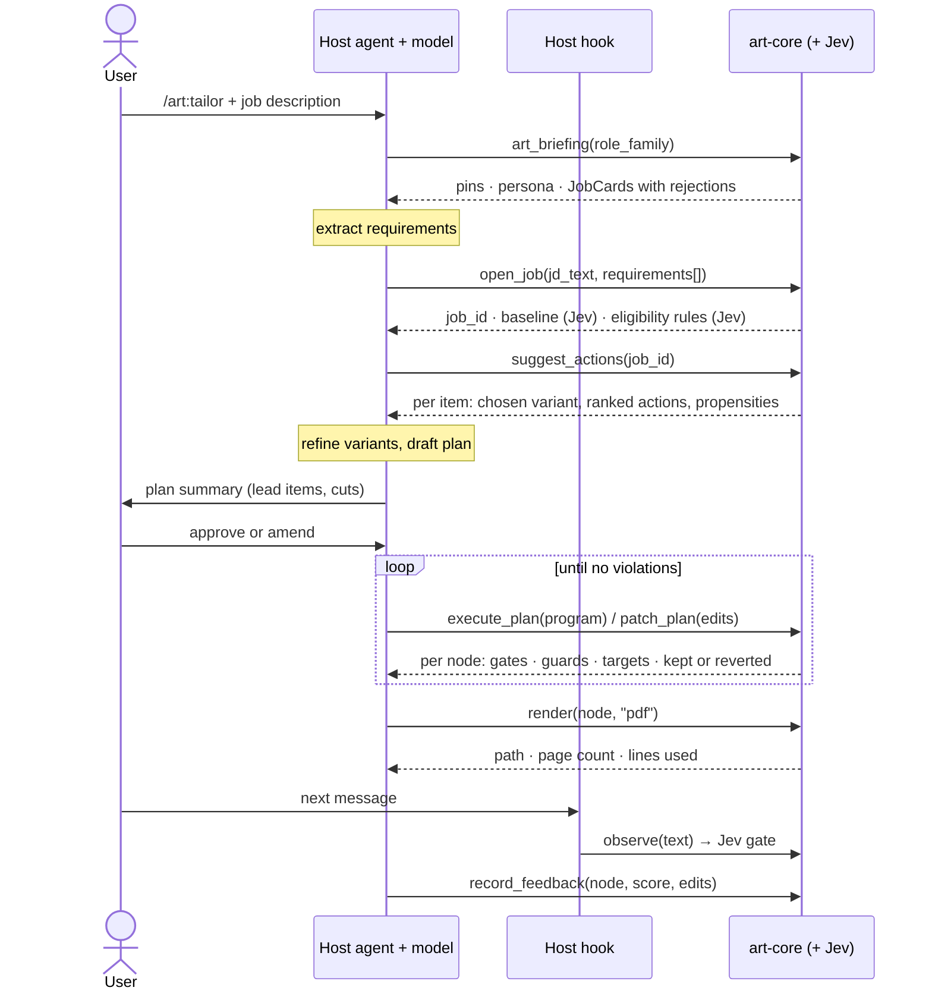
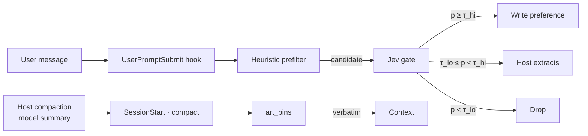
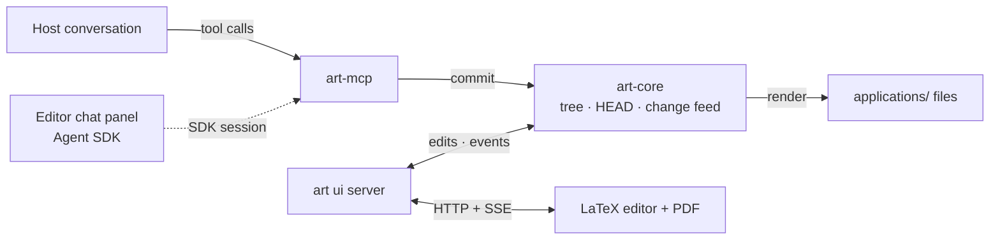
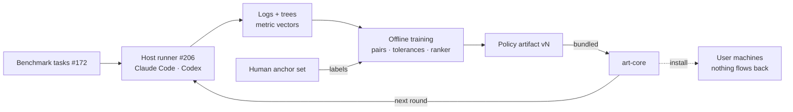

# ART — The Harness Plan

ART is moving from a hosted web app that calls models on its users' behalf to a **local,
model-free package that a coding agent the user already pays for drives through tools**
(Claude Code, Codex). The host's model does the open-ended reading and writing on the
user's own plan. ART keeps the knowledge graph, an approved-bullet library, standing
preferences, the gates that enforce them, and the history the offline policy learns from.
It makes bounded judgment calls with TypeSafe's Jev, and the web app's LaTeX editor
survives as `art ui`, a local companion.

This document is **the target architecture**. [`architecture.md`](architecture.md)
describes what is merged today; where the two differ, this file says where things are
going and `architecture.md` says where they are. Tracking epic: **#207**. Every
section below names the issues that deliver it.

---

## Decisions (locked 2026-09-25)

| Decision | Choice |
|---|---|
| Model calls inside ART | **None that generate text.** Nothing under `harness/` may import `llm.py`, `langchain_*`, `anthropic` or `openai`; a test enforces it (#190). |
| Jev | **Built in.** A single decisions engine with a request-hash cache and a heuristic fallback at every decision point (#193). Users bring their own TypeSafe key. |
| Metrics | **Kept separate.** Hard gates, guards, targets, finalize checks, and report-only. The ATS composite is monotone in text and is **never** a gate or an objective. No scalar, no λ (#113, #127). |
| Plans | The host submits a whole **plan program**; the executor applies each node under the per-metric acceptance rule (#197). |
| Source text | Tailoring refines bullets from an **approved library** and branches from a **track baseline** (#199). |
| Storage | Everything local: SQLite plus rendered files under `applications/`. Raw chat stays with the host. |
| Editor | Kept as `art ui` (#204). The default chat mode is side by side with the host; an Agent SDK chat panel and an API-key fallback are options (#205). |
| Learning | Offline, on the benchmark, across several hosts. No online bandit (#51, #119). |
| Distribution | `uvx art-mcp`, with extras `[embed]`, `[pdf]`, `[ui]` (#194). |
| Bullet promotion | A committed bullet scored ≥ 4 becomes a draft library variant; the user confirms before it is approved. |
| Hosted sync | Deferred until after the H4 evaluation (#206). |

---

## 1. What changes



The edge from ART to a generative model disappears. ART's only outbound call is a
classification request to Jev (about $0.001 per decision), which returns typed answers
with probabilities and never writes resume text.

## 2. Who owns what

| ART (deterministic) | Jev (bounded judgment) | Host (open-ended) |
|---|---|---|
| KG storage, dedup, tombstones, `manually_edited` protection | Is this message a standing preference; polarity; strength | Reading the resume, LinkedIn export and local repos |
| Bullet library, track baselines, render cache | Which approved variant fits; which track baseline | Filling extraction schemas; extracting job requirements |
| Arbitration and the fabrication boundary | Does the posting's eligibility wording trigger a job-scoped rule | Choosing the plan and rewriting bullets, with citations |
| Executor: gates, guards, targets, finalize | Do these two bullets say the same thing | Deciding how to fix reported violations |
| Checks: citations, line budget, coverage, redundancy | Ranking candidate actions per item (propensities) | The conversation with the user |
| Rendering, tree, decision log, provenance, Jev cache | Role family for JobCards | Explaining results |

## 3. Component architecture



Three adapters sit on one service layer; `services.py` already plays that role for the web
app and CLI. A contract test runs the same calls through every adapter on both the SQLite
and Postgres legs (#191).

## 4. Jev decisions

Jev returns typed values (`noul` yes-probability, `choice` over up to 255 options, `score`
over 2–10 levels) with probabilities, in 70–500 ms. It cannot be fine-tuned, is cloud-only,
and is documented as weak on double negatives, indirect reasoning, counting, dates and
arithmetic. ART therefore uses it only where the answer set can be enumerated, and keeps
every deterministic computation in code.

| Decision point | Question type | Decides | Fallback |
|---|---|---|---|
| Memory gate (#202) | noul, choice, score | Is the message a standing preference; emphasize or suppress; strength 1–5 (#129's scale) | Heuristics, then host extraction |
| Variant choice (#199) | choice per item, with no-match | Which approved bullet variant fits the job; no-match means the host writes a new one | Retrieval similarity |
| Track baseline (#199) | choice | Which baseline a new job branches from | Role-family lookup |
| Eligibility rules (#192) | noul per rule | Job-scoped variables (e.g. graduation date when the posting requires post-internship enrollment) | Host asks the user |
| Semantic duplicates (#113) | noul per pair | Whether two bullets say the same thing, for the duplication guard, without torch | Embedding cosine with `[embed]`, else term overlap |
| Action ranking (#193) | choice per item | Priors for `suggest_actions`; probabilities become logged propensities, reweighted by the ranker | Uniform over valid actions |
| Role family (#137 cards) | choice | JobCard grouping | Host supplies it |

**Rules for every call.** All candidates for one decision go in one question (choice
probabilities only compare options within a question). Include a no-match option where
"none" is a real answer. Keep the state narrow and structured. Fit thresholds on ART's own
data (`tests/memory_evals/`, the #172 anchor set), never on Jev's reported confidence.

**Cache and replay.** Every call is keyed on a hash of (state, questions, resolved model
version). Replays and benchmark reruns never hit the API; tests run on recorded decisions,
and live calls happen only under `--integration`.

**Privacy.** JD text and resume bullets leave the machine in Jev requests. Setup says so,
and every decision point can run on its fallback for users who decline.

## 5. Metrics, kept separate

Two findings drive this. The ATS composite is monotone non-decreasing in text (#127,
re-confirmed by #125), so a gate on ΔATS approves stuffing and rejects every deletion.
And pooling hid real results: the per-stratum spread in #172 vanished when pooled, and in
#137 the composite read 0.0 on a negation task where relevance density moved.

| Metric | Monotone in text? | Role | Source |
|---|---|---|---|
| Citation faithfulness | No | **Hard gate** | #198 |
| Hard-preference and negative-pin compliance | No | **Hard gate** | `agents/arbitration.py`, #202 |
| Numeric and entity consistency | No | **Hard gate** | #123 |
| Rendered lines per bullet ≤ 2 | No | **Hard gate** | #200 |
| Term stuffing (bullet-level term DF) | Yes, upward | Guard | `agents/redundancy.py` (#122) |
| Semantic duplication | Yes, upward | Guard | `agents/redundancy.py`, Jev |
| Leading-verb entropy | No | Guard | `agents/redundancy.py` |
| MTLD (dilution) | No | Guard | `agents/redundancy.py` |
| Edit distance from the approved variant | Yes | Guard | #199 |
| Supportable weighted coverage | Yes, but flat on unsupported terms | Target | `agents/keyword_weights.py` (#125) |
| Relevance density | No | Target | promoted from `eval/metrics._keyword_relevance` |
| Page count and line budget | Yes | Finalize | `agents/layout.py`, #200 |
| Non-empty sections, skills cap | No | Finalize | `agents/tailor_planner.py` |
| ATS composite and components | Yes | **Report only** | `agents/ats_scorer.py` |

**The acceptance rule (#113).** An action commits if and only if all of the following hold:

1. It passes every hard gate.
2. No guard regresses by more than its tolerance.
3. It improves at least one target, or it is a delete or reorder that the user or a
   preference requested.

A stuffing edit fails the target test (unsupported terms weigh zero) or the stuffing guard.
A preference-driven delete passes, and relevance density usually rises. Tolerances are
fitted per guard on the human anchor set (#127) and ship in the policy artifact. Nothing
combines metrics into one number.

## 6. A tailoring run



The host's model works in two places only: extracting requirements and refining variants.
The run waits for plan approval before executing. Every return comes from deterministic
code or a cached Jev decision.

## 7. Plan programs (#197)

```json
{
  "job_id": "job_8f2c",
  "parent": "node_14",
  "nodes": [
    { "id": "exp1", "op": "revise", "item_key": "exp:acme-analytics",
      "from_variant": "var:acme-analytics#model-default",
      "strategy": "keyword_weave", "keywords": ["causal inference"],
      "bullets": [{ "text": "Designed a CUPED-adjusted A/B framework ...",
                    "cites": ["ev:acme-analytics#b2", "skill:experimentation"] }],
      "accept": { "improves": ["coverage", "relevance_density"] } },
    { "id": "swap", "op": "replace", "item_key": "proj:todo-app",
      "replacement_key": "proj:recsys-gnn", "use_variant": "var:recsys-gnn#ml",
      "accept": { "improves": ["relevance_density"] } },
    { "id": "drop", "op": "delete", "item_key": "proj:coursework-db",
      "because": "pref:no-coursework" }
  ],
  "finalize": { "pages": 1, "line_budget": 60, "max_skills": 18 }
}
```

Execution:

1. **Arbitration first.** Nodes that break a hard preference or name something the KG
   doesn't hold are refused with a reason.
2. **Nodes in section order**, each checked against the acceptance rule. A node may tighten
   a tolerance, never loosen one. A failing node is reverted, and independent nodes
   continue.
3. **Finalize** checks page, line budget, sections and skills cap. On any violation
   nothing commits, and the host gets the violations with trade hints.
4. **Patch** edits the saved program by JSON pointer.
5. **Commit** writes a tree node with its metric vector and provenance.

Stable IDs do the faithfulness work. The host names item keys, variant IDs and evidence
IDs, and ART resolves them without parsing display text.

## 8. Bullets and baselines (#199, #200)

Tailoring works in three layers: **raw facts** (the KG), **approved phrasings** (the
library) and **rules** (preferences). ART used to go straight from facts to generated
bullets. Starting from approved text makes runs cheaper, more consistent, and faithful by
construction.

- **Bullet library.** `BulletVariant` rows hold the item key, text, tags (track, job),
  status, cites, rendered line count and source node. Plan nodes start `from_variant`;
  edit distance from it is a guard, and a no-match is the only path to writing from raw
  facts.
- **Promotion.** A committed bullet with a user score ≥ 4 becomes a draft variant, and the
  user confirms it.
- **Track baselines.** Pinned tree nodes tagged with a track. A new job's root is a copy of
  the chosen baseline.
- **Job-scoped rules.** Profile fields with conditional values, evaluated per posting by
  Jev (#192).
- **Line budget.** A per-bullet two-line gate, a page line budget, and "anything restored
  needs a matching cut" as trade hints.
- **Block render cache.** Lines per bullet, keyed by (text hash, template hash), measured
  once.
- **Negative pins.** Facts that must never render, enforced as hard gates (#202).
- **Plan approval.** The skill shows the plan and waits; users can turn this off for quick
  re-tailors.
- **Repo cross-check.** For project claims, the host verifies against the local checkout,
  and a citation can point to a file and line.

## 9. Tool surface

| Group | Tool | Takes → returns |
|---|---|---|
| Context | `art_briefing` | role family → pins, negative pins, persona traits, JobCards with rejections |
| | `art_pins` | → strength-5 preferences and negative pins, verbatim |
| Retrieval | `kg_search` | query, kinds → items with keys and evidence IDs |
| | `list_items` | kind → every key and title, no query needed (#191) |
| | `get_item` | key → record, evidence, approved variants |
| | `get_profile` | → name and contact details for the header (#191) |
| Ingest & library | `ingest_schema` | kind → JSON schema the host fills |
| | `upsert_items` | records with evidence → keys, merges, conflicts |
| | `promote_bullet` | node, bullet → draft variant |
| | `save_baseline` | node, track → pinned baseline |
| Jobs | `open_job` | JD text, requirements → job id, baseline, rules, schema errors |
| | `list_jobs` | filter → jobs with status, HEAD, last score |
| | `suggest_actions` | job, node → per item: variant, ranked actions, propensities |
| Execute & history | `execute_plan` | program → node results, metric vectors, refusals, violations |
| | `patch_plan` | base node, pointer edits → same |
| | `checkout` | node → moves HEAD |
| | `diff_nodes` | two nodes → bullet-level diff with rationale |
| | `get_head` | job, cursor → HEAD, events and editor edits since the cursor |
| | `history` | job → every version, oldest first |
| Check & render | `check_draft` | node → metric vector by role |
| | `render` | node, format → path, page count, lines used |
| Feedback & memory | `observe` | user text → gate decision |
| | `record_preference` | typed preference → stored or refused with reason |
| | `record_feedback` | node, 1–5 score, edits → logged, JobCard rebuilt, promotion candidates |

## 10. Memory and compaction (#202)



A host left to itself under-calls memory tools (When2Tool, #105), so the hook runs on
every message. Claude Code compacts with a model-written summary, which is where negated
preferences disappear (#129: 14.8% F1 on opposed-case retrieval), so pins come back from
ART word for word. Jev is documented as weak on exactly this negation workload. #202
measures it against heuristics alone, reports the negation cases separately, and sets the
thresholds τ from that result.

## 11. Tailoring history as a tree (#196)

Each committed change is a node whose parent is the version it revised. That includes host
runs (`source=host`) and editor edits (`source=editor`). Revert moves HEAD, and baselines
are pinned nodes. Two siblings share a context, so each sibling pair is a preference label
for #174. Provenance on every node covers the host, host version, model ID if reported,
ART version, policy artifact version, and the briefing hash. Existing `UserJobResult` rows
migrate as a linear chain.

## 12. What's stored locally

| What | Where |
|---|---|
| KG (experiences, education, projects, skills, achievements, evidence) | SQLite, existing tables |
| Preferences, persona, pins, negative pins, job-scoped rules | SQLite |
| Bullet library, track baselines | SQLite, new tables |
| Job records (company, role, posting, URL, status: drafting / applied / interview / closed) | SQLite, `JobDescription` + status |
| JD profiles, term weights, eligibility answers | SQLite, `JDProfile` |
| Every tailored version: program, snapshot, metric vector, provenance | SQLite, `TailorNode` |
| Layout overrides (#118), JobCards, decision log | SQLite, existing |
| Rendered `.tex` and PDF per job | `applications/<Company>_<Role>/` |
| Jev decision cache, block render cache | SQLite (clearable) |
| Chat transcripts | The host's storage; ART keeps extracted preferences, feedback and the session ID |
| Keys (TypeSafe; optionally Anthropic for the chat panel) | OS keychain, env-var fallback; never in the DB |

`art export` / `art import --from-supabase` (#195) handle backup and migration.

## 13. Editor and chat (#204, #205)

The React editor keeps the LaTeX buffer with `%% ART-SECTION` markers, drag reordering,
automatic compile and layout overrides (#71, #118). It runs unchanged as `art ui`, served
by the same routers in local mode (SQLite, no login).



There are three ways to chat-edit:

1. **Side by side (default).** `/art:open` opens the editor, in the Claude desktop browser
   pane where available. The prompt hook injects the user's editor edits from `get_head`,
   so the host never overwrites manual work.
2. **The chat panel.** It drives a Claude Agent SDK session with `art-mcp` attached.
   Anthropic's help center currently lets third-party apps authenticate users' own
   subscriptions through the Agent SDK, against a per-user monthly credit. Re-verify this
   before shipping.
3. **An API key**, through the existing `llm.py` chat path. This is the only live use of
   `llm.py`, and it sits outside the harness boundary.

| Web-app feature | Harness equivalent |
|---|---|
| `tailor <notes>` → plan preview → apply/cancel | Plan approval before `execute_plan` |
| `explain`, `what changed` | `diff_nodes` |
| `revert` (one snapshot) | `checkout` to any node |
| 1–5 score prompt | `record_feedback` |
| Faithful keep | Nodes branch from HEAD |
| Drag reorder → layout override | Unchanged, and each drag is also a node |

### Running `art ui` (#204)

```bash
npm --prefix web/frontend install && npm --prefix web/frontend run build   # once
python -m web.local_ui --job <job_id>        # opens http://127.0.0.1:8765/?job=<job_id>
```

- **Database and user** are pinned as for the harness (§ 15): local SQLite by default,
  `--database-url` to read elsewhere, Postgres read-only unless `--allow-writes`. The
  user is `--user-id`, else the active profile, else the CLI's default profile.
- **Local mode** (`ART_LOCAL_UI=1`, set only by the launcher) replaces login with the
  bound user and skips the per-user quotas. It binds 127.0.0.1 only, serves only a
  `localhost` / `127.0.0.1` Host (DNS-rebinding guard) and refuses a write whose `Origin`
  is not its own. With the flag off the hosted app is unchanged.
- **Change feed.** `GET /api/jobs/{id}/events` streams the job's `TreeEvent`s as SSE
  (`event: tree`, `id: <event_id>`, data `{event_id, kind, node_id, source}`), resuming
  from `?since=` or `Last-Event-ID`. The editor reloads on any commit that is not its own
  `editor` commit and on every checkout. With unsaved keystrokes it pauses auto-save and
  asks before reloading.
- **Edits reach the host.** Every `.tex` save and drag commits an `editor` node, so the
  host's next `get_head(since_event=...)` lists it under `editor_edits`.

## 14. Learning offline



- **Pairs (#174)** are labeled by metric dominance, by the anchor set where neither
  outcome dominates, and by tree siblings.
- **Learned quantities (#127, #152, #157)** are the guard tolerances, the ranker weights
  and the project-scorer weights. There is no composite and no λ.
- **Propensities** are Jev's choice probabilities reweighted by the ranker. Host choices
  outside the suggestions are logged as overrides and excluded from off-policy estimates.
  Those estimates are reported per metric.
- **Exploration (#112)** runs only in the benchmark runner (#119).

## 15. Host integration

| Host | Tools via | Workflow via | Per-message hook | After compaction | Editor |
|---|---|---|---|---|---|
| Claude Code (#201) | MCP, stdio | Plugin skills, `/art:*` | `UserPromptSubmit` | `SessionStart`, source `compact` | Desktop browser pane or tab |
| Codex (#203) | MCP, stdio | Skills + `AGENTS.md` snippet | None assumed; skill calls `observe` | None assumed; skill re-fetches briefing | Browser tab |
| Cursor, others | MCP | Rules file | None | None | Browser tab |

ART targets mainstream coding agents: Claude Code and Codex (decided 2026-09-25; pi and
other harnesses are out of scope). Codex's hook capabilities are to be confirmed in #203.

### Running the harness (#189, #191)

Every tool is declared once in `harness/contract.py`: name, description, and pydantic
input and output models, with errors carried as an `error` field in the output. That
contract is served two ways, and `tests/test_harness_contract.py` holds both to
identical results:

- **MCP:** `harness/mcp_server.py` serves it over stdio with published input and output
  schemas, using `mcp==2.2.0`. The 2.x SDK renamed `FastMCP` to `MCPServer`.
- **CLI:** `harness/cli.py` prints one JSON document per call. It is a separate entry point
  from `cli.py`, which loads `.env` on import.

The tools are `art_briefing`, `kg_search`, `list_items`, `get_item` and `get_profile`,
plus the tailoring-tree tools from #196: `list_jobs`, `get_head`, `history`, `diff_nodes`
and `checkout`.

**Writes.** `checkout` is the first tool that writes. Local SQLite is writable. A remote or
Postgres database is read-only, and write tools return a `read_only` error, unless the
process is started with `--allow-writes`.

```bash
claude mcp add art -- <repo>/.venv/Scripts/python.exe <repo>/harness/mcp_server.py
python -m harness.cli --list
python -m harness.cli kg_search --args '{"query": "python"}'
```

- **Database.** It reads local SQLite (`$ART_DATA_DIR/art.db`, default `~/.art/art.db`).
  A `DATABASE_URL` in `.env` is never used implicitly. To read elsewhere, pass
  `--database-url <url>`, or `--database-url dotenv` to take `.env`'s `DATABASE_URL`
  explicitly without putting the secret on the command line. Postgres sessions are
  forced read-only (`default_transaction_read_only=on`).
- **User.** Pass `--user-id <uuid>`, or let it fall back to the `~/.art` pointer file.
- **Search.** `kg_search` is lexical for now: only skills and jobs carry embeddings, and
  semantic search arrives with #194.

## 16. Removing model calls

| Module | Today | On the harness path |
|---|---|---|
| `agents/parser.py` | Resume → structured lists | Host fills `ingest_schema`, calls `upsert_items` (#192) |
| `agents/knowledge_extractor.py` | GitHub API → skills, projects | Host reads repos on disk; upserts with file-level evidence |
| `agents/job_analyzer.py`, `agents/jd_profile.py` | JD → metadata, skills, profile | Host fills `open_job`; ART validates |
| `agents/preferences.py` | Chat → typed preferences | Jev gate + `record_preference` |
| `agents/job_card.py` | Cached role-family classify | Jev choice |
| `agents/tailor_planner.py` | Model writes the plan | Host writes the plan program; Jev + ranker suggest |
| `agents/tailor.py` | Generate → evaluate → retry | Host refines variants; executor + metric rules replace evaluate; retries become `patch_plan` |
| `agents/enhancer.py`, `agents/chat.py` | Enhancement, chat routing | Host; `chat.py` stays live only for the API-key panel |
| `services.py` | Artifact creation from chat | Storage stays; extraction moves to the host |

The pure checks in `agents/tailor.py` move to a model-free `agents/checks.py` so the
boundary test can pass (#190).

## 17. Repository layout (target)

```
agents/  database/  services.py      # unchanged homes; pure checks split out
harness/
  contract.py  executor.py  metrics.py  library.py  tree.py  render_cache.py
  decisions/                         # Jev client, cache, fallbacks
  mcp_server.py
web/                                 # becomes art ui (local mode, SSE, SDK chat)
plugin/                              # Claude Code plugin: skills, commands, hooks
integrations/codex/
eval/hosts/                          # taskground-style host runner
pyproject.toml                       # art, art-mcp · extras [embed] [pdf] [ui]
```

## 18. Roadmap

| Phase | Window | Issues | Exit test |
|---|---|---|---|
| H0 · Decide & Spike | Sep 28 – Oct 4 | #188, #189 | One real tailoring in Claude Code with read-only tools; gap list recorded |
| H1 · Core & Jev | Oct 5 – Oct 18 | #190–#195 | Contract tests on both legs; `uvx art-mcp` without torch; every Jev point replays from cache |
| H2 · Executor & Library | Oct 19 – Nov 8 | #196–#200, #113, #127, #123, #117, #151, #163 | Scripted-host benchmark replays byte-identically; stuffing rejected, preference delete kept |
| H3 · Plugin & Memory | Nov 9 – Nov 22 | #201–#203 | Gate recall measured on `memory_evals` (negation separate); pins survive compaction |
| H3b · Editor | Nov 23 – Dec 6 | #204, #205, #87, #82, #84, #136, #147 | Editor drag reaches the host's next turn; host commit reaches the editor without reload |
| H4 · Host Evaluation | Dec 7 – Dec 27 | #206, #172, #173, #178, #181 | Written result, B vs A first; go/no-go on H5 |
| H5 · Offline Policy | From Dec 28 | #174, #152, #157, #119, #51, #114 | Arm C beats B on anchor-agreed quality on ≥ 2 hosts |

## 19. Evaluation (#206)

| Arm | Host gets | Answers |
|---|---|---|
| A | Skill, resume file, JD; no ART tools | How good is a frontier agent alone? |
| B | ART with Jev, unranked suggestions | Does ART add anything? |
| B′ | B with every Jev point on its fallback | What does Jev add; is the no-key path acceptable? |
| C | B + learned ranker | Does the learned policy add anything? |

The hosts are Claude Code and Codex, each run with two of its own models, so the model's
effect can be separated from the scaffold's within a host. The metrics are reported separately and never pooled:

- hard-gate violations at the final PDF (target: zero in B, B′ and C);
- each guard and target;
- the ATS composite, reported only;
- agreement with the anchor set;
- library reuse;
- tool-call compliance, tokens, wall time and Jev spend.

If B doesn't beat A on anchor agreement with zero hard-gate violations, the product has no
reason to exist. That comparison is reported first.

## 20. Risks

- **Jev.** It is cloud-only, waitlisted and frozen, and weak on negation. Mitigated by
  fallbacks everywhere, arm B′, and the cache. Data leaves the machine, which is disclosed
  at setup, and a heuristics-only mode exists.
- **Hosts skip tools.** The gates live inside `execute_plan`, and #206 measures compliance.
- **Editor and host overwrite each other.** Both write through the tree, and a plan whose
  parent isn't HEAD is rejected.
- **The Agent SDK policy changes.** The panel falls back to an API key, and side-by-side
  mode needs no SDK.
- **Tolerances are only as good as the anchor set.** #172 chunk 7 is on the critical path,
  and conservative hand-set values apply until it exists.
- **Tool budget.** 21 short descriptions, with schemas fetched on demand.

## Sources

- [Jive](https://github.com/merijjeyn/jive): graph calls, JSON-pointer patching, stable
  candidate IDs, verbatim pins, context provenance, taskground.
- [pi](https://github.com/earendil-works/pi): the tree-structured session idea behind the
  tailoring tree. (pi is not a supported host.)
- [TypeSafe: System One models and Jev](https://typesafe.ai/blog/introducing-system-one-models-and-jev);
  [a technical deep dive](https://flaviocopes.com/jev/).
- [Use the Claude Agent SDK with your Claude plan](https://support.claude.com/en/articles/15036540-use-the-claude-agent-sdk-with-your-claude-plan).
