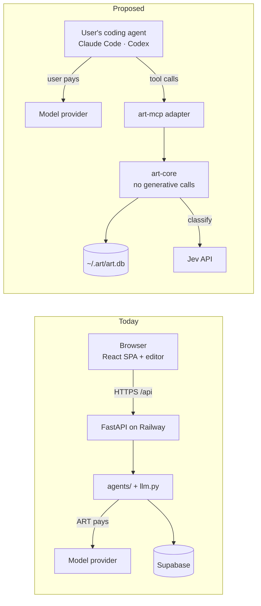
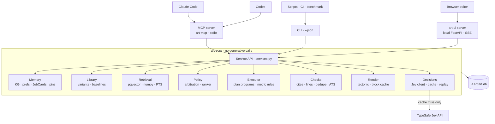
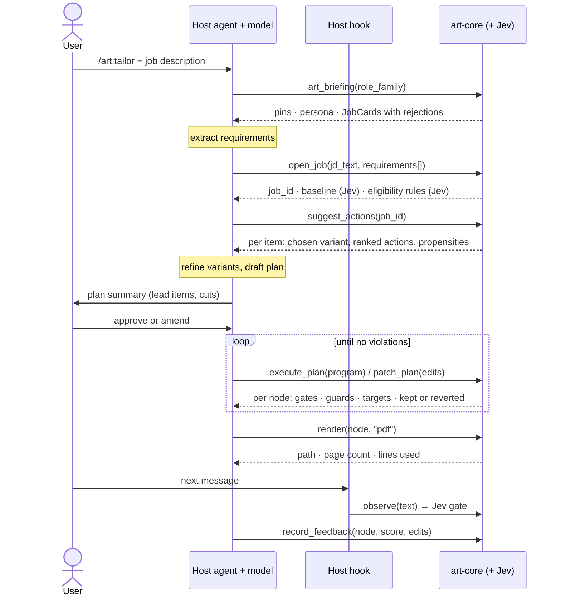
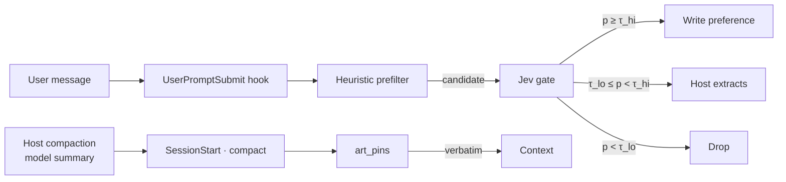
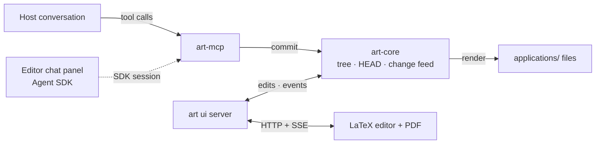
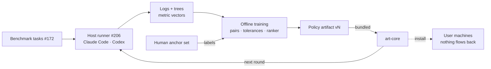

# ART — The Harness Plan

ART is moving from a hosted web app that calls models on its users' behalf to a **local,
model-free package that a coding agent the user already pays for drives through tools**
(Claude Code, Codex). The host's model does the open-ended reading and writing on the
user's own plan. ART keeps the knowledge graph, an approved-bullet library, standing
preferences, the gates that enforce them, and the history the offline policy learns from.
It makes bounded judgment calls with TypeSafe's Jev, and the web app's LaTeX editor
survives as `art ui`, a local companion.

This document is **the target architecture**. [`architecture.md`](architecture.md)
describes what is merged today; where the two differ, this file says where things are
going and `architecture.md` says where they are. Tracking epic: **#207**. Every
section below names the issues that deliver it.

---

## Decisions (locked 2026-09-25)

| Decision | Choice |
|---|---|
| Model calls inside ART | **None that generate text.** Nothing under `harness/` may import `llm.py`, `langchain_*`, `anthropic` or `openai`; a test enforces it (#190). |
| Jev | **Built in.** A single decisions engine with a request-hash cache and a heuristic fallback at every decision point (#193). Users bring their own TypeSafe key. |
| Metrics | **Kept separate.** Hard gates, guards, targets, finalize checks, and report-only. The ATS composite is monotone in text and is **never** a gate or an objective. No scalar, no λ (#113, #127). |
| Plans | The host submits a whole **plan program**; the executor applies each node under the per-metric acceptance rule (#197). |
| Source text | Tailoring refines bullets from an **approved library** and branches from a **track baseline** (#199). |
| Storage | Everything local: SQLite plus rendered files under `applications/`. Raw chat stays with the host. |
| Editor | Kept as `art ui` (#204). The default chat mode is side by side with the host; an Agent SDK chat panel and an API-key fallback are options (#205). |
| Learning | Offline, on the benchmark, across several hosts. No online bandit (#51, #119). |
| Distribution | `uvx art-mcp`, with extras `[embed]`, `[pdf]`, `[ui]` (#194). |
| Bullet promotion | A committed bullet scored ≥ 4 becomes a draft library variant; the user confirms before it is approved. |
| Hosted sync | Deferred until after the H4 evaluation (#206). |

---

## 1. What changes


```mermaid
flowchart LR
    subgraph Today
        B[Browser<br/>React SPA + editor] -->|HTTPS /api| F[FastAPI on Railway]
        F --> AG[agents/ + llm.py]
        AG -->|ART pays| MP[Model provider]
        AG --> SB[(Supabase)]
    end
    subgraph Proposed
        H[User's coding agent<br/>Claude Code · Codex] -->|user pays| MP2[Model provider]
        H -->|tool calls| MCP[art-mcp adapter]
        MCP --> CORE[art-core<br/>no generative calls]
        CORE --> DB[(~/.art/art.db)]
        CORE -->|classify| JEV[Jev API]
    end
```

The edge from ART to a generative model disappears. ART's only outbound call is a
classification request to Jev (about $0.001 per decision), which returns typed answers
with probabilities and never writes resume text.

## 2. Who owns what

| ART (deterministic) | Jev (bounded judgment) | Host (open-ended) |
|---|---|---|
| KG storage, dedup, tombstones, `manually_edited` protection | Is this message a standing preference; polarity; strength | Reading the resume, LinkedIn export and local repos |
| Bullet library, track baselines, render cache | Which approved variant fits; which track baseline | Filling extraction schemas; extracting job requirements |
| Arbitration and the fabrication boundary | Does the posting's eligibility wording trigger a job-scoped rule | Choosing the plan and rewriting bullets, with citations |
| Executor: gates, guards, targets, finalize | Do these two bullets say the same thing | Deciding how to fix reported violations |
| Checks: citations, line budget, coverage, redundancy | Ranking candidate actions per item (propensities) | The conversation with the user |
| Rendering, tree, decision log, provenance, Jev cache | Role family for JobCards | Explaining results |

## 3. Component architecture


```mermaid
flowchart TB
    CC[Claude Code] --> MCP[MCP server<br/>art-mcp · stdio]
    CX[Codex] --> MCP
    SC[Scripts · CI · benchmark] --> CLI[CLI · --json]
    BR[Browser editor] --> UI[art ui server<br/>local FastAPI · SSE]
    subgraph core[art-core · no generative calls]
        SVC[Service API · services.py]
        SVC --> MEM[Memory<br/>KG · prefs · JobCards · pins]
        SVC --> LIB[Library<br/>variants · baselines]
        SVC --> RET[Retrieval<br/>pgvector · numpy · FTS]
        SVC --> POL[Policy<br/>arbitration · ranker]
        SVC --> EXE[Executor<br/>plan programs · metric rules]
        SVC --> CHK[Checks<br/>cites · lines · dedupe · ATS]
        SVC --> REN[Render<br/>tectonic · block cache]
        SVC --> DEC[Decisions<br/>Jev client · cache · replay]
    end
    MCP --> SVC
    CLI --> SVC
    UI --> SVC
    core --> DB[(~/.art/art.db)]
    DEC -->|cache miss only| JEV[TypeSafe Jev API]
```

Three adapters sit on one service layer; `services.py` already plays that role for the web
app and CLI. A contract test runs the same calls through every adapter on both the SQLite
and Postgres legs (#191).

## 4. Jev decisions

Jev returns typed values (`noul` yes-probability, `choice` over up to 255 options, `score`
over 2–10 levels) with probabilities, in 70–500 ms. It cannot be fine-tuned, is cloud-only,
and is documented as weak on double negatives, indirect reasoning, counting, dates and
arithmetic. ART therefore uses it only where the answer set can be enumerated, and keeps
every deterministic computation in code.

| Decision point | Question type | Decides | Fallback |
|---|---|---|---|
| Cited-bullet support (#193) | choice per revised bullet | Whether the cited evidence supports the new bullet: `supported`, `adds_unsupported`, `contradicts`. Scored by p(adds_unsupported) + p(contradicts), which is 1 − p(supported). Blocks at a score ≥ 0.85, surfaces 0.35–0.85 as `review` (fitted on 89 labelled pairs, #237; `eval/support_labels/REPORT.md`) | Unchecked; lexical drift still gates |
| Negative-pin mention (#232) | noul per (changed bullet or item field, pin) | Whether a changed text mentions or refers to a pinned topic in other words (a paraphrase, or a product, employer or project of the topic). Asked positively, never "does it avoid", and with the pin's statement stripped of its directive, or the bare term when a negation or comparison would remain. Blocks at p ≥ 0.85 as a `preferences` violation in the term match's format, surfaces 0.15–0.85 as `review` (fitted on 74 labelled pairs, #232; `eval/negative_pin_labels/REPORT.md`). Jev only adds hits; the term match always runs | Unchecked; the term match alone gates |
| Requirement coverage (#126) | noul per (bullet or education entry, requirement) | Whether one bullet, or one education entry as text, shows the candidate meets one required or preferred requirement of the posting (`incidental` ones are left out), by that text alone, never the page. Asked positively ("Does this bullet show that the candidate meets this requirement: …?"), with stated interest, plans and "eager to learn" named as not meeting it, and (v2) a working-style requirement (deadlines, process, communication, collaboration, ownership, attention to detail) asked for a stated instance. An education entry gets its own question (`education_covered@v1`): it asks what the entry states, treats a degree marked expected as enrollment and not as an earned degree, and never compares dates or levels; a finished degree is shown without its date, because Jev reads a past date as a future one. A requirement is covered when some bullet or entry scores p ≥ 0.65 (fitted on 131 pairs, #126; `eval/coverage_labels/REPORT.md`); `semantic_coverage` is the criticality-weighted share covered, a **target** beside the literal `coverage`, never combined with it. Answers are cached per (bullet or entry, requirement), so a node pays for the bullets it changed only | Unchecked; the target is absent and only the literal targets decide |
| Memory gate (#202) | noul, choice, score, choice, one request per candidate message | Behind a heuristic prefilter (cue words; non-candidates are dropped with no call). The state is the message text alone; a message that leans on the previous reply ("never list that again") is sent with the end of that reply as `memory_gate@v2` (#244, § 10). Four questions, all positive: is it a lasting preference about the resume (noul; one-off edits, questions, facts and small talk named as not); emphasize, suppress, format rule or none (choice); strength 1–5 on #129's scale, in its own wording (score); which catalog item it is about, or `no_match` (choice over the user's skills, roles, projects and sections). Routes on p: below 0.25 drop, 0.25–0.65 to the host, at or above 0.65 write when the target is an item (never a whole section) picked at p ≥ 0.75 and named in the message, the direction agrees with the prefilter's negation flag, and the strength is 4 or less. **A strength-5 preference, a negative pin or a preference about a whole section is never written by the gate**; it goes to the host for the user to confirm through `record_preference`. Fitted on 111 user-confirmed synthetic messages, #202 (`eval/memory_gate_labels/REPORT.md`) | Prefilter alone: every candidate goes to the host, nothing is written |
| Variant choice (#199) | choice per (job, item with approved variants), with no-match | Which approved bullet variant of an item fits the job; no-match means the host writes a new one. One request per item, state `{job: {title, top 8 required and preferred requirements by criticality}, item: {title}}`. Options are the item's approved variants keyed by variant id with the bullet text as the description, plus `no_match`; the question names a bullet that only repeats the posting's keywords as not fitting. The gate is the probability Jev puts on any variant (one minus its `no_match`): at 0.50 or more the pick is its likeliest variant, else no-match (Jev splits its mass between two good phrasings of one bullet, so gating its own choice lost the close calls). `suggest_actions` reports the picked variant's own probability as its score, the whole distribution (every variant id and `no_match`) as `propensity`, and `source` `jev` or `cache`. Fitted on 48 synthetic cases, #199 (`eval/library_labels/REPORT.md`): Jev picked no poor-fit variant, 47 of 48 cases right against the fallback's 18 | Term overlap (shipped in #229, byte for byte unchanged): the approved variant whose content tokens best overlap the job's weighted terms (`relevance_density`'s tokenization, each term at its weight over the heaviest's, so uniform weights give exactly `relevance_density`), at or above `VARIANT_MATCH_FLOOR` (0.10); below it, no-match. `source: "fallback"` |
| Track baseline (#199) | choice per job, only when a baseline is saved | Which saved track a new job branches from. State `{title, top 8 requirements}`; options are the saved tracks, each described in code as the track's name in words plus the title of the job its baseline came from, plus `none`. The pick is Jev's argmax when it is a track and its probability is at least 0.50, else no baseline. A host `metadata.role_family` that names a saved track exactly wins without asking (source `host`). `open_job` reports `baseline.source` (`host`, `jev`, `cache` or `fallback`) and `p`. Fitted on 36 synthetic jobs, #199: no wrong track, 35 of 36 right against the role-family lookup's 27; the lookup is wrong on all 7 jobs whose title and duties disagree | Role-family lookup (shipped in #229, unchanged): the track whose name equals the job's role family, else none. The family is the host's (`open_job` `metadata.role_family`), else a deterministic title keyword map (`agents/job_card.TITLE_ROLE_FAMILIES`), else `other`; never the LLM classifier. `source: "fallback"` |

Six decision points are shipped (the table above; `docs/architecture.md` § 8.4 traces what each feeds).
Four more are **planned and not built** (#252). Each already has its
fallback running, which is what ships today:

| Planned point | Question type | Would decide | Fallback (what runs today) |
|---|---|---|---|
| Eligibility rules | noul per rule | Job-scoped variables (e.g. graduation date when the posting requires post-internship enrollment). #192 shipped the host-answered version | The host asks the user (`needs_answer`, then `open_job` again with `rule_answers`) |
| Semantic duplicates | noul per pair | Whether two bullets say the same thing, for the duplication guard, without torch | Token-set Jaccard, the model-free fallback the guard ships with (`harness/acceptance.py`). The embedding-cosine variant with `[embed]` is not built either |
| Action ranking | choice per item | Priors for `suggest_actions`; probabilities become logged propensities, reweighted by the ranker | Uniform over valid actions |
| Role family (JobCards, #137) | choice | JobCard grouping | The host supplies it |

**Rules for every call.** All candidates for one decision go in one question (choice
probabilities only compare options within a question). Include a no-match option where
"none" is a real answer. Keep the state narrow and structured. Fit thresholds on ART's own
labelled sets (`eval/*_labels/`; the procedure is in `architecture.md` § 8.8), never on Jev's
reported confidence.

**Cache and replay.** Each question is cached on its own, keyed on a hash of (state,
question, requested model), with the resolved model version stored on the row; a request
sends only the questions the cache lacks, batched per state. `ART_JEV_MODE` is `off`
(always the fallback), `replay` (cache only; a miss raises, never a live call) or `auto`
(default: cache, then Jev when `TYPESAFE_API_KEY` is set, then the fallback). `art jev
status|export|import` manages recordings, which hold questions and answers and never the state. A
question can still name text (the variant choice lists the approved bullets, the memory gate the user's
item names), so the committed recordings are built from synthetic profiles and one exported from a real
store is personal. Replays
and benchmark reruns never hit the API; tests run on recorded decisions, and live calls
happen only under `--integration`. The API is `harness/decisions/`, the only network call
under `harness/`.

**Privacy.** JD text and resume bullets leave the machine in Jev requests. Setup says so
(`INSTALL.md`, "Jev (optional)"), and every decision point can run on its fallback for users who
decline: `ART_JEV_MODE=off`, or simply no `TYPESAFE_API_KEY`, sends nothing. What each request
carries is narrow: the support check sends a changed bullet, the bullet it revises and the cited source text; the pin
check a changed bullet or item field and the pinned topic; the coverage check one bullet or education entry beside the posting's
requirement texts; the memory gate the user's message (and, for a message that refers back, the
last 600 characters of the previous reply) beside the names of the user's skills, roles and
projects; the library choices the job title, its top requirements and the candidate variants or
tracks.

## 5. Metrics, kept separate

Two findings drive this. The ATS composite is monotone non-decreasing in text (#127,
re-confirmed by #125), so a gate on ΔATS approves stuffing and rejects every deletion.
And pooling hid real results: the per-stratum spread in #172 vanished when pooled, and in
#137 the composite read 0.0 on a negation task where relevance density moved.

| Metric | Monotone in text? | Role | Source |
|---|---|---|---|
| Citation faithfulness | No | **Hard gate** | #198 |
| Hard-preference and negative-pin compliance | No | **Hard gate** | `agents/arbitration.py`, #202; reworded pin mentions by Jev, #232 |
| Numeric and entity consistency | No | **Hard gate** | #123 |
| Rendered lines per bullet ≤ 2 | No | **Hard gate** | #200 |
| Term stuffing (bullet-level term DF) | Yes, upward | Guard | `agents/redundancy.py` (#122) |
| Semantic duplication | Yes, upward | Guard | `agents/redundancy.py` (the metric). The shipped guard is token-set Jaccard in `harness/acceptance.py`; the Jev or embedding reading is planned (§ 4) |
| Leading-verb entropy | No | Guard | `agents/redundancy.py` |
| MTLD (dilution) | No | Guard | `agents/redundancy.py` |
| Edit distance from the approved variant (`variant_drift`) | Yes | Guard, default tolerance 0.35, judged on the node's own bullets rather than against the parent | `harness/acceptance.py`, #229 |
| Supportable weighted coverage | Yes, but flat on unsupported terms | Target | `agents/keyword_weights.py` (#125) |
| Semantic requirement coverage | Only in what a bullet evidences | Target | `harness/decisions/coverage.py`, Jev, #126 |
| Relevance density | No | Target | promoted from `eval/metrics._keyword_relevance` |
| Page count and line budget | Yes | Finalize | `agents/layout.py`, #200 |
| Non-empty sections, skills cap | No | Finalize | `agents/tailor_planner.py` |
| ATS composite and components | Yes | **Report only** | `agents/ats_scorer.py` |

**The acceptance rule (#113).** An action commits if and only if all of the following hold:

1. It passes every hard gate.
2. No guard regresses by more than its tolerance.
3. It improves at least one target, or it is a delete or reorder that the user or a
   preference requested.

A stuffing edit fails the target test (unsupported terms weigh zero) or the stuffing guard.
A preference-driven delete passes, and relevance density usually rises. Tolerances today are
hand-set, provisional constants (`DEFAULT_TOLERANCES`, hand-picked and conservative); #127 fits them
per guard on the human anchor set and #241 ships them in the policy artifact. Nothing
combines metrics into one number.

**Literal and semantic coverage (#126).** `coverage` is what an ATS filter sees: substring
matching over the posting's keywords. `semantic_coverage` is what a recruiter sees: whether
some bullet (or education entry) shows each required or preferred requirement (`100 × Σ criticality of covered ÷ Σ
criticality of all eligible`). They are two targets with their own roles; an action may be
accepted on either alone, and neither is weighted into the other or into a composite (the
`_WEIGHTS` rebalancing #126 once proposed is dropped under this rule). Their disagreement is
the planner's signal, per requirement: **`semantic_only`**, covered by a bullet (or, marked `by: education`, a degree line) while some of
its terms are not on the page (the claim is already true and not in the posting's words, so
`keyword_weave` candidates, with the cited evidence still deciding what may be woven), and
**`literal_only`**, some of its terms on the page while no bullet shows it (the stuffing
signature). With no key, mode `off` or an API error the target is absent from every vector and
result, not zero, and a node judged on `semantic_coverage` alone is judged on the literal
targets instead.

## 6. A tailoring run


```mermaid
sequenceDiagram
    actor U as User
    participant H as Host agent + model
    participant K as Host hook
    participant A as art-core (+ Jev)
    U->>H: /art:tailor + job description
    H->>A: art_briefing(role_family)
    A-->>H: pins · persona · JobCards with rejections
    Note over H: extract requirements
    H->>A: open_job(jd_text, requirements[])
    A-->>H: job_id · baseline (Jev) · eligibility rules (Jev)
    H->>A: suggest_actions(job_id)
    A-->>H: per item: chosen variant, ranked actions, propensities
    Note over H: refine variants, draft plan
    H->>U: plan summary (lead items, cuts)
    U->>H: approve or amend
    loop until no violations
        H->>A: execute_plan(program) / patch_plan(edits)
        A-->>H: per node: gates · guards · targets · kept or reverted
    end
    H->>A: render(node, "pdf")
    A-->>H: path · page count · lines used
    U->>K: next message
    K->>A: observe(text) → Jev gate
    H->>A: record_feedback(node, score, edits)
```

The host's model works in two places only: extracting requirements and refining variants.
The run waits for plan approval before executing. Every return comes from deterministic
code or a cached Jev decision.

## 7. Plan programs (#197)

```json
{
  "job_id": "8f2c…",
  "parent": "5b1e…",
  "nodes": [
    { "id": "exp1", "op": "revise", "item_key": "exp:data scientist|acme analytics",
      "strategy": "keyword_weave", "keywords": ["causal inference"],
      "bullets": [{ "text": "Designed a CUPED-adjusted A/B framework ...",
                    "from_variant": "3b9c1d2e-…",
                    "cites": ["exp:data scientist|acme analytics#b2", "skill:experimentation"] }],
      "accept": { "improves": ["coverage", "relevance_density"] } },
    { "id": "swap", "op": "replace", "item_key": "proj:todo app",
      "replacement_key": "proj:recsys gnn",
      "accept": { "improves": ["relevance_density"] } },
    { "id": "drop", "op": "delete", "item_key": "proj:coursework db",
      "because": "pref:3f0a…" }
  ],
  "skills": ["Python", "SQL", "PyTorch"],
  "finalize": { "line_budget": 60, "max_skills": 18, "min_skills": 8, "max_bullet_lines": 2 },
  "host": { "name": "claude-code", "version": "2.1", "model": "claude-opus-5-5" }
}
```

Execution:

1. **Arbitration first.** Nodes that break a hard preference or name something the KG
   doesn't hold are refused with a reason.
2. **Nodes in section order**, each checked against the acceptance rule. A node may tighten
   a tolerance, never loosen one. A failing node is reverted, and independent nodes
   continue.
3. **Finalize** checks page, line budget, sections and skills cap. On any violation
   nothing commits, and the host gets the violations with trade hints.
4. **Patch** edits the saved program by JSON pointer.
5. **Commit** writes a tree node with its metric vector and provenance.

Stable IDs do the faithfulness work. The host names item keys, variant IDs and evidence
IDs, and ART resolves them without parsing display text.

**As built (#197).** `harness/program.py` holds the schema, `harness/acceptance.py` the
metric vector and the rule, and `harness/executor.py` runs it. The details:

- **IDs.** Evidence IDs are `<item key>#b<n>`, the n-th source bullet (0-based). A cite may
  also be any item key. `because` is `pref:<preference id>` or `user:<what they asked>`.
- **No parent yet.** A job with no history starts from its track baseline when one applies
  (§ 8), else from the whole KG with skills ranked (`kg_default_content`).
- **Gates compare sets.** A node fails only if it *adds* a violation. Finalize is where
  what remains stops a commit.
- **Hard-preference deletes.** A delete that a hard preference requires is accepted even
  if a guard objects, since compliance is itself a hard gate.
- **Citations (#198).**
  - Content items carry `cites`, keyed by bullet text: KG text cites itself, and a
    revise or replace records the program's cites.
  - The `citations` hard gate flags any bullet on the page that is neither a verbatim
    source bullet nor cited, or that cites something that doesn't resolve or that the
    user deleted.
  - Arbitration refuses a `tombstoned_cite` or `tombstoned` item with that reason.
  - Lexical drift (`faithfulness`) stays a hard gate alongside it. #123 has landed, but
    removing drift is a separate decision.
- **Consistency (#123).** The `consistency` hard gate is model-free
  (`agents/checks.py::consistency_check`). Every number, percentage, date, duration,
  money or scale figure, and every proper noun or technology name, in a *cited* bullet
  must appear in its cited evidence: the source bullets its cites resolve to, plus its
  own item's source bullets and header. A number elsewhere in the profile does not count.
  - Reformatting normalizes (`1,000,000` = `1M` = `one million`, `2 years` = `24
    months`, `40k requests/min` = `40,000 requests per minute`).
  - It is strict on derivations: "200 to 800 users" does not license "4x growth".
  - Verbatim source bullets and uncited bullets are skipped; the latter are the citations
    gate's job. Violations are `consistency:<short bullet>:<token>`.
- **Negative pins (#198).** A strength-5 suppression by term (not by key) is a fact that
  must never render.
  - A revise or replace whose bullets mention it is refused, even when cited.
  - A pinned term already on the page (from KG text) fails finalize with a "revise …"
    hint.
  - A suppression keyed `skill:` still only drops the skill.
  - **Reworded mentions (#232).** The term match is literal, so a changed bullet or item
    field that mentions a pinned topic in other words ("message broker" pinned, "Kafka"
    written) also gets a Jev yes/no per pin. A confident yes reverts the node as a
    `preferences` violation; an uncertain one comes back as `review` (`check:
    negative_pin`). Per node, only text that changed against the base is checked; the term match
    always runs and Jev never removes one of its hits. Finalize runs the same check over
    the whole page, unchanged base text included, so a base paraphrase also stops the
    commit; each (text, pin) is one call once. With no key it is the term match alone.
- **Line budget.** It is measured by #200's render cache. Without a LaTeX engine it
  reports `unmeasured` and doesn't block.
- **Saving and replay.** Every program is saved (`PlanProgram`), so `patch_plan` can
  amend one that finalize refused. `dry_run` evaluates everything and commits nothing.
- **Visible in the editor.** A commit materializes into the job's current result, so
  the web app and `art ui` show it.
- **Scripted host.** `python -m eval.scripted_host` drives benchmark tasks through the
  contract with a fixed, model-free policy.

## 8. Bullets and baselines (#199, #200)

Tailoring works in three layers: **raw facts** (the KG), **approved phrasings** (the
library) and **rules** (preferences). ART used to go straight from facts to generated
bullets. Starting from approved text makes runs cheaper, more consistent, and faithful by
construction.

- **Bullet library (#229).** `BulletVariant` rows (one table, scoped per user) hold the item
  key, text, tags (`track`, `job_id`), status (`draft` or `approved`), cites, rendered line
  count (from the block render cache, when a LaTeX engine is available) and source node.
  - *Getting text in.* The user's curated library arrives through `upsert_items`, kind
    `variant` (`{item_key, text, cites?, tags?}`), **approved**, because the user wrote it.
    `item_key` must be an existing experience or project, a record is de-duplicated on
    (item key, whitespace- and case-normalized text), and cites default to the item itself
    so the citations gate resolves it. `get_item` lists an item's approved variants only.
  - *Choosing one (#199).* `suggest_actions` asks Jev, once per experience or project that has
    an approved variant, which variant best fits the job: one `choice` over the variants plus
    `no_match` (§ 4). The gate is the probability Jev puts on *any* variant (one minus its
    `no_match`): at least `TAU_VARIANT` (0.50, more likely than not that some variant fits)
    picks Jev's likeliest variant, else `no_match`. The variant's `score` is its own
    probability, `propensity` is the whole distribution, and `source` says `jev` or `cache`.
    With no key, mode `off` or an API error, and for an item with no approved variant, #229's
    word-overlap pick runs unchanged and says `source: "fallback"`. Gating Jev's own choice
    instead was the first design and lost close calls: two good phrasings of one bullet split
    its probability, so neither reached 0.50 while `no_match` stayed low (8 of 8 close calls
    right on the mass gate, 4 of 8 on the first design). The track choice keeps the argmax
    rule: a track is one start, and there is nothing to pool.
  - *Starting from one.* `suggest_actions` names the best approved variant per item, and a
    plan bullet starts from it with `bullets[].from_variant` (`ProgramNode.from_variant` is
    shorthand for a one-bullet revise). Only an approved variant of that very item is
    accepted: an unknown id, another user's, a draft or another item's is refused at
    arbitration. A bullet that names a variant, or is verbatim one, needs no `cites` and
    inherits the variant's. A `no_match` is the only path to writing from raw facts.
  - *The edit-distance guard.* `variant_drift` is the largest normalized token-level
    Levenshtein distance (edits over the longer token count, lowercased, edge punctuation
    ignored) between a bullet and the variant it names; 0 when no bullet names one. The
    default tolerance is 0.35 (about one token in three). It is a guard like the others: a
    node may tighten it and never loosen it. Unlike the relative guards it is judged against
    the tolerance itself, not against the parent's value, and per node.
  - *Gates.* A bullet verbatim an approved variant is the user's own confirmed wording, so
    the support check (#193) and the consistency gate (#123) skip it exactly as they skip a
    verbatim source bullet. A lightly edited variant is checked normally, with the approved variant it names (`from_variant`) added to that bullet's evidence in both checks, so a number or name the user approved there is not flagged; a bullet naming none gets nothing extra. **Negative pins
    still apply with no exception**: a pinned fact never renders, variant or not. The
    coverage check (#126) never skipped source bullets and asks per bullet text, so variant
    text is covered like any bullet.
- **Promotion (#229).** `promote_bullet(node, bullet)` makes a **draft** variant from a
  bullet on a committed node of the user's own job, tagged with the job and its role family,
  citing what the bullet cited on that node. A draft is never offered to a plan.
  `approve_variant` is the only way to approve one, owner only, and nothing approves itself.
  Score-based promotion (a committed bullet with a user score ≥ 4) waits for
  `record_feedback`, which is not built (#252).
- **Track baselines (#229).** `save_baseline(node, track)` pins a tree node for a track
  (`TrackBaseline`, one per user and track; saving again replaces it; the track is lowercased,
  with spaces and hyphens as `_`). `open_job` picks the job's baseline (#199) and reports it as
  `{track, node_id, applies, source, p}`: a host `metadata.role_family` that names a saved
  track exactly wins without a question (`source: "host"`); otherwise, when any track is
  saved, one Jev `choice` over the saved tracks plus `none` decides (`jev` or `cache`, `p` its
  probability; a pick under `TAU_BASELINE` or `none` is no baseline); without Jev the track
  whose name equals the job's role family is used as in #229 (`fallback`, see § 4 for how the
  family is found). While the job has no history its first version is a copy of
  that node's content, not the whole KG: item content stays as the baseline has it; skills are
  re-ranked against this posting with the KG default's ranking, over the baseline's own skill
  set; job-scoped rule fields go back to the stored value so another job's answer never leaks,
  and this posting's answers are applied as for any base. The baseline is recorded in the
  first node's provenance (`baseline`: track, node, role family, how the family was found).
  A job with no matching track starts from the whole KG exactly as before. Deleting a job
  deletes the baselines that pinned its nodes.
- **Job-scoped rules.** Profile fields with conditional values, answered per posting by the
  host (#192). A Jev answer is planned (§ 4).
- **Line budget.** A per-bullet two-line gate, a page line budget, and "anything restored
  needs a matching cut" as trade hints.
- **Block render cache.** Lines per bullet, keyed by (text hash, template hash), measured
  once.
- **Negative pins.** Facts that must never render, enforced as hard gates (#198, #232). A pin is a strength-5 preference the user confirmed through `record_preference` (#202); the memory gate never writes one on its own.
- **Plan approval.** The skill shows the plan and waits; users can turn this off for quick
  re-tailors.
- **Repo cross-check.** For project claims, the host verifies against the local checkout,
  and a citation can point to a file and line.

## 9. Tool surface

| Group | Tool | Takes → returns |
|---|---|---|
| Context | `art_briefing` | role family → pins, negative pins, persona traits, JobCards with rejections |
| | `art_pins` | role family, job → strength-5 preferences and negative pins, verbatim; the set `art_briefing` pushes, plus a job's own (#202) |
| Retrieval | `kg_search` | query, kinds → items with keys and evidence IDs |
| | `list_items` | kind → every key and title, no query needed (#191) |
| | `get_item` | key → record, evidence; an experience or project also lists its approved variants (id, text, tags, cites) (#229) |
| | `get_profile` | → name and contact details for the header (#191) |
| Ingest & library | `ingest_schema` | kind → JSON schema the host fills |
| | `upsert_items` | records with evidence → keys, merges, conflicts; kind `variant` imports the user's curated bullets, approved (#229) |
| | `promote_bullet` | node, bullet, optional item key and track → a **draft** variant, or the existing one (#229) |
| | `approve_variant` | variant id → the variant, approved; only after the user said yes (#229) |
| | `save_baseline` | node, track → pinned baseline, and the node the track pointed at before (#229) |
| | `suggest_project_contexts` | optional include-reviewed flag → where each unreviewed project was probably done (a role or a degree), from employer names in repo names and course codes; proposes, never writes (#230) |
| | `set_project_context` | project, `exp:` / `edu:` key or `personal` → stored, on the user's confirmation only (#230) |
| | `link_achievement` | award, optional project → the award tied to the project it was won for, or untied (#230) |
| | `update_profile` | header fields (name, email, phone, location, links) → the profile row `get_profile` returns (#201) |
| Jobs | `open_job` | JD text, requirements, optional `role_family` → job id, role family and how it was found, baseline `{track, node_id, applies, source, p}`, rules, schema errors |
| | `list_jobs` | filter → jobs with status, HEAD, last score |
| | `suggest_actions` | job, optional node (HEAD by default) → per item: the best approved variant with its score (Jev's probability, or the overlap on the fallback) or `no_match`, `source` (`jev`, `cache` or `fallback`), `propensity` (Jev's distribution over the variants and `no_match`; only with Jev) and the valid actions with uniform propensities (#229, #199; Jev ranking of actions is #193) |
| Execute & history | `execute_plan` | program → node results, metric vectors, refusals, violations |
| | `patch_plan` | saved program id, pointer edits → same |
| | `checkout` | node → moves HEAD |
| | `diff_nodes` | two nodes → bullet-level diff with rationale |
| | `get_head` | job, cursor → HEAD, events and editor edits since the cursor |
| | `history` | job → every version, oldest first |
| Check & render | `check_draft` | **Planned, not built (#252).** node → metric vector by role (`execute_plan` already returns each node's vector) |
| | `render` | job, optional node (HEAD by default), `pdf` or `tex` → `.tex` and PDF paths, whether the user's own edited `.tex` was rendered, page count, line budget (#201) |
| Feedback & memory | `observe` | user text → gate decision: `drop`, `host` (confirm with the user, then `record_preference`) or `write` (#202) |
| | `record_preference` | typed preference (text, polarity, target, strength, scope) → stored, superseded, already recorded, or refused with a reason; strength 5 and negative pins allowed here, because this is the confirmation (#202) |
| | `record_feedback` | **Planned, not built (#252).** node, 1–5 score, edits → logged, JobCard rebuilt, promotion candidates |

## 10. Memory and compaction (#202)


```mermaid
flowchart LR
    M[User message] --> HK[UserPromptSubmit hook] --> PF[Heuristic prefilter] -->|candidate| JG[Jev gate]
    JG -->|p ≥ τ_hi| W[Write preference]
    JG -->|τ_lo ≤ p < τ_hi| X[Host extracts]
    JG -->|p < τ_lo| D[Drop]
    C[Host compaction<br/>model summary] --> SH[SessionStart · compact] --> P[art_pins] -->|verbatim| CTX[Context]
```

A host left to itself under-calls memory tools (When2Tool, #105), so the hook runs on
every message. Claude Code compacts with a model-written summary, which is where negated
preferences disappear (#129: 14.8% F1 on opposed-case retrieval), so pins come back from
ART word for word. Jev is documented as weak on exactly this negation workload, so #202
measured it against heuristics alone on 111 user-confirmed synthetic messages and reports the
negation cases separately (`eval/memory_gate_labels/REPORT.md`).

**The gate** (`harness/decisions/memory_gate.py`, `harness/memory.py`):

- **Prefilter.** Cue words ("always", "never", "don't", "prefer", "make sure", "from now
  on", "for this job", ...) mark a candidate; anything else is dropped with no call. The
  prefilter also sets a `negated` flag from negation cues, the backstop for Jev's weakness:
  a negated message Jev reads as emphasize, or a suppress with no negation cue, goes to the
  host. A message over 1,200 characters is pasted material and dropped.
- **Jev.** One request per candidate with the message alone as the state and four positive questions: standing preference,
  direction, strength, target. Jev picks the target from the user's catalog and cannot name
  one; the gate also requires the message to say the item's name, because a loosely
  touched item ("leave my GPA off") binds to the wrong one.
- **The previous assistant turn (#244, `memory_gate@v2`).** A message such as "never list
  that again" or "keep it like that" cannot be read without what "that" is. The prefilter
  flags an unresolved reference (an anaphoric phrase such as "again" or "like that", a bare
  pronoun when the message names no catalog item, a short yes or no); only then does `observe`
  look for the turn: the hook reads the last assistant text from the end of the host's
  `transcript_path` (`harness/transcript.py`: text only, tool calls and results dropped,
  the last 600 characters, bounded in bytes and time), and a host without a hook passes it as
  `observe`'s `previous_turn`. With a turn the same four questions run as v2, whose state is
  `{message, previous_assistant_turn}` and whose instructions say the turn is only there to
  resolve the reference; the routing and every code rule are unchanged, the thresholds are
  v2's own (fitted on 40 context messages: `eval/memory_gate_labels/context/`). Without a
  reference, or with no readable turn (no path, a missing or unreadable file, a format ART
  does not read, no assistant text), v1 runs exactly as before and its cached answers still
  hit. A decision records `version` and `context` (`none`, `used`, `missing`). On the set v2
  lifts the standing call from 31 of 40 right to 39, direction from 25 to 31 and the target
  from 12 to 28 (of 33 preferences). It does not make the gate write more: a target the
  message does not name is never written, so these go to the host with a better guess.
- **Routing.** p below τ_lo = 0.25: drop. From τ_lo to τ_hi = 0.65, or whenever a condition
  below fails: the `user-prompt` hook adds one line asking the host to confirm with the user
  and call `record_preference`, with the gate's guess. At or above τ_hi, ART writes when the
  direction is emphasize or suppress, the target is an item (not a whole section), resolved (p ≥ 0.75) and named, the
  negation agrees, the strength is 4 or less, the message is one statement of at most 300
  characters, and a job-scoped message has a known job (the session's current job from hook
  state). The hook then tells the host what it saved.
- **Never written by the gate:** a strength-5 preference or a negative pin (they become
  gates that refuse plans; this is a safety rule, not a threshold), a preference about a
  whole section (a misreading suppresses or reorders all of it: also a code rule), a format rule, a
  replacement of a preference the user holds, a role-scoped preference, anything when the
  store is read-only. With no key, mode `off` or an API error the prefilter alone routes:
  every candidate to the host, nothing written.
- **`record_preference`** is the confirmation path and writes anything valid, strength 5
  included; a changed strength or polarity for the same subject and scope supersedes the old
  row, which stays.
- **One-time import.** The gate captures only new statements, so `art-setup` tells the host
  to import the user's existing standing preferences and negative pins through
  `record_preference`. There is no import path of its own.

Thresholds are constants in `memory_gate.py`, with a drift test, like the other Jev points. τ_hi is fitted as if the code rules above did not exist and is floored at 0.5: a write needs Jev to call the message more likely than not a preference. v2 has its own three (`TAU_*_V2`), fitted on its own answers by the same rules and then **pinned: a context variant's write thresholds are never looser than v1's evidence-backed ones while its own would-be write set is thinner than v1's** (`TAU_HI_V2` = max(fit, `TAU_HI`), `TAU_TARGET_V2` = max(fit, `TAU_TARGET`)). A threshold fitted on three would-be writes sits where the rule leaves it, which is not evidence that a looser cut is safe. The values are 0.20, 0.65 and 0.75 (the fit alone gives 0.20, 0.50 and 0.40).
Consolidating every fitted threshold into one policy artifact is open (#241).

## 11. Tailoring history as a tree (#196)

Each committed change is a node whose parent is the version it revised. That includes host
runs (`source=host`) and editor edits (`source=editor`). Revert moves HEAD, and baselines
are pinned nodes (`TrackBaseline`, #229): a job's first node records the baseline it was
copied from in its provenance. Two siblings share a context, so each sibling pair is a preference label
for #174. Provenance on every node covers the host, host version, model ID if reported,
ART version, policy artifact version, and the briefing hash. Existing `UserJobResult` rows
migrate as a linear chain.

## 12. What's stored locally

| What | Where |
|---|---|
| KG (experiences, education, projects, skills, achievements, evidence) | SQLite, existing tables |
| Preferences, persona, pins, negative pins, job-scoped rules | SQLite |
| Bullet library, track baselines, each job's role family | SQLite, `BulletVariant`, `TrackBaseline`, `JobRoleFamily` (additive; #229) |
| Job records (company, role, posting, URL, status: drafting / applied / interview / closed) | SQLite, `JobDescription` + status |
| JD profiles, term weights, eligibility answers | SQLite, `JDProfile` |
| Every tailored version: program, snapshot, metric vector, provenance | SQLite, `TailorNode` |
| Layout overrides (#118), JobCards, decision log | SQLite, existing |
| Rendered `.tex` and PDF per job | `applications/<Company>_<Role>/` |
| Jev decision cache, block render cache | SQLite (clearable) |
| Chat transcripts | The host's storage; ART keeps extracted preferences, feedback and the session ID |
| Keys (TypeSafe; optionally Anthropic for the chat panel, planned in #205) | `TYPESAFE_API_KEY` in the environment, else the OS keychain through the optional `keyring` package (service `art-mcp`); never in the DB |

### Backup, restore and the one-time migration (#195)

`art export` and `art import` (`harness/export_import.py`) are CLI commands that print one
JSON document, like the other `art` subcommands. They are **not MCP tools**: a host
should not be able to restore over a store or read a hosted database on its own.

```bash
art export --out ~/backups/art.zip [--user-id <uuid>] [--include-cache]
art import ~/backups/art.zip [--user-id <uuid>] [--merge | --replace --confirm-replace] [--dry-run]
art import --from-supabase --source-url <postgresql://...> --user-id <uuid> [--set-active]
```

**The bundle** is one zip: `manifest.json` (format `art-export`, `format_version`,
`art_version`, `exported_at` in UTC, `user_id`, `include_cache`, row counts, `redacted`),
`tables/<table>.json` (`{"table", "rows"}`, rows in primary-key order) and a copy of
`applications/`. Two exports of one store differ only in `exported_at`. It covers every
user-scoped table in the list above: the profile row, `Skill` (only those the profile
uses), the KG, `UserSkill` pins, `UserPreference` (the pins and negative pins),
`PersonaTrait`, `Persona`, `DeletedEntry` tombstones, jobs and their skills, results,
`JobCard`, `JDProfile`, `JobRule`, chat messages, the tree (`TailorNode`, `JobHead`,
`TreeEvent`, `PlanProgram`), `BulletVariant`, `TrackBaseline` and `JobRoleFamily`. With
`--include-cache` it also holds the Jev decision cache and the block render cache. It
leaves out `AIUsage` (the hosted app's counters) and `InstitutionCanonical` (a cache);
`tests/test_export_import.py` fails when a new table is neither exported nor named as left
out.

**Keys and secrets never leave the store.** The profile's `password_hash`,
`github_access_token` and `supabase_uid` are not columns of a bundle. A string that
looks like an API key, a token or a database password, anywhere in a row, is replaced by
`[REDACTED]` and counted in the manifest.

**Import** keeps primary keys, so tree parents, `<key>#b<n>` cites, baseline node ids and
variant ids stay valid, and binds every row to one user id. That id is `--user-id` or,
for a bundle, the bundle's own; for `--from-supabase` it is required and never guessed.
It is the last place a stale profile can cause damage, so:

- a **fallback profile** (the CLI's `user@example.com` placeholder, or any `@local`
  address) is refused, in the bundle or already in the store, unless
  `--allow-fallback-profile`;
- the destination is **local SQLite** only; a remote destination is refused;
- a user who already has data is refused unless `--merge` (add what is missing, never
  overwrite; shared skills match by name) or `--replace --confirm-replace` (delete that
  user's rows first). Both run in one transaction, and `--dry-run` rolls it back;
- primary keys that belong to a different profile are a conflict, not an overwrite.

`applications/` files come back next to the store. A file that differs from the one on
disk is kept unless `--replace`. A bundle path that would leave `applications/` is ignored.

**`--from-supabase`** reads one profile from a Postgres database with the same tables
and loads it through the same code as a bundle. The source URL is explicit
(`--source-url`, or `ART_IMPORT_SOURCE_URL` to keep the password out of the shell
history), never `DATABASE_URL`. The source is opened in a read-only transaction that is
verified before the first read; only SELECTs run. An **older schema** is read as it is:
a missing table or column is skipped and noted, text ids and JSON columns are read
through their text, jobs with no owner that the profile's results use are taken as the
profile's, and rows missing a required column, or whose required parent is gone, are
dropped with a warning. Bundles from older schemas are read the same way (unknown tables
and columns are dropped).

## 13. Editor and chat (#204, #205)

The React editor keeps the LaTeX buffer with `%% ART-SECTION` markers, drag reordering,
automatic compile and layout overrides (#71, #118). It runs unchanged as `art ui`, served
by the same routers in local mode (SQLite, no login).


```mermaid
flowchart LR
    HC[Host conversation] -->|tool calls| MCP[art-mcp]
    CP[Editor chat panel<br/>Agent SDK] -.->|SDK session| MCP
    MCP -->|commit| CORE[art-core<br/>tree · HEAD · change feed]
    UIS[art ui server] <-->|edits · events| CORE
    UIS <-->|HTTP + SSE| ED[LaTeX editor + PDF]
    CORE -->|render| FS[applications/ files]
```

There are three ways to chat-edit:

1. **Side by side (default).** `/art:open` opens the editor, in the Claude desktop browser
   pane where available. The prompt hook injects the user's editor edits from `get_head`,
   so the host never overwrites manual work.
2. **The chat panel.** It drives a Claude Agent SDK session with `art-mcp` attached.
   Anthropic's help center currently lets third-party apps authenticate users' own
   subscriptions through the Agent SDK, against a per-user monthly credit. Re-verify this
   before shipping.
3. **An API key**, through the existing `llm.py` chat path. This is the only live use of
   `llm.py`, and it sits outside the harness boundary.

| Web-app feature | Harness equivalent |
|---|---|
| `tailor <notes>` → plan preview → apply/cancel | Plan approval before `execute_plan` |
| `explain`, `what changed` | `diff_nodes` |
| `revert` (one snapshot) | `checkout` to any node |
| 1–5 score prompt | `record_feedback` |
| Faithful keep | Nodes branch from HEAD |
| Drag reorder → layout override | Unchanged, and each drag is also a node |

### Running `art ui` (#204)

```bash
art ui --job <job_id>                        # installed with [ui]; opens http://127.0.0.1:8765/?job=<job_id>
npm --prefix web/frontend ci && npm --prefix web/frontend run build   # from a checkout, once
python -m web.local_ui --job <job_id>        # from a checkout
```

- **Database and user** are pinned as for the harness (§ 15): local SQLite by default,
  `--database-url` to read elsewhere, Postgres read-only unless `--allow-writes`. The
  user is `--user-id`, else the active profile, else the CLI's default profile.
- **Local mode** (`ART_LOCAL_UI=1`, set only by the launcher) replaces login with the
  bound user and skips the per-user quotas. It binds 127.0.0.1 only, serves only a
  `localhost` / `127.0.0.1` Host (DNS-rebinding guard) and refuses a write whose `Origin`
  is not its own. With the flag off the hosted app is unchanged.
- **Change feed.** `GET /api/jobs/{id}/events` streams the job's `TreeEvent`s as SSE
  (`event: tree`, `id: <event_id>`, data `{event_id, kind, node_id, source}`), resuming
  from `?since=` or `Last-Event-ID`. The editor reloads on any commit that is not its own
  `editor` commit and on every checkout. With unsaved keystrokes it pauses auto-save and
  asks before reloading.
- **Edits reach the host.** Every `.tex` save and drag commits an `editor` node, so the
  host's next `get_head(since_event=...)` lists it under `editor_edits`.

## 14. Learning offline


```mermaid
flowchart LR
    T[Benchmark tasks #172] --> R[Host runner #206<br/>Claude Code · Codex]
    R --> L[Logs + trees<br/>metric vectors]
    L --> TR[Offline training<br/>pairs · tolerances · ranker]
    AN[Human anchor set] -->|labels| TR
    TR --> PA[Policy artifact vN]
    PA -->|bundled| CORE[art-core]
    CORE -->|next round| R
    CORE -.->|install| USR[User machines<br/>nothing flows back]
```

- **Pairs (#174)** are labeled by metric dominance, by the anchor set where neither
  outcome dominates, and by tree siblings.
- **Learned quantities (#127, #152, #157)** are the guard tolerances, the ranker weights
  and the project-scorer weights. There is no composite and no λ.
- **Propensities** are Jev's choice probabilities reweighted by the ranker. Host choices
  outside the suggestions are logged as overrides and excluded from off-policy estimates.
  Those estimates are reported per metric.
- **Exploration (#112)** runs only in the benchmark runner (#119).

## 15. Host integration

| Host | Tools via | Workflow via | Per-message hook | After compaction | Editor |
|---|---|---|---|---|---|
| Claude Code (#201) | MCP, stdio | Plugin skills, `/art:*` | `UserPromptSubmit` | `SessionStart`, source `compact` | Desktop browser pane or tab |
| Codex (#203) | MCP, stdio | Plugin skills (`$art-tailor`) + `AGENTS.md` snippet | `UserPromptSubmit`, installed separately | `SessionStart`, source `compact`, installed separately | Browser tab |
| Cursor, others | MCP | Rules file | None | None | Browser tab |

ART targets mainstream coding agents: Claude Code and Codex (decided 2026-09-25; pi and
other harnesses are out of scope).

### Codex (#203)

Codex CLI (0.149) was checked against its docs and live runs.

- **Plugin.** `plugin/` carries a second manifest, `.codex-plugin/plugin.json`, which shares
  the skills and `.mcp.json`. The repo's `.agents/plugins/marketplace.json` lists it:
  `codex plugin marketplace add nathansso/agentic_resume_tailoring`, then
  `codex plugin add art@art`. The Claude-only `commands/` directory is ignored, and the
  skills are host-neutral.
- **Hooks.**
  - Codex has `UserPromptSubmit` and `SessionStart` (source `compact`), with the same stdin
    and `hookSpecificOutput.additionalContext` JSON as Claude Code, so `art hook` serves both.
  - It also has `PreCompact` / `PostCompact`, which ART doesn't use.
  - **The transcript (#244).** Both hosts put `transcript_path` in the hook's input, and the
    memory gate reads the previous assistant turn from it. Claude Code's is JSONL, one
    `{"type": "assistant", "message": {"content": [{"type": "text", ...}, {"type":
    "tool_use", ...}]}}` per line, written asynchronously: the current prompt is usually not
    in it yet when `UserPromptSubmit` fires. Codex's `transcript_path` can be null, and
    points at a rollout file (`{"type": "response_item", "payload": {"type": "message",
    "role": "assistant", "content": [{"type": "output_text", ...}]}}`) whose format its docs
    call unstable for hooks. `harness/transcript.py` reads both defensively; a null path, a
    format it does not recognise or a failed read is v1. Codex's rollout line shape is from
    its source and was **not checked against a live run**, which the fallback makes safe.
    Docs: [Claude Code hooks](https://code.claude.com/docs/en/hooks), Codex's hooks page
    (developers.openai.com/codex/hooks).
  - **Plugins can't carry hooks** (`plugin_hooks` was removed). `art hooks codex --write`
    merges them into `$CODEX_HOME/hooks.json`, and the user trusts them with `/hooks`.
  - A project's `.codex/hooks.json` loads only in a trusted project. In live runs a
    user-level hook fired in `codex exec`, and the project file in an untrusted directory
    did not.
- **Write approval.** ART's write tools need approval under Codex's default policy. With
  `approval_policy="never"`, `open_job` fails ("requires approval"). Users approve them or
  always-allow the server; `--approve-for-me` works headless.
- **Verified live** (`codex exec`):
  - A benchmark posting tailored end to end through `$art-tailor`: 17 ART calls, one
    `patch_plan`, a committed version and a one-page PDF.
  - The prompt hook's editor-edit message reached the model.
  - `codex exec` would not compact on demand (no `/compact`, and a low
    `model_auto_compact_token_limit` didn't trigger it), so the post-compaction hook was
    verified in Claude Code only.

### The Claude Code plugin (#201)

`plugin/` is the plugin, and the repo root's `.claude-plugin/marketplace.json` lists it,
so `/plugin marketplace add nathansso/agentic_resume_tailoring` then `/plugin install
art@art` installs it.

- **Server.** `.mcp.json` runs `art-mcp` through `uvx --from git+…`.
- **Skills.**
  - `art-tailor`: briefing → `open_job` (with requirements and rule answers) → read the
    graph → a plan program **shown for approval** → `execute_plan` / `patch_plan` →
    `render`.
  - `art-setup`: read the user's sources → `upsert_items`, using `correct` for stale
    facts → `update_profile` → job-scoped rules.
- **Commands.** `/art:tailor`, `/art:setup`, `/art:open`, `/art:history`,
  `/art:revert` and `/art:prefs` (read-only).
- **Hooks** (`art hook <event>`, `harness/hooks.py`), local and model-free:
  - `UserPromptSubmit` tells the host which jobs the user edited in `art ui` since the
    last message, and what changed. It keeps a per-session event cursor in
    `$ART_DATA_DIR/sessions/`. It also runs the memory gate (#202) on the message: one
    line when it may be a standing preference, or when ART saved one. A message that leans
    on the previous reply ("never list that again") is read with that reply, taken from
    `transcript_path` (#244).
  - `SessionStart` with matcher `compact` re-injects the pins verbatim, plus the
    session's current job and that job's own pins.
- **Two tools added for the plugin:**
  - `render` writes a node's `.tex` and PDF to `$ART_DATA_DIR/applications/<Company>_<Role>/`
    and reports the pages and the line budget. The user's `.tex` edits win, job-rule
    education values are laid over the stored rows, and nothing is trimmed silently.
  - `update_profile` sets the header fields `get_profile` returns.
- **Planned, not built (#252):** `record_feedback` and `check_draft` are in no contract. `tests/test_plugin.py` fails if a skill or command names
  a tool the contract lacks.

### Running the harness (#189, #191)

Every tool is declared once in `harness/contract.py`: name, description, and pydantic
input and output models, with errors carried as an `error` field in the output. That
contract is served two ways, and `tests/test_harness_contract.py` holds both to
identical results:

- **MCP:** `harness/mcp_server.py` serves it over stdio with published input and output
  schemas, using `mcp==2.2.0`. The 2.x SDK renamed `FastMCP` to `MCPServer`.
- **CLI:** `harness/cli.py` prints one JSON document per call. It is a separate entry point
  from `cli.py`, which loads `.env` on import.

There are 27 tools, all in § 9. They arrived in layers: the read-only spike's `art_briefing`,
`kg_search` and `get_item` (#189); `list_items` and `get_profile` (#191); the tailoring-tree
tools `list_jobs`, `get_head`, `history`, `diff_nodes` and `checkout` (#196); the executor's
`execute_plan` and `patch_plan` (#197); the ingestion and job tools `ingest_schema`,
`upsert_items` and `open_job` (#192); `render` and `update_profile` (#201); `observe`,
`record_preference` and `art_pins` (#202); the library's `suggest_actions`, `promote_bullet`,
`approve_variant` and `save_baseline` (#229); and project context's `suggest_project_contexts`,
`set_project_context` and `link_achievement` (#230).

**Ingestion and jobs (#192).** The host fills `ingest_schema(kind)` and calls
`upsert_items`, which stores records through the resume parser's own dedup, merge, heal
and tombstone code (moved to the model-free `agents/kg_store.py`), so a host-filled payload
lands as the rows the parser would write. A row the user edited by hand is never changed;
`correct: true` overwrites a stale field on any other matched row. `open_job` stores the
posting and the host's requirements as a `JDProfile` with keyword weights, and resolves
**job-scoped rules**: yes/no questions about a posting that set a profile field (a
graduation date that depends on post-internship enrollment). Rules are recorded with
`upsert_items` (kind `rule`), listed in `art_briefing`, answered in `open_job`'s
`rule_answers` (Jev takes this over in #193), and applied to the executor's base content.
Each job has an application status (drafting, applied, interview, closed) that
`list_jobs(status)` filters on.

**Writes.** `checkout` is the first tool that writes. Local SQLite is writable. A remote or
Postgres database is read-only, and write tools return a `read_only` error, unless the
process is started with `--allow-writes`.

**Installed (#194).** The package is `art-mcp` (`pyproject.toml`, hatchling). Its default
install is what the harness imports: `mcp`, `sqlmodel`, `pydantic`, `numpy`, `networkx`,
`requests`, `python-dotenv`. There is no torch and no LLM client. The extras are `[embed]`,
`[pdf]`, `[ui]` and `[postgres]`. It provides two scripts: `art-mcp` (the server) and `art`
(the JSON CLI, plus `art ui`). INSTALL.md has the commands; a checkout still works as before:

```bash
claude mcp add art -- uvx --from git+https://github.com/nathansso/agentic_resume_tailoring art-mcp
claude mcp add art -- <repo>/.venv/Scripts/python.exe <repo>/harness/mcp_server.py   # checkout
art --list                                   # or python -m harness.cli --list
art kg_search --args '{"query": "python"}'
```

- **Database.** It reads local SQLite (`$ART_DATA_DIR/art.db`, default `~/.art/art.db`).
  A `DATABASE_URL` in `.env` is never used implicitly. To read elsewhere, pass
  `--database-url <url>`, or `--database-url dotenv` to take `.env`'s `DATABASE_URL`
  explicitly without putting the secret on the command line. Postgres sessions are
  forced read-only (`default_transaction_read_only=on`).
- **First run.** `art-mcp` and `art` create and migrate a local SQLite store on start and
  bind a default profile when none is bound, so a clean install answers tools instead of
  returning `no_user`. A store named by `ART_DATA_DIR` starts empty; only the default
  `~/.art` still adopts a checkout's legacy `art.db`.
- **User.** Pass `--user-id <uuid>`, or let it fall back to the pointer file in the data
  directory.
- **Search.** `kg_search` uses SQLite FTS5: an in-memory index per call with porter
  stemming and BM25, where names count 3× body text (`database/vector_search.fts_search`).
  A skill's name is indexed as body text, so one-word skills no longer outrank the
  experiences that use them. Without FTS5 it falls back to token matching. Only skills
  and jobs carry embeddings, so there is still no semantic search over experiences.

## 16. Removing model calls

| Module | Today | On the harness path |
|---|---|---|
| `agents/parser.py` | Resume → structured lists | Host fills `ingest_schema`, calls `upsert_items` (#192) |
| `agents/knowledge_extractor.py` | GitHub API → skills, projects | Host reads repos on disk; upserts with file-level evidence |
| `agents/job_analyzer.py`, `agents/jd_profile.py` | JD → metadata, skills, profile | Host fills `open_job`; ART validates |
| `agents/preferences.py` | Chat → typed preferences | Jev gate + `record_preference` |
| `agents/job_card.py` | Cached role-family classify | Jev choice |
| `agents/tailor_planner.py` | Model writes the plan | Host writes the plan program; Jev + ranker suggest |
| `agents/tailor.py` | Generate → evaluate → retry | Host refines variants; executor + metric rules replace evaluate; retries become `patch_plan` |
| `agents/enhancer.py`, `agents/chat.py` | Enhancement, chat routing | Host; `chat.py` stays live only for the API-key panel |
| `services.py` | Artifact creation from chat | Storage stays; extraction moves to the host |

The pure checks in `agents/tailor.py` move to a model-free `agents/checks.py` so the
boundary test can pass (#190).

## 17. Repository layout

```
agents/  database/  services.py      # unchanged homes; pure checks in agents/checks.py
harness/
  contract.py  mcp_server.py  cli.py  entry.py          # the contract and its adapters
  executor.py  acceptance.py  program.py                # plan programs and the metric rule
  tree.py  library.py  memory.py  ingest.py  tools.py   # history, bullets, preferences, ingestion
  render.py  render_cache.py  hooks.py  transcript.py  runtime.py
  export_import.py                   # art export / art import (#195)
  decisions/                         # Jev client, cache, engine, recordings, one module per point
web/                                 # art ui (local mode, SSE); the SDK chat panel is planned (#205)
plugin/                              # Claude Code plugin: skills, commands, hooks
integrations/codex/
eval/hosts/                          # planned (#206): taskground-style host runner
eval/*_labels/                       # labelled sets, recordings and fits for each Jev point
pyproject.toml                       # art, art-mcp · extras [embed] [pdf] [ui] [postgres]
```

## 18. Roadmap

The windows are the plan and have not moved. Status is as of 2026-10-05, from the board and
`CHANGELOG.md`.

| Phase | Window | Shipped | Open | Exit test | Status |
|---|---|---|---|---|---|
| H0 · Decide & Spike | Sep 28 – Oct 4 | #188, #189, #209 | | One real tailoring in Claude Code with read-only tools; gap list recorded | Done |
| H1 · Core & Jev | Oct 5 – Oct 18 | #190, #191, #192, #193, #194, #195, #210, #237 | #249 (in progress) | Contract tests on both legs; `uvx art-mcp` without torch; every Jev point replays from cache | Shipped, but for #249 |
| H2 · Executor & Library | Oct 19 – Nov 8 | #113, #123, #126, #196, #197, #198, #199, #200, #229, #230, #232, #233 | #117, #127, #151, #163, #185, #241, #252 | Scripted-host benchmark replays byte-identically; stuffing rejected, preference delete kept | Mostly shipped; what is open is tuning and the policy artifact |
| H3 · Plugin & Memory | Nov 9 – Nov 22 | #201, #202, #203, #244 | | Gate recall measured on a labelled set (negation separate); pins survive compaction | Done |
| H3b · Editor | Nov 23 – Dec 6 | #204 | #205, #87, #82, #84, #136, #147 | Editor drag reaches the host's next turn; host commit reaches the editor without reload | The local editor and change feed shipped; the chat panel and the UI issues are open |
| H4 · Host Evaluation | Dec 7 – Dec 27 | | #206, #172 (chunks 1–6 of 7 shipped), #173, #178, #181 | Written result, B vs A first; go/no-go on H5 | Not started |
| H5 · Offline Policy | From Dec 28 | | #174, #152, #157, #119, #51, #114 | Arm C beats B on anchor-agreed quality on ≥ 2 hosts | Not started; runs only if H4 says go |

**H1 through H3 largely shipped ahead of the calendar.** Their exit tests are met by the
merged work (contract tests over both adapters, the `art-mcp` wheel without torch, every
Jev point replaying from committed recordings, the scripted host replaying byte-identically,
the memory gate measured with negation reported separately, pins re-injected after
compaction) while their windows still run to Nov 22. Nothing was re-dated.

What is left in H2, and why:

- **#127** fits the guard tolerances on the anchor set, which waits on #172's last chunk, and
  **#241** gives them and every fitted Jev threshold one versioned home.
- **#117** (keep-biased suggestions, an edit-distance guard against the parent) and **#163**
  (keyword insertion by importance × supportability) are not started.
- **#151** splits required from preferred coverage into separate targets.
- **#185** bounds the fallback skills floor by the cap.
- **#252** tracks what is planned and not built: four Jev points (§ 4) and the tools `check_draft` and `record_feedback` (§ 9).

## 19. Evaluation (#206)

| Arm | Host gets | Answers |
|---|---|---|
| A | Skill, resume file, JD; no ART tools | How good is a frontier agent alone? |
| B | ART with Jev, unranked suggestions | Does ART add anything? |
| B′ | B with every Jev point on its fallback | What does Jev add; is the no-key path acceptable? |
| C | B + learned ranker | Does the learned policy add anything? |

The hosts are Claude Code and Codex, each run with two of its own models, so the model's
effect can be separated from the scaffold's within a host. The metrics are reported separately and never pooled:

- hard-gate violations at the final PDF (target: zero in B, B′ and C);
- each guard and target;
- the ATS composite, reported only;
- agreement with the anchor set;
- library reuse;
- tool-call compliance, tokens, wall time and Jev spend.

If B doesn't beat A on anchor agreement with zero hard-gate violations, the product has no
reason to exist. That comparison is reported first.

## 20. Risks

- **Jev.** It is cloud-only, waitlisted and frozen, and weak on negation. Mitigated by
  fallbacks everywhere, arm B′, and the cache. Data leaves the machine, which is disclosed
  at setup, and a heuristics-only mode exists.
- **Hosts skip tools.** The gates live inside `execute_plan`, and #206 measures compliance.
- **Editor and host overwrite each other.** Both write through the tree, and a plan whose
  parent isn't HEAD is rejected.
- **The Agent SDK policy changes.** The panel falls back to an API key, and side-by-side
  mode needs no SDK.
- **Tolerances are only as good as the anchor set.** #172 chunk 7 is on the critical path,
  and conservative hand-set values apply until it exists.
- **Tool budget.** 27 short descriptions today, with schemas fetched on demand.

## Sources

- [Jive](https://github.com/merijjeyn/jive): graph calls, JSON-pointer patching, stable
  candidate IDs, verbatim pins, context provenance, taskground.
- [pi](https://github.com/earendil-works/pi): the tree-structured session idea behind the
  tailoring tree. (pi is not a supported host.)
- [TypeSafe: System One models and Jev](https://typesafe.ai/blog/introducing-system-one-models-and-jev);
  [a technical deep dive](https://flaviocopes.com/jev/).
- [Use the Claude Agent SDK with your Claude plan](https://support.claude.com/en/articles/15036540-use-the-claude-agent-sdk-with-your-claude-plan).
